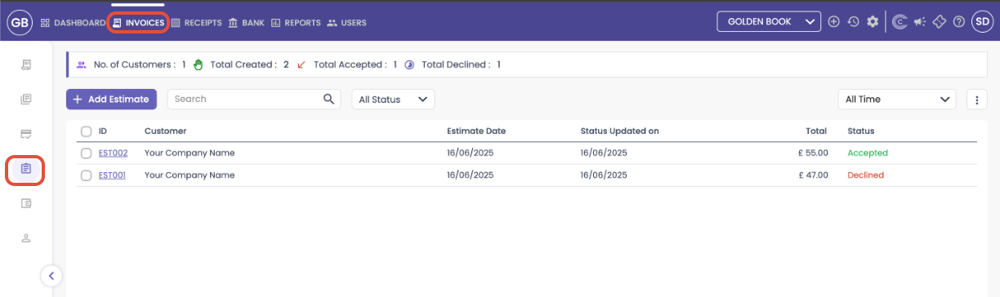
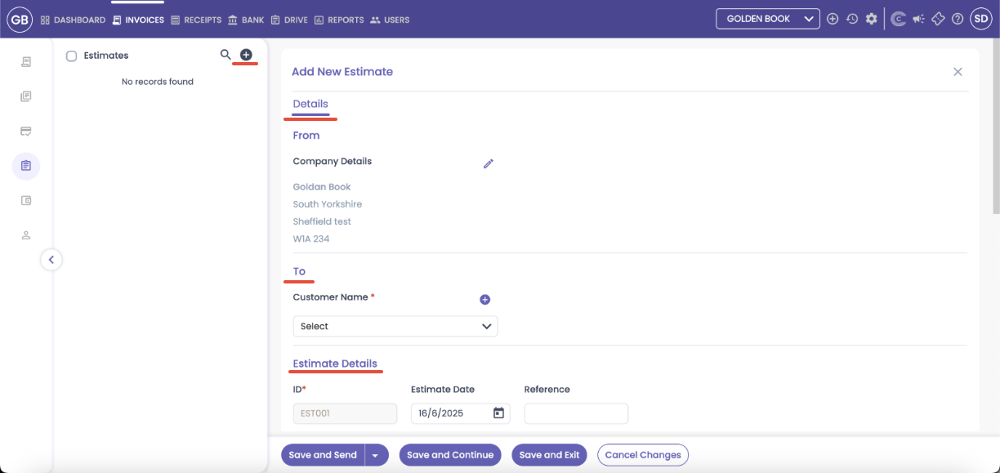
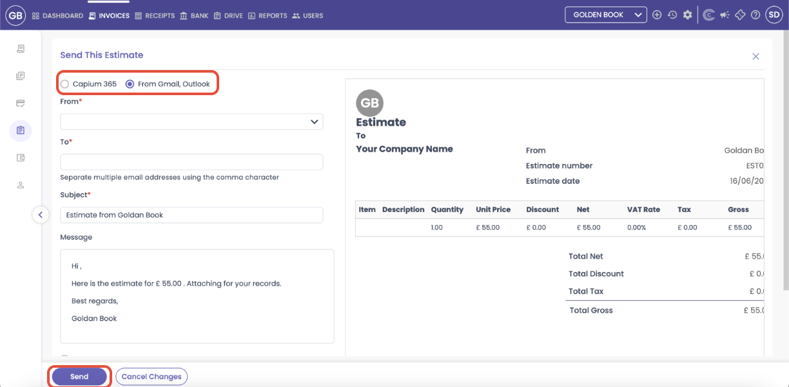

# CAPIUM 365: How to create &amp; send Estimates to your clients
	 	
			
			Print

- **Category:** Capium 365
- **Folder:** Capium 365 (Customer/Client)
- **Source URL:** [https://capium.freshdesk.com/support/solutions/articles/9000270108-capium-365-how-to-create-send-estimates-to-your-clients](https://capium.freshdesk.com/support/solutions/articles/9000270108-capium-365-how-to-create-send-estimates-to-your-clients)
- **Article ID:** 9000270108

## Content

Solution home 
		Capium 365
		Capium 365 (Customer/Client)

### CAPIUM 365: How to create & send Estimates to your clients

			Print

	Modified on: Tue, 29 Jul, 2025 at 11:43 AM

		The article below is a step-by-step guide that show you how to generate, send, and manage quotation-style documents for your clients.

Navigation: Capium 365 > Client Portal > Invoices > Estimates 

Once you've filled in the relevant details (e.g. client, description, amounts, notes), you can save the estimate or immediately send it to the client from the same screen. See screenshot below: 

After an estimate is created, you will see a summary view showing key metrics: 

 -Number of Customers with Estimates 

-Total Estimates Created 

-Total Accepted 

-Total Decline 

Just like in other sections, you can use the following tools: 

Filter by Status & Timeframe – View only Pending, Accepted, or Declined estimates 

Search – Quickly locate specific estimates using keywords or client names 

Export estimates in Excel, CSV, or PDF formats 

Managing Estimates 

When you hover over any estimate line, quick-action icons appear, giving you the ability to: 

Send – Email the estimate to the client via capium 365 or from Gmail, Outlook (See screenshot) 

Print – Print a physical copy 

Mark as Sent – Record it for tracking even if sent outside Capium 

Mark as Accepted – Once approved by client (You can then convert it into an invoice) 

Mark as Declined – If rejected 

Duplicate – Reuse the same format and info for another estimate 

Edit – Make changes if details need updating 

Want an overview of Invoices and other Areas with that? 

For a more detailed guide on how to add or bulk upload invoices, please see the help article below:

https://capium.freshdesk.com/a/solutions/articles/9000268872?portalId=9000044273

										Did you find it helpful?
								Yes
								No

Send feedback	Sorry we couldn't be helpful. Help us improve this article with your feedback.

## Screenshots & Diagrams (4)

