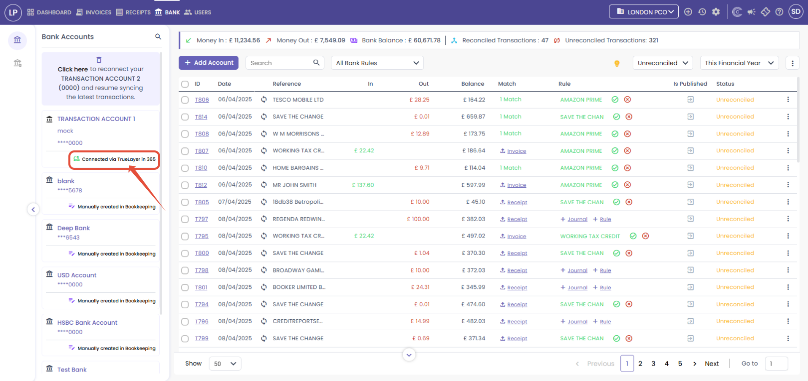
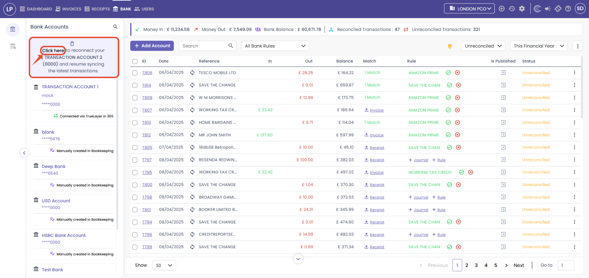
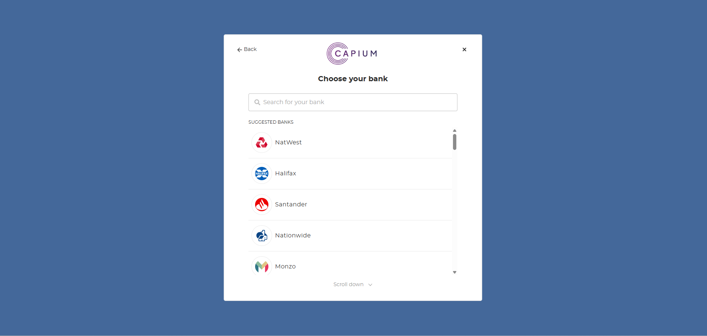
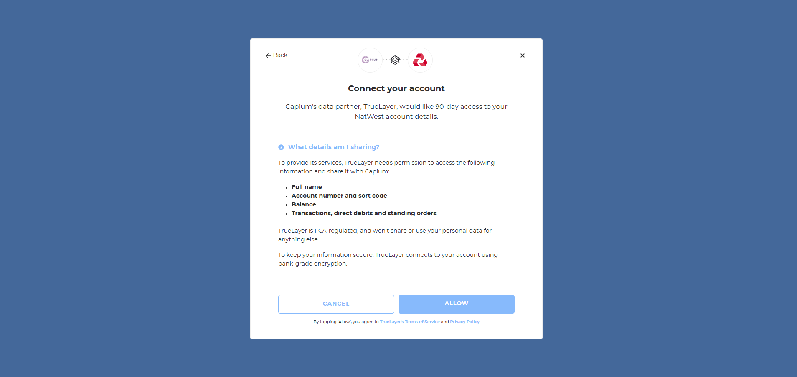

# How to Reauthenticate and Reauthorise your bank accounts in Capium 365
	 	
			
			Print

- **Category:** Capium 365
- **Folder:** Capium 365 (Accountant)
- **Source URL:** [https://capium.freshdesk.com/support/solutions/articles/9000272099-how-to-reauthenticate-and-reauthorise-your-bank-accounts-in-capium-365](https://capium.freshdesk.com/support/solutions/articles/9000272099-how-to-reauthenticate-and-reauthorise-your-bank-accounts-in-capium-365)
- **Article ID:** 9000272099

## Content

Solution home 
		Capium 365
		Capium 365 (Accountant)

### How to Reauthenticate and Reauthorise your bank accounts in Capium 365

			Print

	Modified on: Wed, 29 Oct, 2025 at  2:42 PM

		Welcome to this quick guide on how to reauthenticate and reauthorise your bank accounts in Capium 365. This guide will walk you through the essential steps. 

Capium 365: Bank

Navigation: Capium 365 > Client Specific > Bank

Reauthenticate:

To reauthenticate your bank accounts in Capium 365, click the 'Connected via TrueLayer in 365' button (shown in the picture below). This will reauthenticate the specific bank account in Capium 365 once it has been imported from the bookkeeping module.    

Reauthorise:

When your bank accounts need to be reauthorised, a message will appear asking you to reconnect them (as shown in the picture below). To reauthorise your bank accounts in Capium 365, click 'Click Here'. This will redirect you to a new page. 

Here, search for your bank from the list provided.

Click 'Allow' to connect the bank account. You will then need to enter your login details on the next page. Once completed, TrueLayer will securely connect the bank account to the client you are working on. 

										Did you find it helpful?
								Yes
								No

Send feedback	Sorry we couldn't be helpful. Help us improve this article with your feedback.

## Screenshots & Diagrams (4)

