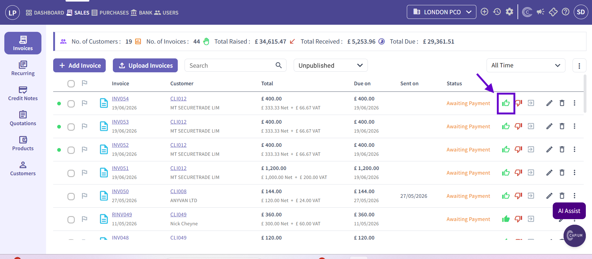
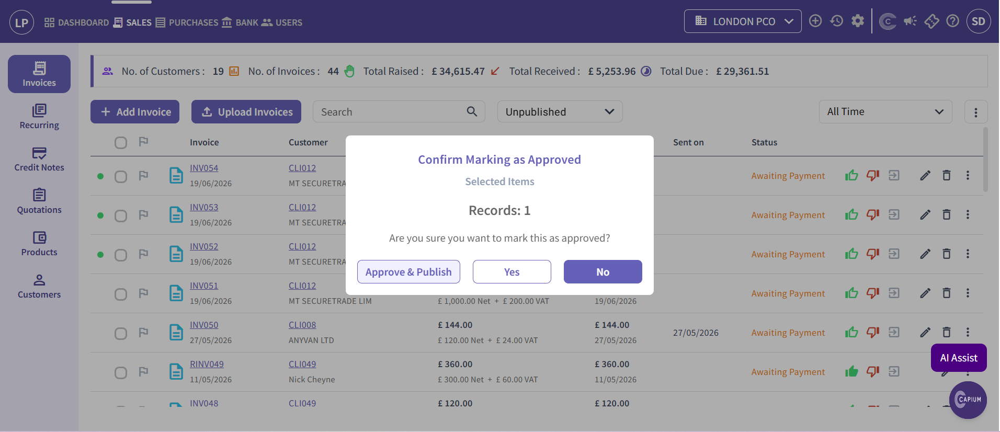
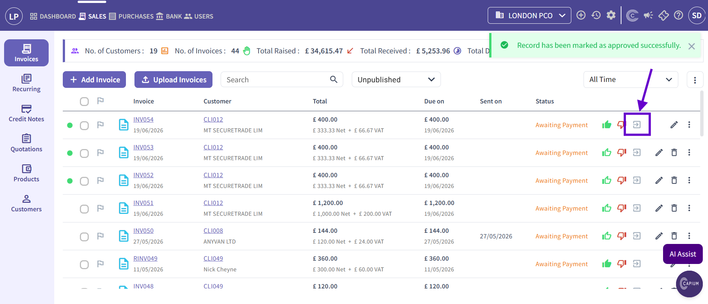
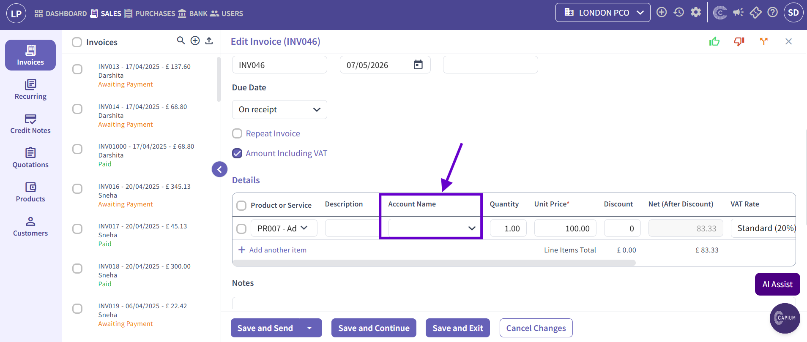

# Capium 365: How to Approve and Publish Invoices into Bookkeeping
	 	
			
			Print

- **Category:** Capium 365
- **Folder:** Capium 365 (Accountant)
- **Source URL:** [https://capium.freshdesk.com/support/solutions/articles/9000277285-capium-365-how-to-approve-and-publish-invoices-into-bookkeeping](https://capium.freshdesk.com/support/solutions/articles/9000277285-capium-365-how-to-approve-and-publish-invoices-into-bookkeeping)
- **Article ID:** 9000277285

## Content

Solution home 
		Capium 365
		Capium 365 (Accountant)

### Capium 365: How to Approve and Publish Invoices into Bookkeeping

			Print

	Modified on: Sun, 21 Jun, 2026 at  1:45 AM

		In order to publish your Invoices from Capium 365 into your Bookkeeping module, follow the navigation below:

Navigation: Capium 365 > [Specific Client] > Sales > invoices

You can click here to go to that navigation.

For Purchase Invoices and Credit Notes, you can also follow the below steps:

1. Firstly, you have to approve any invoices with the thumb icon:

2. After clicking this icon, a pop-up will appear:

a) In this pop-up you can either press 'Yes', or you can press 'Approve & Publish', which will immediately publish it into your Bookkeeping module.

3). If you only clicked 'Yes', you still have an opportunity to publish to Bookkeeping with this icon:

4) To unpublish the invoice, you can just click on the same icon again.

Note: if you are unable to approve a transaction, double check that in the details of the invoice, an account name has been designated to the product or service.

										Did you find it helpful?
								Yes
								No

Send feedback	Sorry we couldn't be helpful. Help us improve this article with your feedback.

## Screenshots & Diagrams (4)

