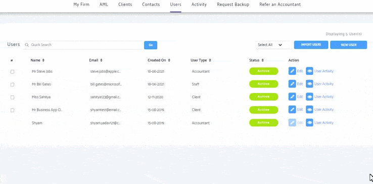
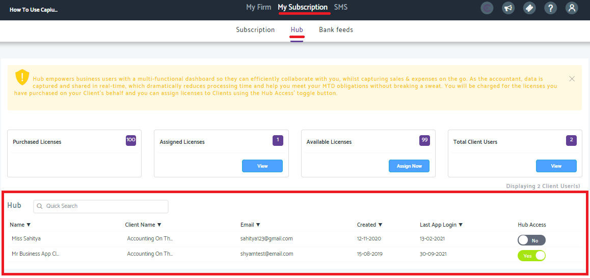
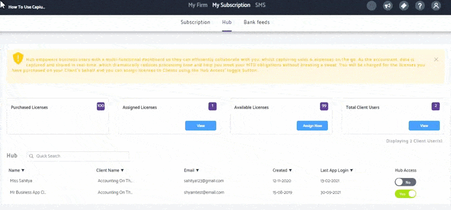

# How to allocate a licence to a customer
	 	
			
			Print

- **Category:** Capium Hub
- **Folder:** Capium Hub Overview
- **Source URL:** [https://capium.freshdesk.com/support/solutions/articles/9000207012-how-to-allocate-a-licence-to-a-customer](https://capium.freshdesk.com/support/solutions/articles/9000207012-how-to-allocate-a-licence-to-a-customer)
- **Article ID:** 9000207012

## Content

Solution home 
		Capium Hub
		Capium Hub Overview

### How to allocate a licence to a customer

			Print

	Modified on: Wed, 13 Oct, 2021 at 12:39 PM

		Location:

Create a user > My Subscription > Hub > Find user and switch hub access to 'Yes' 

Video Guide:

Click here to watch how to allocate a licence to a customer

Help Guide:

The first step is to create a client user. 

Go into My Firm > Users > New User.

Please note, the email and password that you create are the credentials yours customers will use to log into the mobile app. 

To assign this user a license, go into My Subscription > Hub 

You'll see the client user created in the list below. 

Switch Hub access to 'Yes' to give the client access to log into the mobile app.

										Did you find it helpful?
								Yes
								No

Send feedback	Sorry we couldn't be helpful. Help us improve this article with your feedback.

## Screenshots & Diagrams (3)

