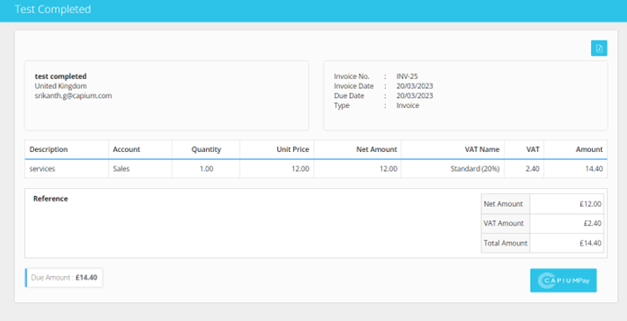
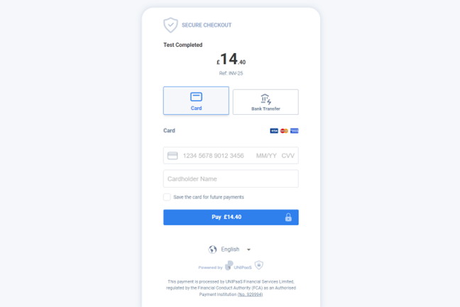

# Capium Pay Module - Knowledge Base & Feature Index

> Total Articles: **30** | Module Directory: `d:/sansuite/Capium Pay`

## Articles List & Local Assets

### 1. Capium Pay Workshop
- **Folder:** Help Guide
- **Article ID:** `9000225889` | **Slug:** `capium-pay-workshop`
- **Markdown File:** [raw_articles/9000225889_capium-pay-workshop.md](../raw_articles/9000225889_capium-pay-workshop.md)
- **Images Count:** 0

---

### 2. Payment status display
- **Folder:** Help Guide
- **Article ID:** `9000225988` | **Slug:** `payment-status-display`
- **Markdown File:** [raw_articles/9000225988_payment-status-display.md](../raw_articles/9000225988_payment-status-display.md)
- **Images Count:** 2
- **Screenshots:**
  - 
  - 

---

### 3. How to send a link to get paid
- **Folder:** Help Guide
- **Article ID:** `9000226011` | **Slug:** `how-to-send-a-link-to-get-paid`
- **Markdown File:** [raw_articles/9000226011_how-to-send-a-link-to-get-paid.md](../raw_articles/9000226011_how-to-send-a-link-to-get-paid.md)
- **Images Count:** 3
- **Screenshots:**
  - 
  - 
  - 

---

### 4. How to raise a ticket
- **Folder:** Help Guide
- **Article ID:** `9000226022` | **Slug:** `how-to-raise-a-ticket`
- **Markdown File:** [raw_articles/9000226022_how-to-raise-a-ticket.md](../raw_articles/9000226022_how-to-raise-a-ticket.md)
- **Images Count:** 1
- **Screenshots:**
  - 

---

### 5. Mapping Bank Accounts (Capium Pay Bank Reconciliation)
- **Folder:** Help Guide
- **Article ID:** `9000226028` | **Slug:** `mapping-bank-accounts-capium-pay-bank-reconciliation-`
- **Markdown File:** [raw_articles/9000226028_mapping-bank-accounts-capium-pay-bank-reconciliation-.md](../raw_articles/9000226028_mapping-bank-accounts-capium-pay-bank-reconciliation-.md)
- **Images Count:** 0

---

### 6. Capium Pay: How to Create a Vendor
- **Folder:** Help Guide
- **Article ID:** `9000226038` | **Slug:** `capium-pay-how-to-create-a-vendor`
- **Markdown File:** [raw_articles/9000226038_capium-pay-how-to-create-a-vendor.md](../raw_articles/9000226038_capium-pay-how-to-create-a-vendor.md)
- **Images Count:** 2
- **Screenshots:**
  - 
  - 

---

### 7. Capium Pay: Onboarding Process (Sole Traders)
- **Folder:** Help Guide
- **Article ID:** `9000226039` | **Slug:** `capium-pay-onboarding-process-sole-traders-`
- **Markdown File:** [raw_articles/9000226039_capium-pay-onboarding-process-sole-traders-.md](../raw_articles/9000226039_capium-pay-onboarding-process-sole-traders-.md)
- **Images Count:** 1
- **Screenshots:**
  - 

---

### 8. Capium Pay: Onboarding Process (Limited Company)
- **Folder:** Help Guide
- **Article ID:** `9000226050` | **Slug:** `capium-pay-onboarding-process-limited-company-`
- **Markdown File:** [raw_articles/9000226050_capium-pay-onboarding-process-limited-company-.md](../raw_articles/9000226050_capium-pay-onboarding-process-limited-company-.md)
- **Images Count:** 2
- **Screenshots:**
  - 
  - 

---

### 9. How a user can make a payment?
- **Folder:** Help Guide
- **Article ID:** `9000226051` | **Slug:** `how-a-user-can-make-a-payment-`
- **Markdown File:** [raw_articles/9000226051_how-a-user-can-make-a-payment-.md](../raw_articles/9000226051_how-a-user-can-make-a-payment-.md)
- **Images Count:** 3
- **Screenshots:**
  - 
  - 
  - 

---

### 10. What details does the vendor need to provide to sign up?
- **Folder:** FAQ
- **Article ID:** `9000226024` | **Slug:** `what-details-does-the-vendor-need-to-provide-to-sign-up-`
- **Markdown File:** [raw_articles/9000226024_what-details-does-the-vendor-need-to-provide-to-sign-up-.md](../raw_articles/9000226024_what-details-does-the-vendor-need-to-provide-to-sign-up-.md)
- **Images Count:** 0

---

### 11. What onboarding documents are required?
- **Folder:** FAQ
- **Article ID:** `9000226027` | **Slug:** `what-onboarding-documents-are-required-`
- **Markdown File:** [raw_articles/9000226027_what-onboarding-documents-are-required-.md](../raw_articles/9000226027_what-onboarding-documents-are-required-.md)
- **Images Count:** 0

---

### 12. Why the onboarding details are asked?
- **Folder:** FAQ
- **Article ID:** `9000226029` | **Slug:** `why-the-onboarding-details-are-asked-`
- **Markdown File:** [raw_articles/9000226029_why-the-onboarding-details-are-asked-.md](../raw_articles/9000226029_why-the-onboarding-details-are-asked-.md)
- **Images Count:** 0

---

### 13. “Action Required” status and what to do next
- **Folder:** FAQ
- **Article ID:** `9000226031` | **Slug:** `-action-required-status-and-what-to-do-next`
- **Markdown File:** [raw_articles/9000226031_-action-required-status-and-what-to-do-next.md](../raw_articles/9000226031_-action-required-status-and-what-to-do-next.md)
- **Images Count:** 0

---

### 14. My onboarding link doesn’t work, what should I do?
- **Folder:** FAQ
- **Article ID:** `9000226032` | **Slug:** `my-onboarding-link-doesn-t-work-what-should-i-do-`
- **Markdown File:** [raw_articles/9000226032_my-onboarding-link-doesn-t-work-what-should-i-do-.md](../raw_articles/9000226032_my-onboarding-link-doesn-t-work-what-should-i-do-.md)
- **Images Count:** 0

---

### 15. How to disconnect from integrations with open banking &#39;Plaid&#39;?
- **Folder:** FAQ
- **Article ID:** `9000226034` | **Slug:** `how-to-disconnect-from-integrations-with-open-banking-plaid-`
- **Markdown File:** [raw_articles/9000226034_how-to-disconnect-from-integrations-with-open-banking-plaid-.md](../raw_articles/9000226034_how-to-disconnect-from-integrations-with-open-banking-plaid-.md)
- **Images Count:** 0

---

### 16. How to remove all my data from Capium Pay?
- **Folder:** FAQ
- **Article ID:** `9000226036` | **Slug:** `how-to-remove-all-my-data-from-capium-pay-`
- **Markdown File:** [raw_articles/9000226036_how-to-remove-all-my-data-from-capium-pay-.md](../raw_articles/9000226036_how-to-remove-all-my-data-from-capium-pay-.md)
- **Images Count:** 0

---

### 17. How do I create a vendor?
- **Folder:** FAQ
- **Article ID:** `9000226037` | **Slug:** `how-do-i-create-a-vendor-`
- **Markdown File:** [raw_articles/9000226037_how-do-i-create-a-vendor-.md](../raw_articles/9000226037_how-do-i-create-a-vendor-.md)
- **Images Count:** 0

---

### 18. Where can I check the vendor’s status?
- **Folder:** FAQ
- **Article ID:** `9000226041` | **Slug:** `where-can-i-check-the-vendor-s-status-`
- **Markdown File:** [raw_articles/9000226041_where-can-i-check-the-vendor-s-status-.md](../raw_articles/9000226041_where-can-i-check-the-vendor-s-status-.md)
- **Images Count:** 0

---

### 19. Where can I check the vendor’s balance?
- **Folder:** FAQ
- **Article ID:** `9000226042` | **Slug:** `where-can-i-check-the-vendor-s-balance-`
- **Markdown File:** [raw_articles/9000226042_where-can-i-check-the-vendor-s-balance-.md](../raw_articles/9000226042_where-can-i-check-the-vendor-s-balance-.md)
- **Images Count:** 0

---

### 20. What payment methods are supported?
- **Folder:** FAQ
- **Article ID:** `9000226043` | **Slug:** `what-payment-methods-are-supported-`
- **Markdown File:** [raw_articles/9000226043_what-payment-methods-are-supported-.md](../raw_articles/9000226043_what-payment-methods-are-supported-.md)
- **Images Count:** 0

---

### 21. Why my card payment was declined?
- **Folder:** FAQ
- **Article ID:** `9000226044` | **Slug:** `why-my-card-payment-was-declined-`
- **Markdown File:** [raw_articles/9000226044_why-my-card-payment-was-declined-.md](../raw_articles/9000226044_why-my-card-payment-was-declined-.md)
- **Images Count:** 0

---

### 22. When would the refund be reflected under the client account?
- **Folder:** FAQ
- **Article ID:** `9000226045` | **Slug:** `when-would-the-refund-be-reflected-under-the-client-account-`
- **Markdown File:** [raw_articles/9000226045_when-would-the-refund-be-reflected-under-the-client-account-.md](../raw_articles/9000226045_when-would-the-refund-be-reflected-under-the-client-account-.md)
- **Images Count:** 0

---

### 23. Is there a limitation for payments?
- **Folder:** FAQ
- **Article ID:** `9000226046` | **Slug:** `is-there-a-limitation-for-payments-`
- **Markdown File:** [raw_articles/9000226046_is-there-a-limitation-for-payments-.md](../raw_articles/9000226046_is-there-a-limitation-for-payments-.md)
- **Images Count:** 0

---

### 24. What is the last date to do a refund?
- **Folder:** FAQ
- **Article ID:** `9000226047` | **Slug:** `what-is-the-last-date-to-do-a-refund-`
- **Markdown File:** [raw_articles/9000226047_what-is-the-last-date-to-do-a-refund-.md](../raw_articles/9000226047_what-is-the-last-date-to-do-a-refund-.md)
- **Images Count:** 0

---

### 25. Why are the funds not in the “Payable Balance”?
- **Folder:** FAQ
- **Article ID:** `9000226048` | **Slug:** `why-are-the-funds-not-in-the-payable-balance-`
- **Markdown File:** [raw_articles/9000226048_why-are-the-funds-not-in-the-payable-balance-.md](../raw_articles/9000226048_why-are-the-funds-not-in-the-payable-balance-.md)
- **Images Count:** 0

---

### 26. Where can I check the payment details?
- **Folder:** FAQ
- **Article ID:** `9000226049` | **Slug:** `where-can-i-check-the-payment-details-`
- **Markdown File:** [raw_articles/9000226049_where-can-i-check-the-payment-details-.md](../raw_articles/9000226049_where-can-i-check-the-payment-details-.md)
- **Images Count:** 0

---

### 27. How quickly can I withdraw funds
- **Folder:** FAQ
- **Article ID:** `9000226203` | **Slug:** `how-quickly-can-i-withdraw-funds`
- **Markdown File:** [raw_articles/9000226203_how-quickly-can-i-withdraw-funds.md](../raw_articles/9000226203_how-quickly-can-i-withdraw-funds.md)
- **Images Count:** 0

---

### 28. Why I cannot payout my balance?
- **Folder:** FAQ
- **Article ID:** `9000226205` | **Slug:** `why-i-cannot-payout-my-balance-`
- **Markdown File:** [raw_articles/9000226205_why-i-cannot-payout-my-balance-.md](../raw_articles/9000226205_why-i-cannot-payout-my-balance-.md)
- **Images Count:** 0

---

### 29. Why there is a stuck amount in my balance?
- **Folder:** FAQ
- **Article ID:** `9000226206` | **Slug:** `why-there-is-a-stuck-amount-in-my-balance-`
- **Markdown File:** [raw_articles/9000226206_why-there-is-a-stuck-amount-in-my-balance-.md](../raw_articles/9000226206_why-there-is-a-stuck-amount-in-my-balance-.md)
- **Images Count:** 0

---

### 30. How much is the fee for card payments?
- **Folder:** FAQ
- **Article ID:** `9000226249` | **Slug:** `how-much-is-the-fee-for-card-payments-`
- **Markdown File:** [raw_articles/9000226249_how-much-is-the-fee-for-card-payments-.md](../raw_articles/9000226249_how-much-is-the-fee-for-card-payments-.md)
- **Images Count:** 0

---

