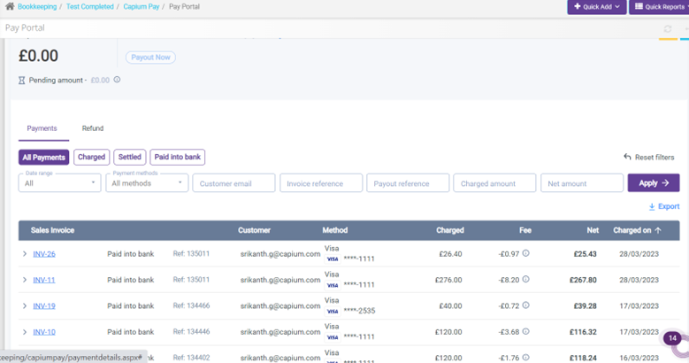
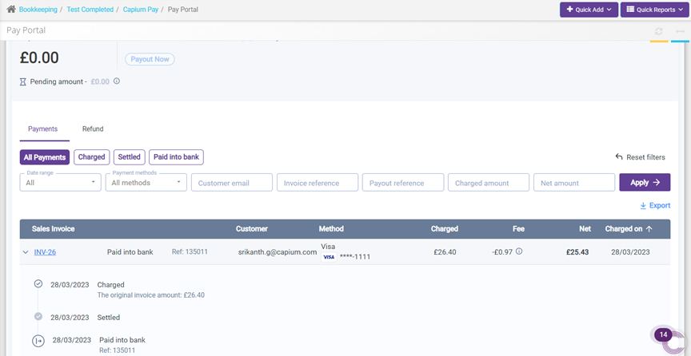

# Payment status display
	 	
			
			Print

- **Category:** Capium Pay
- **Folder:** Help Guide
- **Source URL:** [https://capium.freshdesk.com/support/solutions/articles/9000225988-payment-status-display](https://capium.freshdesk.com/support/solutions/articles/9000225988-payment-status-display)
- **Article ID:** 9000225988

## Content

Solution home 
		Capium Pay
		Help Guide

### Payment status display

			Print

	Modified on: Thu, 30 Mar, 2023 at 10:01 AM

		To see the status of the payment within Capium Pay. 

Navigation: Bookkeeping >> Selected client >> Capium Pay >> Pay Portal

Following the navigation process, a user is able to see the list of invoices raised. To see the status of a specific invoice, a user is required to click on the ‘Arrow’ option for that specific invoice.

Once performed, a client is able to keep track of the invoice getting paid and check the status of the payment for a selected invoice. 

										Did you find it helpful?
								Yes
								No

Send feedback	Sorry we couldn't be helpful. Help us improve this article with your feedback.

## Screenshots & Diagrams (2)

