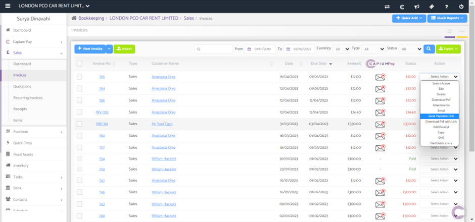
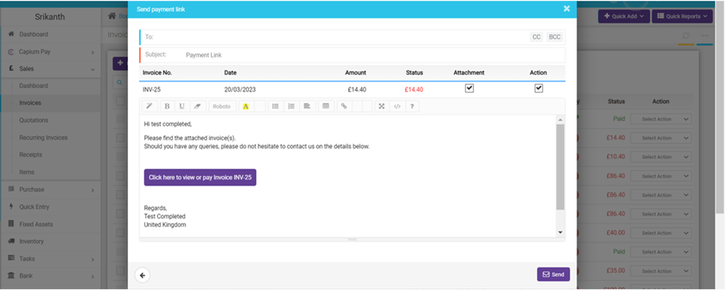
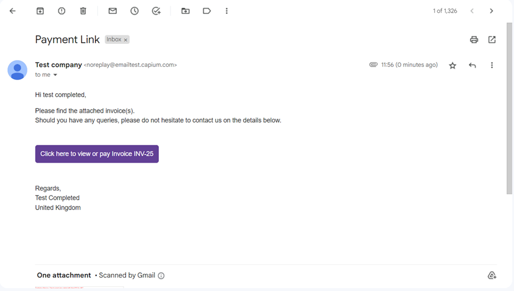

# How to send a link to get paid
	 	
			
			Print

- **Category:** Capium Pay
- **Folder:** Help Guide
- **Source URL:** [https://capium.freshdesk.com/support/solutions/articles/9000226011-how-to-send-a-link-to-get-paid](https://capium.freshdesk.com/support/solutions/articles/9000226011-how-to-send-a-link-to-get-paid)
- **Article ID:** 9000226011

## Content

Solution home 
		Capium Pay
		Help Guide

### How to send a link to get paid

			Print

	Modified on: Wed, 3 May, 2023 at  4:39 PM

		To send a link to get paid using the Capium Pay option. 

Navigation: Bookkeeping > Selected client > Sales > Invoices

Following the navigation process, a user is able to send a link to get paid by selecting an invoice required to be sent, using the ‘Select Action’ drop-down menu and selecting the ‘Send Payment Link’ option. Alternatively, a user is able to send an email without the link by selecting the 'Email' option from the drop-down menu.

Once performed, a user is able to send a link via email to a selected client.

Navigation: Email

Once performed, a client will receive an email with the payment link and attached invoice.

										Did you find it helpful?
								Yes
								No

Send feedback	Sorry we couldn't be helpful. Help us improve this article with your feedback.

## Screenshots & Diagrams (3)

