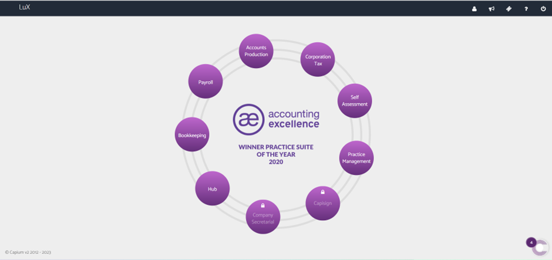

# How to raise a ticket
	 	
			
			Print

- **Category:** Capium Pay
- **Folder:** Help Guide
- **Source URL:** [https://capium.freshdesk.com/support/solutions/articles/9000226022-how-to-raise-a-ticket](https://capium.freshdesk.com/support/solutions/articles/9000226022-how-to-raise-a-ticket)
- **Article ID:** 9000226022

## Content

Solution home 
		Capium Pay
		Help Guide

### How to raise a ticket

			Print

	Modified on: Thu, 6 Apr, 2023 at  8:15 AM

		To seek support with queries and concerns within the Capium Pay. 

Navigation: Home Page > Ticket button

Following the navigation process, a user is able to raise a ticket regarding Capium Pay queries and issues. Once it has been done, a user will receive a confirmation email. The ticket will be reviewed by our support team and the solution will be provided as soon as possible.

										Did you find it helpful?
								Yes
								No

Send feedback	Sorry we couldn't be helpful. Help us improve this article with your feedback.

## Screenshots & Diagrams (1)

