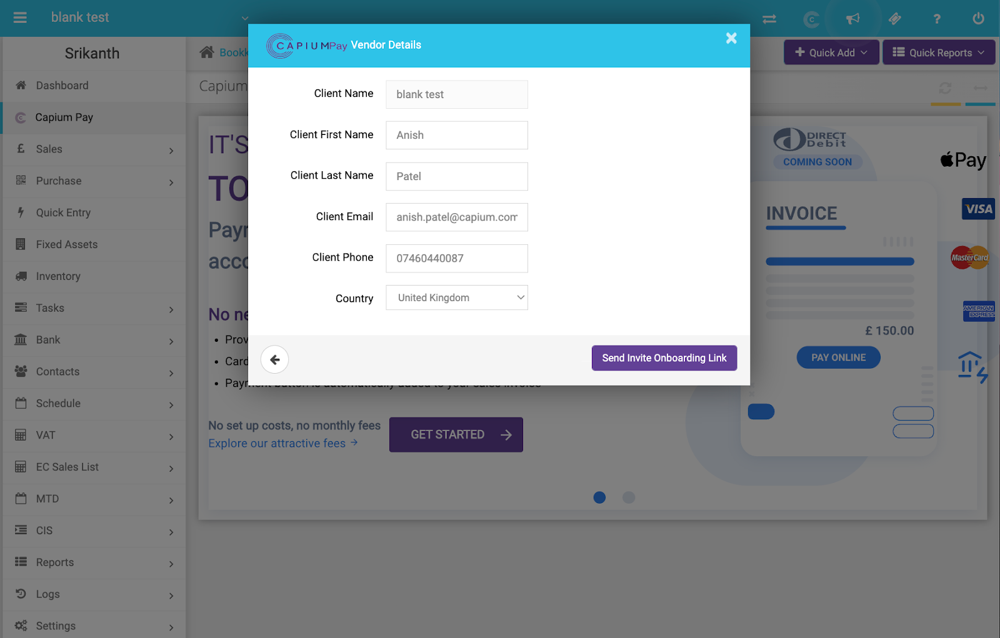
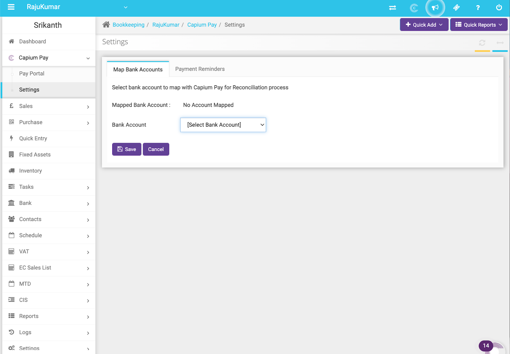

# Capium Pay: How to Create a Vendor
	 	
			
			Print

- **Category:** Capium Pay
- **Folder:** Help Guide
- **Source URL:** [https://capium.freshdesk.com/support/solutions/articles/9000226038-capium-pay-how-to-create-a-vendor](https://capium.freshdesk.com/support/solutions/articles/9000226038-capium-pay-how-to-create-a-vendor)
- **Article ID:** 9000226038

## Content

Solution home 
		Capium Pay
		Help Guide

### Capium Pay: How to Create a Vendor

			Print

	Modified on: Thu, 30 Mar, 2023 at  4:59 PM

		Navigation >>> Bookkeeping>>> Capium Pay

Step 1: Vendor Registration:

Once you click ‘Get started’ on the Capium Pay welcome page, you’ll be navigated to the Capium Pay Vendor Details screen- please fill in the relevant Vendor details below:

Once vendor details are entered, this will then trigger the payment portal to open & you will be sent an onboarding invite email.

Please immediately map the appropriate bank account from Capium that you would want to withdraw funds to. It's important to do this step so you don’t run into reconciliation issues at year end. 

(Settings>>> Map Bank account>>> Choose from list & then save)

Please Note: If the bank account that you want to collect the money is not currently added on Capium, you’ll need to add a bank account manually under ‘Bank’. Once added, you can come back to this section and now map the account to Capium Pay.

										Did you find it helpful?
								Yes
								No

Send feedback	Sorry we couldn't be helpful. Help us improve this article with your feedback.

## Screenshots & Diagrams (2)

