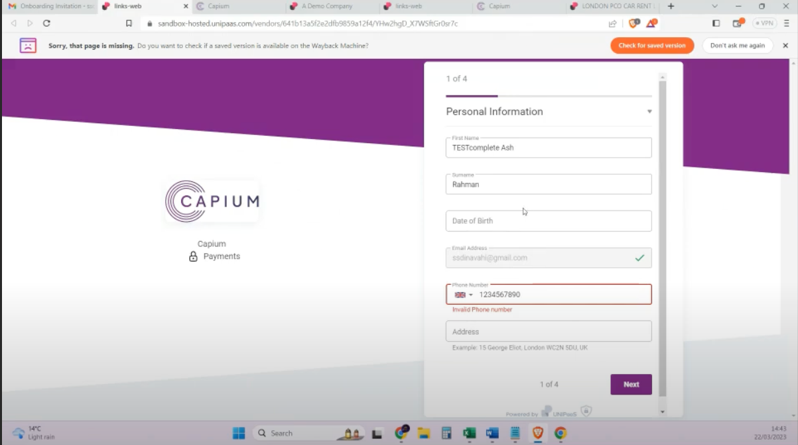

# Capium Pay: Onboarding Process (Sole Traders)
	 	
			
			Print

- **Category:** Capium Pay
- **Folder:** Help Guide
- **Source URL:** [https://capium.freshdesk.com/support/solutions/articles/9000226039-capium-pay-onboarding-process-sole-traders-](https://capium.freshdesk.com/support/solutions/articles/9000226039-capium-pay-onboarding-process-sole-traders-)
- **Article ID:** 9000226039

## Content

Solution home 
		Capium Pay
		Help Guide

### Capium Pay: Onboarding Process (Sole Traders)

			Print

	Modified on: Thu, 30 Mar, 2023 at  5:23 PM

		Navigation: Bookkeeping>>> Capium Pay

Once the user clicked on ‘Accept to proceed’ as provided in the Onboarding Invitation, the system will redirect to the Onboarding page where the user needs to input the required information as below:

Sole Trader Onboarding 4 pages:

There are 4 pages below to be filled for a Sole Trader & 6 pages for a Limited company:

For Sole Trader:

Company Information

Company Representative

Sponsored Merchant Service Agreement

Bank Account Information

										Did you find it helpful?
								Yes
								No

Send feedback	Sorry we couldn't be helpful. Help us improve this article with your feedback.

## Screenshots & Diagrams (1)

