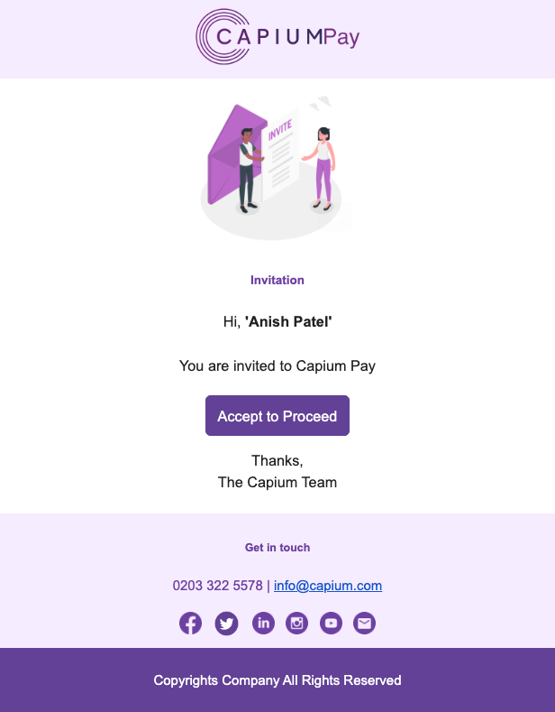
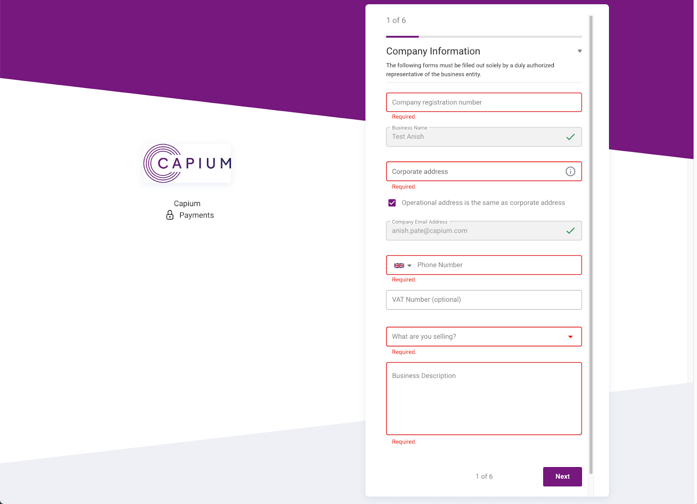

# Capium Pay: Onboarding Process (Limited Company)
	 	
			
			Print

- **Category:** Capium Pay
- **Folder:** Help Guide
- **Source URL:** [https://capium.freshdesk.com/support/solutions/articles/9000226050-capium-pay-onboarding-process-limited-company-](https://capium.freshdesk.com/support/solutions/articles/9000226050-capium-pay-onboarding-process-limited-company-)
- **Article ID:** 9000226050

## Content

Solution home 
		Capium Pay
		Help Guide

### Capium Pay: Onboarding Process (Limited Company)

			Print

	Modified on: Fri, 26 May, 2023 at  3:58 PM

Navigation: Bookkeeping>>> Capium Pay 

The end user will then receive the onboarding invite link to their email once the vendor information has been entered.

The end to which they can click ‘Accept to Proceed’:

Finish the Onboarding process

Once the user has clicked on ‘Accept to proceed’ as provided in the Onboarding Invitation, the system will redirect to the Onboarding page where the user needs to input the required information as below:

There are 6 pages to be filled for a Limited company:

These are the following pages that need to be filled in for a Limited Company:

Company Information

Company Representative

Sponsored Merchant Service Agreement

Bank Account Information

Company Stakeholders

Required Documents

Once this is done, Unipass will then need to verify the information provided. This normally only takes a few hours or so. Until then, the preliminary amounts of up to £2,500 for Limited companies will apply when accepting payments & no money will be able to be withdrawn until verification complete.

As part of the onboarding process in the initial registration, and up until the point in which a vendor is fully approved, UNIPaaS will set and communicate a set of statuses that reflect the vendor’s permissions to accept payments, withdraw funds, and the stage in which the vendor’s onboarding is currently on.

										Did you find it helpful?
								Yes
								No

Send feedback	Sorry we couldn't be helpful. Help us improve this article with your feedback.

## Screenshots & Diagrams (2)

