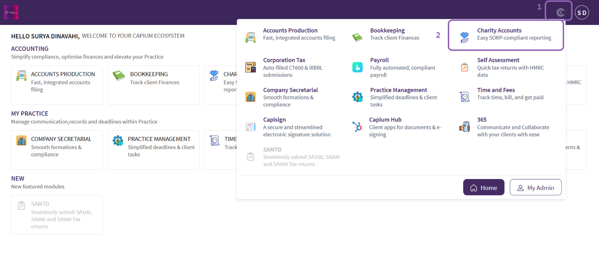
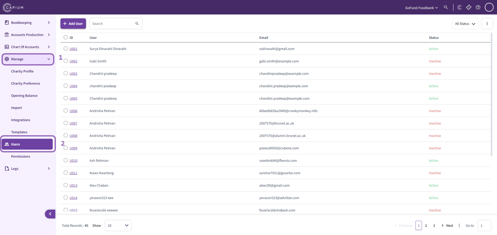
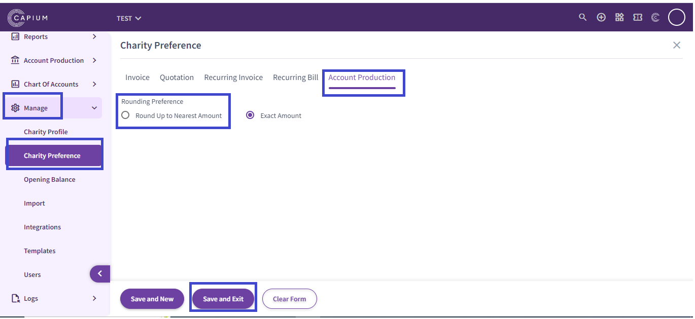
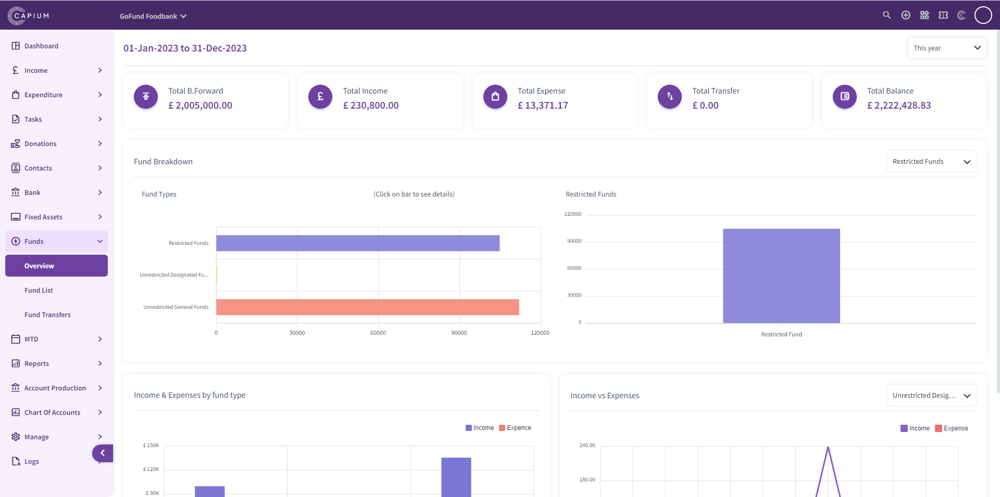
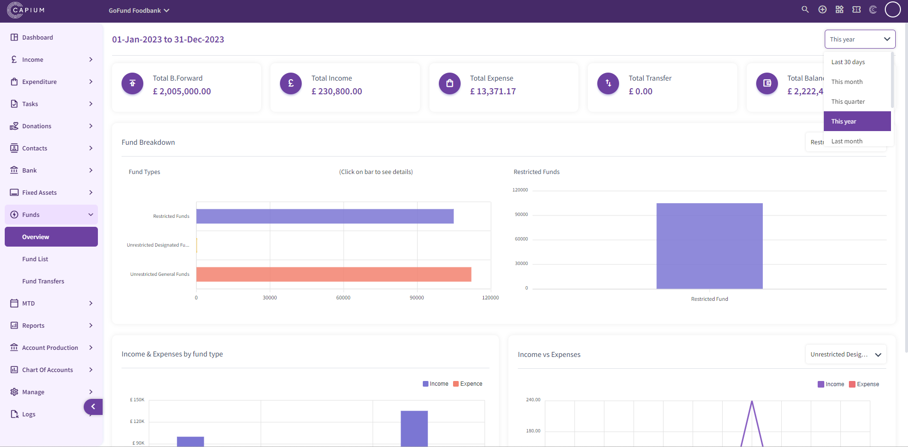
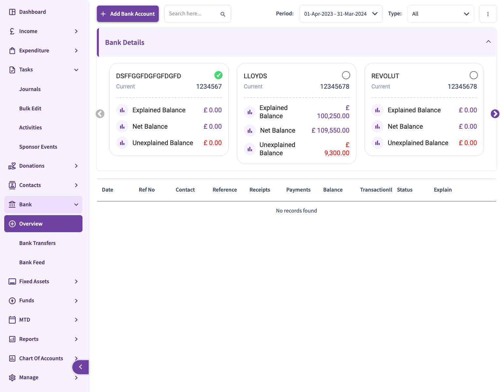
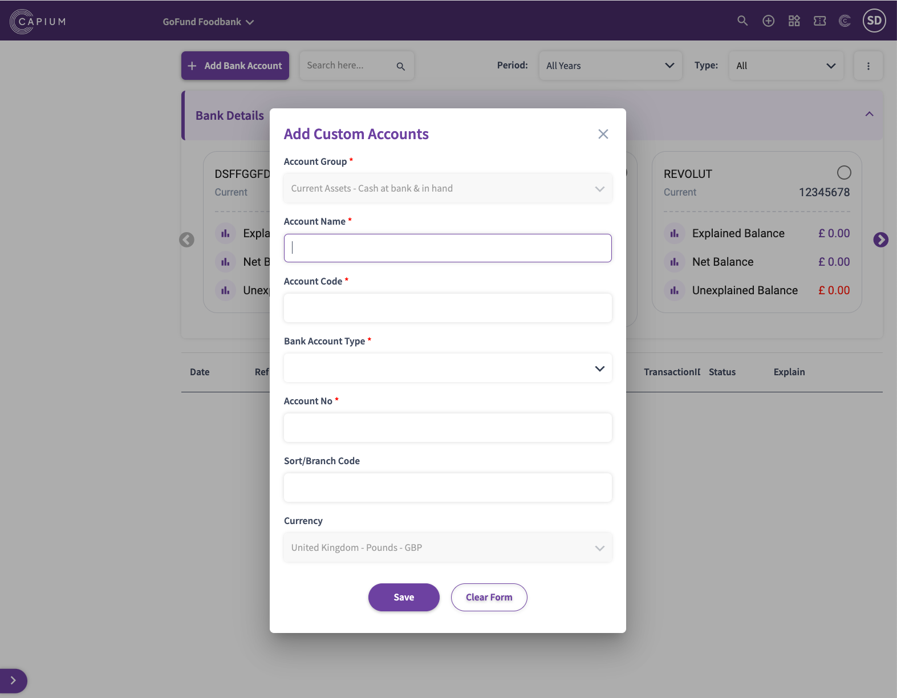
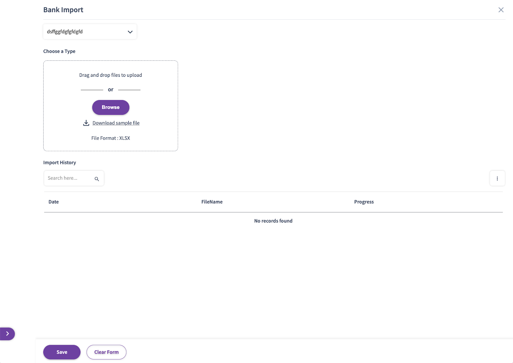
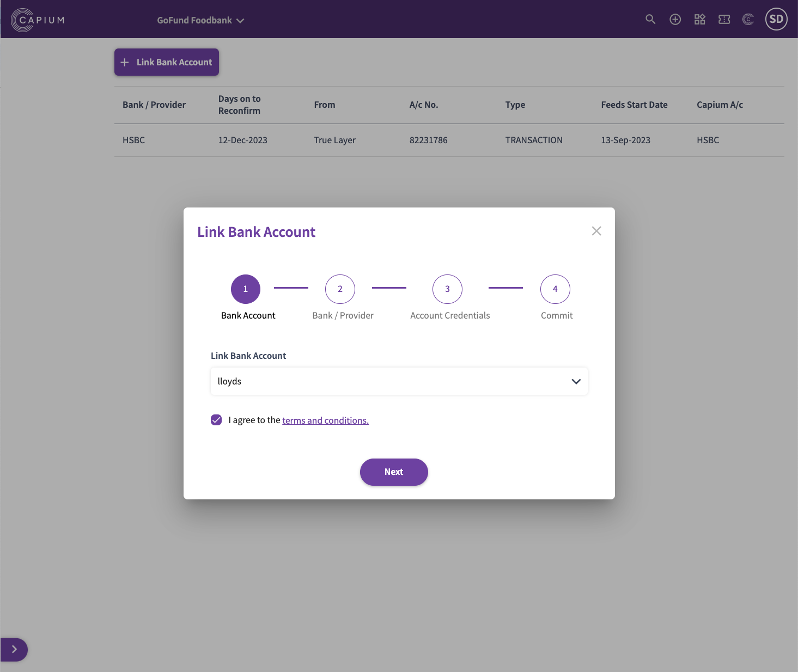
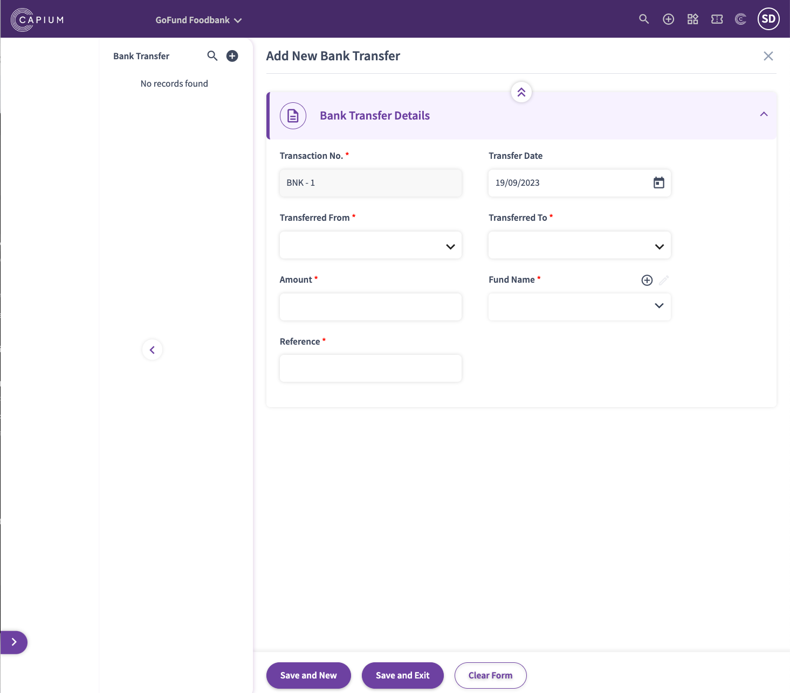

# Charities Module - Knowledge Base & Feature Index

> Total Articles: **26** | Module Directory: `d:/sansuite/Charities`

## Articles List & Local Assets

### 1. FAQ: What types of charities are supported?
- **Folder:** FAQs
- **Article ID:** `9000268663` | **Slug:** `faq-what-types-of-charities-are-supported-`
- **Markdown File:** [raw_articles/9000268663_faq-what-types-of-charities-are-supported-.md](../raw_articles/9000268663_faq-what-types-of-charities-are-supported-.md)
- **Images Count:** 0

---

### 2. An Intro into Charity Accounts Module
- **Folder:** FAQs
- **Article ID:** `9000226737` | **Slug:** `an-intro-into-charity-accounts-module`
- **Markdown File:** [raw_articles/9000226737_an-intro-into-charity-accounts-module.md](../raw_articles/9000226737_an-intro-into-charity-accounts-module.md)
- **Images Count:** 0

---

### 3. Capium Charity Module Updates (May 2025)
- **Folder:** FAQs
- **Article ID:** `9000268373` | **Slug:** `capium-charity-module-updates-may-2025-`
- **Markdown File:** [raw_articles/9000268373_capium-charity-module-updates-may-2025-.md](../raw_articles/9000268373_capium-charity-module-updates-may-2025-.md)
- **Images Count:** 0

---

### 4. Charity Accounts
- **Folder:** FAQs
- **Article ID:** `9000268814` | **Slug:** `charity-accounts`
- **Markdown File:** [raw_articles/9000268814_charity-accounts.md](../raw_articles/9000268814_charity-accounts.md)
- **Images Count:** 0

---

### 5. Why can&#39;t I see my users in Charities? - User Access
- **Folder:** FAQs
- **Article ID:** `9000271165` | **Slug:** `why-can-t-i-see-my-users-in-charities-user-access`
- **Markdown File:** [raw_articles/9000271165_why-can-t-i-see-my-users-in-charities-user-access.md](../raw_articles/9000271165_why-can-t-i-see-my-users-in-charities-user-access.md)
- **Images Count:** 2
- **Screenshots:**
  - 
  - 

---

### 6. Enabling &#39;Rounding up to Nearest Amount&#39; in the Charity Module
- **Folder:** FAQs
- **Article ID:** `9000271666` | **Slug:** `enabling-rounding-up-to-nearest-amount-in-the-charity-module`
- **Markdown File:** [raw_articles/9000271666_enabling-rounding-up-to-nearest-amount-in-the-charity-module.md](../raw_articles/9000271666_enabling-rounding-up-to-nearest-amount-in-the-charity-module.md)
- **Images Count:** 2
- **Screenshots:**
  - 
  - 

---

### 7. How to regenerate or refresh the accounts report in Charity module
- **Folder:** FAQs
- **Article ID:** `9000271488` | **Slug:** `how-to-regenerate-or-refresh-the-accounts-report-in-charity-module`
- **Markdown File:** [raw_articles/9000271488_how-to-regenerate-or-refresh-the-accounts-report-in-charity-module.md](../raw_articles/9000271488_how-to-regenerate-or-refresh-the-accounts-report-in-charity-module.md)
- **Images Count:** 0

---

### 8. How to add accountants details in Charity accounts report
- **Folder:** FAQs
- **Article ID:** `9000272503` | **Slug:** `how-to-add-accountants-details-in-charity-accounts-report`
- **Markdown File:** [raw_articles/9000272503_how-to-add-accountants-details-in-charity-accounts-report.md](../raw_articles/9000272503_how-to-add-accountants-details-in-charity-accounts-report.md)
- **Images Count:** 0

---

### 9. Setting up a Charity
- **Folder:** Getting Started
- **Article ID:** `9000228174` | **Slug:** `setting-up-a-charity`
- **Markdown File:** [raw_articles/9000228174_setting-up-a-charity.md](../raw_articles/9000228174_setting-up-a-charity.md)
- **Images Count:** 0

---

### 10. Charities - Manage
- **Folder:** Getting Started
- **Article ID:** `9000231688` | **Slug:** `charities-manage`
- **Markdown File:** [raw_articles/9000231688_charities-manage.md](../raw_articles/9000231688_charities-manage.md)
- **Images Count:** 8
- **Screenshots:**
  - 
  - 
  - 
  - 
  - 
  - 
  - 
  - 

---

### 11. Charity - Tasks
- **Folder:** Getting Started
- **Article ID:** `9000231689` | **Slug:** `charity-tasks`
- **Markdown File:** [raw_articles/9000231689_charity-tasks.md](../raw_articles/9000231689_charity-tasks.md)
- **Images Count:** 8
- **Screenshots:**
  - 
  - 
  - 
  - 
  - 
  - 
  - 
  - 

---

### 12. Charity - Funds
- **Folder:** Getting Started
- **Article ID:** `9000231702` | **Slug:** `charity-funds`
- **Markdown File:** [raw_articles/9000231702_charity-funds.md](../raw_articles/9000231702_charity-funds.md)
- **Images Count:** 8
- **Screenshots:**
  - 
  - 
  - 
  - 
  - 
  - 
  - 
  - 

---

### 13. Charity- Income
- **Folder:** Getting Started
- **Article ID:** `9000231703` | **Slug:** `charity-income`
- **Markdown File:** [raw_articles/9000231703_charity-income.md](../raw_articles/9000231703_charity-income.md)
- **Images Count:** 6
- **Screenshots:**
  - 
  - 
  - 
  - 
  - 
  - 

---

### 14. Charity - Expenditure
- **Folder:** Getting Started
- **Article ID:** `9000231704` | **Slug:** `charity-expenditure`
- **Markdown File:** [raw_articles/9000231704_charity-expenditure.md](../raw_articles/9000231704_charity-expenditure.md)
- **Images Count:** 4
- **Screenshots:**
  - 
  - 
  - 
  - 

---

### 15. Charity - Contacts
- **Folder:** Getting Started
- **Article ID:** `9000231738` | **Slug:** `charity-contacts`
- **Markdown File:** [raw_articles/9000231738_charity-contacts.md](../raw_articles/9000231738_charity-contacts.md)
- **Images Count:** 3
- **Screenshots:**
  - 
  - 
  - 

---

### 16. Charity – Logs
- **Folder:** Getting Started
- **Article ID:** `9000231743` | **Slug:** `charity-logs`
- **Markdown File:** [raw_articles/9000231743_charity-logs.md](../raw_articles/9000231743_charity-logs.md)
- **Images Count:** 2
- **Screenshots:**
  - 
  - 

---

### 17. Charities - Donations
- **Folder:** Getting Started
- **Article ID:** `9000231821` | **Slug:** `charities-donations`
- **Markdown File:** [raw_articles/9000231821_charities-donations.md](../raw_articles/9000231821_charities-donations.md)
- **Images Count:** 8
- **Screenshots:**
  - 
  - 
  - 
  - 
  - 
  - 
  - 
  - 

---

### 18. Charity - MTD VAT Setup
- **Folder:** Getting Started
- **Article ID:** `9000231917` | **Slug:** `charity-mtd-vat-setup`
- **Markdown File:** [raw_articles/9000231917_charity-mtd-vat-setup.md](../raw_articles/9000231917_charity-mtd-vat-setup.md)
- **Images Count:** 2
- **Screenshots:**
  - 
  - 

---

### 19. Charity - MTD VAT
- **Folder:** Getting Started
- **Article ID:** `9000231919` | **Slug:** `charity-mtd-vat`
- **Markdown File:** [raw_articles/9000231919_charity-mtd-vat.md](../raw_articles/9000231919_charity-mtd-vat.md)
- **Images Count:** 1
- **Screenshots:**
  - 

---

### 20. Charity - Charts of Accounts
- **Folder:** Getting Started
- **Article ID:** `9000231920` | **Slug:** `charity-charts-of-accounts`
- **Markdown File:** [raw_articles/9000231920_charity-charts-of-accounts.md](../raw_articles/9000231920_charity-charts-of-accounts.md)
- **Images Count:** 3
- **Screenshots:**
  - 
  - 
  - 

---

### 21. Charities - Bank
- **Folder:** Getting Started
- **Article ID:** `9000232000` | **Slug:** `charities-bank`
- **Markdown File:** [raw_articles/9000232000_charities-bank.md](../raw_articles/9000232000_charities-bank.md)
- **Images Count:** 6
- **Screenshots:**
  - 
  - 
  - 
  - 
  - 
  - 

---

### 22. Onboarding Guide: Getting started with Charities Accounts Production
- **Folder:** Getting Started
- **Article ID:** `9000268643` | **Slug:** `onboarding-guide-getting-started-with-charities-accounts-production`
- **Markdown File:** [raw_articles/9000268643_onboarding-guide-getting-started-with-charities-accounts-production.md](../raw_articles/9000268643_onboarding-guide-getting-started-with-charities-accounts-production.md)
- **Images Count:** 27
- **Screenshots:**
  - 
  - 
  - 
  - 
  - 
  - 
  - 
  - 
  - 
  - 
  - 
  - 
  - 
  - 
  - 
  - 
  - 
  - 
  - 
  - 
  - 
  - 
  - 
  - 
  - 
  - 
  - 

---

### 23. Charity - Independent Examiner&#39;s Report
- **Folder:** Getting Started
- **Article ID:** `9000268923` | **Slug:** `charity-independent-examiner-s-report`
- **Markdown File:** [raw_articles/9000268923_charity-independent-examiner-s-report.md](../raw_articles/9000268923_charity-independent-examiner-s-report.md)
- **Images Count:** 2
- **Screenshots:**
  - 
  - 

---

### 24. Charity Updates - July 2025
- **Folder:** Getting Started
- **Article ID:** `9000269219` | **Slug:** `charity-updates-july-2025`
- **Markdown File:** [raw_articles/9000269219_charity-updates-july-2025.md](../raw_articles/9000269219_charity-updates-july-2025.md)
- **Images Count:** 16
- **Screenshots:**
  - 
  - 
  - 
  - 
  - 
  - 
  - 
  - 
  - 
  - 
  - 
  - 
  - 
  - 
  - 
  - 

---

### 25. Opening Balances
- **Folder:** Getting Started
- **Article ID:** `9000273117` | **Slug:** `opening-balances`
- **Markdown File:** [raw_articles/9000273117_opening-balances.md](../raw_articles/9000273117_opening-balances.md)
- **Images Count:** 0

---

### 26. How to Submit Corporation Tax for Charity accounts
- **Folder:** Getting Started
- **Article ID:** `9000277518` | **Slug:** `how-to-submit-corporation-tax-for-charity-accounts`
- **Markdown File:** [raw_articles/9000277518_how-to-submit-corporation-tax-for-charity-accounts.md](../raw_articles/9000277518_how-to-submit-corporation-tax-for-charity-accounts.md)
- **Images Count:** 11
- **Screenshots:**
  - 
  - 
  - 
  - 
  - 
  - 
  - 
  - 
  - 
  - 
  - 

---

