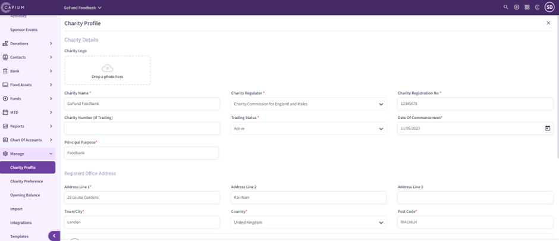
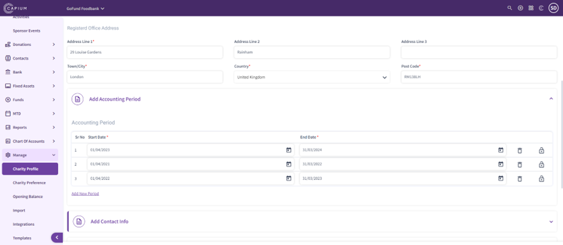
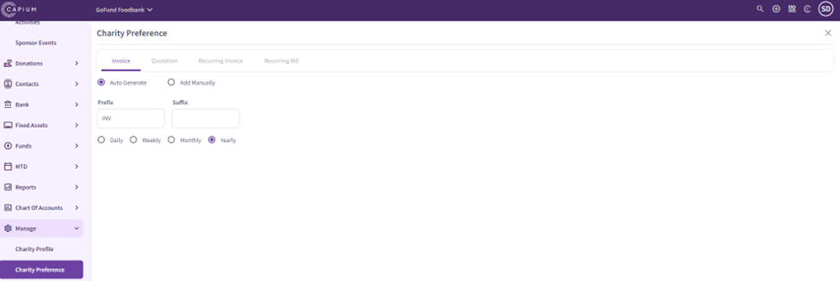
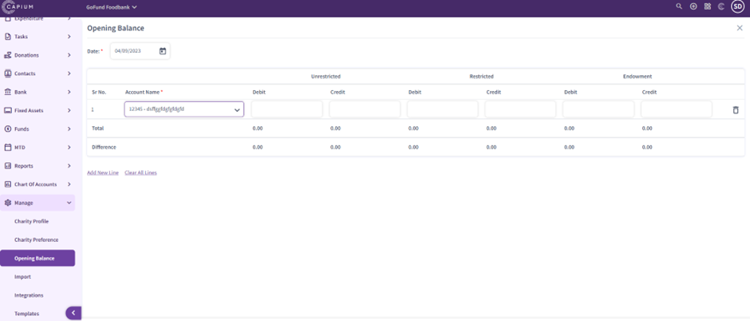
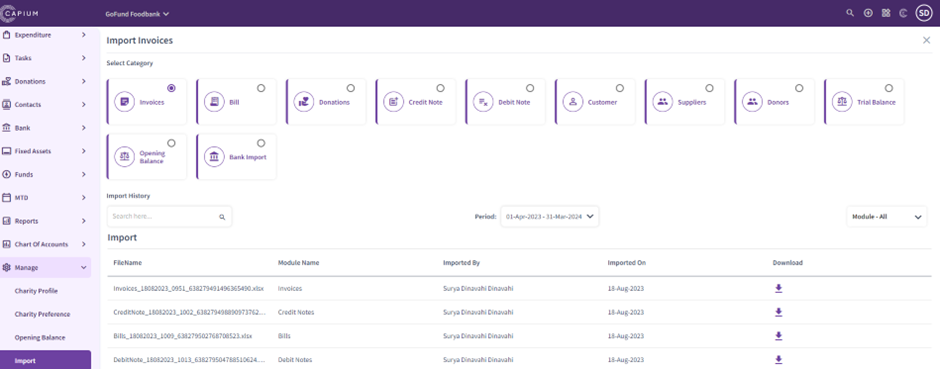
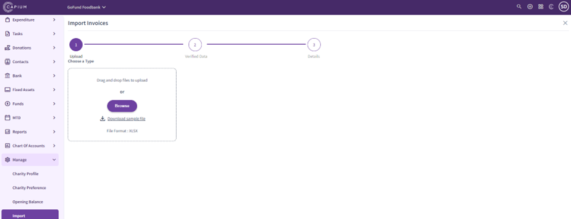
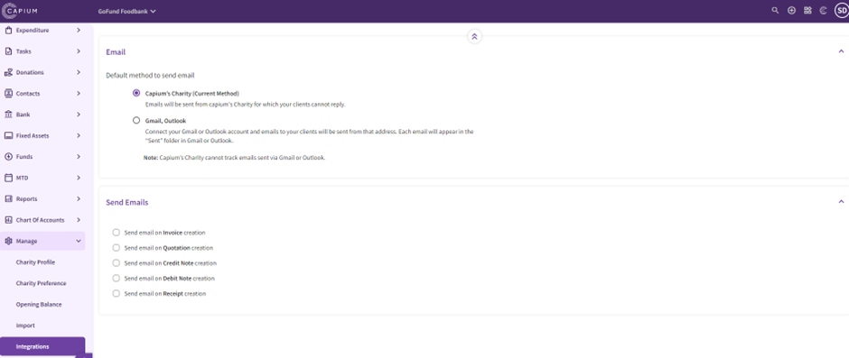
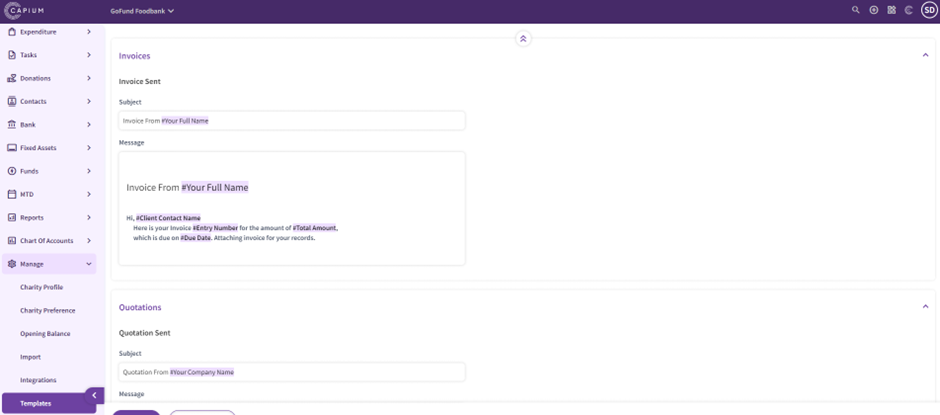

# Charities - Manage
	 	
			
			Print

- **Category:** Charities
- **Folder:** Getting Started
- **Source URL:** [https://capium.freshdesk.com/support/solutions/articles/9000231688-charities-manage](https://capium.freshdesk.com/support/solutions/articles/9000231688-charities-manage)
- **Article ID:** 9000231688

## Content

Solution home 
		Charities
		Getting Started

### Charities - Manage

			Print

	Modified on: Thu, 21 Sep, 2023 at  7:20 AM

		Navigation:  Charities > Dashboard > Manage

In the Charity Manage section, you can see a breakdown for the following options:

Charity Profile

Charity Preference 

Opening Balance

Import

Integrations

Templates

Navigation:  Charities > Dashboard > Manage > Charity Profile

In the Charity Profile section, you can update charity information, you’ll need to include the following:

Charity Name

Charity Regulator

Charity Registration Number

Trading Status

Date of Commencement

Principal Purpose

Registered Office Address

Add Accounting Periods

Add Contact Information

Add Accounting Details

Navigation:  Charities > Dashboard > Manage > Charity Preference

In the Charity Preference section, you can customise Prefix and Suffix for: 

Invoices

Quotations

Recurring Invoices

Recurring Bills

Customise Frequency (Daily, Weekly, Monthly, Yearly)

Navigation:  Charities > Dashboard > Manage > Opening Balance

In the Opening Balance section, you can manage opening balances for different accounts updating debit and credit values.

Once you select an account, you will be able to update values and save.

You can add new lines and clear lines within the opening balance section.

Navigation:  Charities > Dashboard > Manage > Import

In the Import section, you will be able to import:

Invoices

Bills

Donations

Credit Notes

Debit Notes

Customers

Suppliers

Donors

Trial Balance

Opening Balance

Bank Import

Imports section helps to make imports in bulk by downloading CSV templates and populating them. Once it has been done, you can import populated templates to finalise bulk imports.   

Navigation:  Charities > Dashboard > Manage > Integrations

In Integrations section, you will be able to send emails from the Charity module to your clients (No Reply emails), as well as you can integrate Gmail and Outlook to send emails regarding:

Invoices

Quotations

Credit Notes

Debit Notes

Receipts

Navigation:  Charities > Dashboard > Manage > Templates

In the Templates section, you will be able to customise templates based on your practice needs. There are different templates which are available for customisation:

Invoice template

Quotation template

Credit Notes template

Receipts template

Debit Notes template

Signature template

										Did you find it helpful?
								Yes
								No

Send feedback	Sorry we couldn't be helpful. Help us improve this article with your feedback.

## Screenshots & Diagrams (8)

