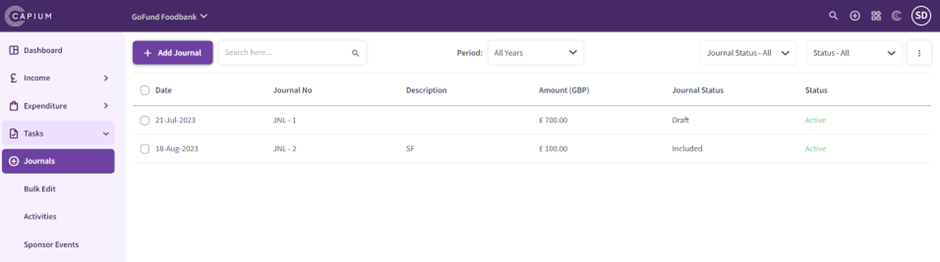
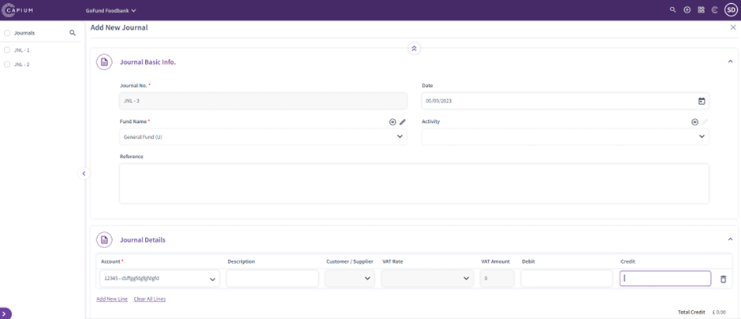
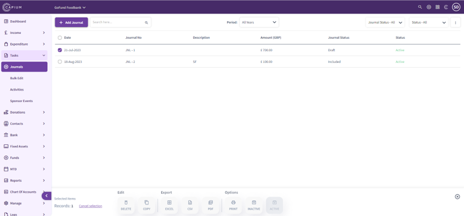
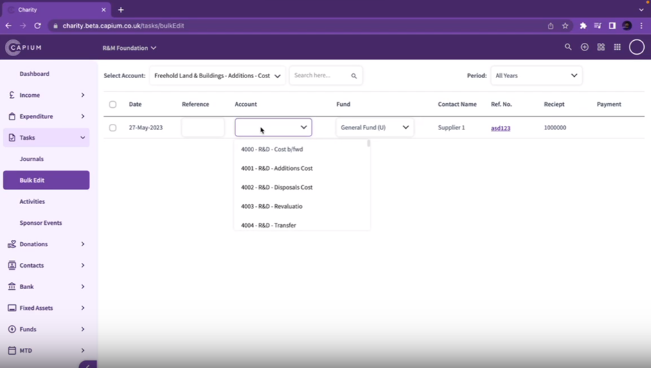
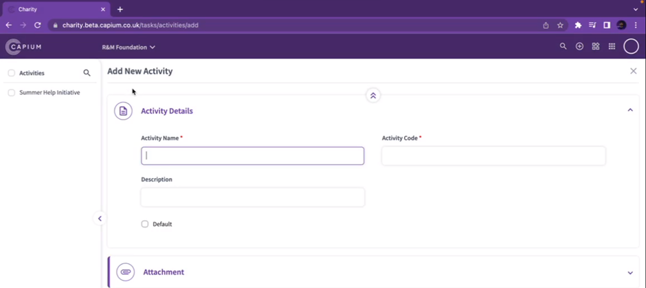
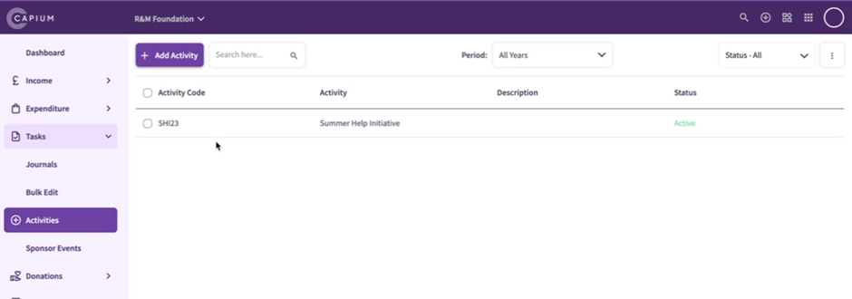
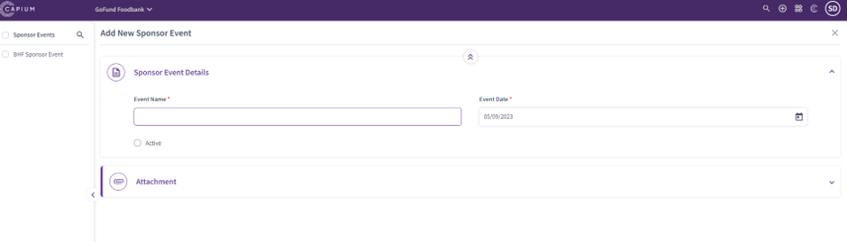
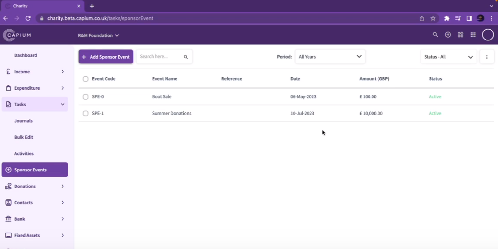

# Charity - Tasks
	 	
			
			Print

- **Category:** Charities
- **Folder:** Getting Started
- **Source URL:** [https://capium.freshdesk.com/support/solutions/articles/9000231689-charity-tasks](https://capium.freshdesk.com/support/solutions/articles/9000231689-charity-tasks)
- **Article ID:** 9000231689

## Content

Solution home 
		Charities
		Getting Started

### Charity - Tasks

			Print

	Modified on: Fri, 22 Dec, 2023 at 12:18 PM

Navigation:  Charities > Dashboard > Tasks

In the Charities Tasks section, you can see a breakdown for the following options:

Journals

Bulk Edit

Activities

Sponsor Events

Navigation:  Charities > Dashboard > Tasks > Journals

 - In Journals section, you can create journals, you’ll need to include the following:
 - Journal number
 - Date         
 - Fund name (for which the journal is related to)
 - Reference
 - Account name
 - Description
 - Debit and Credit values

You can also link the journal to a specific activity to keep track of how much the activity has generated and is performing through the reports.

You can also add attachments.

Navigation:  Charities > Dashboard > Tasks > Journals

Once journals have been created, you can:

Make them inactive/active

Filter by date

Search for a specific one

Filter by status

If you select a specific journal, you can:

Export as Excel, CSV and PDF file

Delete journals

Copy journals.

Navigation:  Charities > Dashboard > Tasks > Bulk Edit

In the Bulk Edit section, you can bulk categorise transactions from one existing account to another.

Once you select an account, you will be able to bulk recategorise transactions from one account to another.

You can search a specific transaction using a search bar option and filter transactions by date.

Navigation:  Charities > Dashboard > Tasks > Activities

In Activities section, you will be able to create activities, you’ll need to include the following:

Activity name

Activity code

Description

Add attachments.

Activities help you filter the existing Income and Expenditure through a particular activity to keep track of how each activity is performing.

Navigation:  Charities > Dashboard > Tasks > Activities

In Activities section, you will be able to:

Search activities

Filter by date

Filter by status

Navigation:  Charities > Dashboard > Tasks > Sponsor Events

In Sponsor Events section, you will be able to create events, you’ll need to include the following:

Event name

Event date

Add attachments.

Once events are created, you will be able to see the output of the income for a specific event. You can also:

Search events

Filter by date

Filter by status

										Did you find it helpful?
								Yes
								No

Send feedback	Sorry we couldn't be helpful. Help us improve this article with your feedback.

## Screenshots & Diagrams (8)

