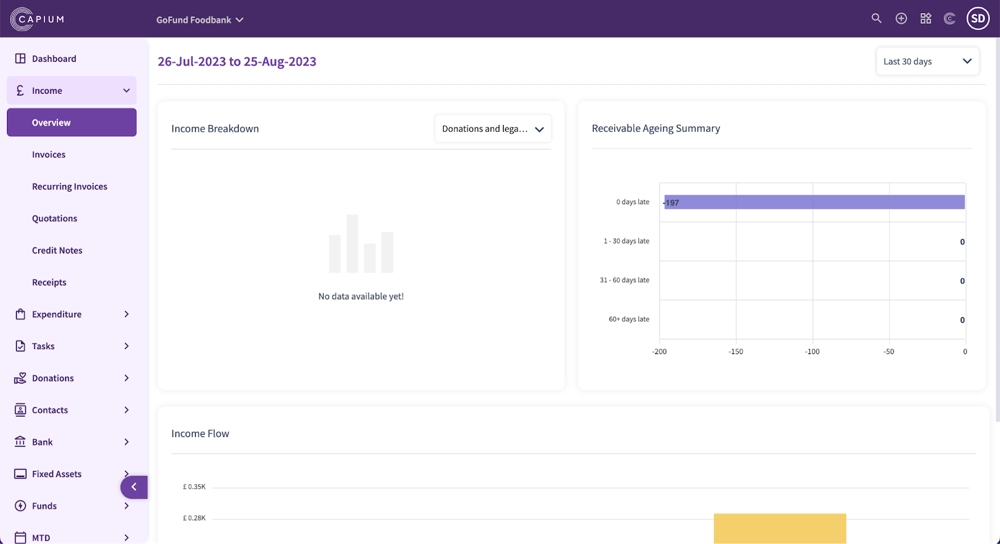
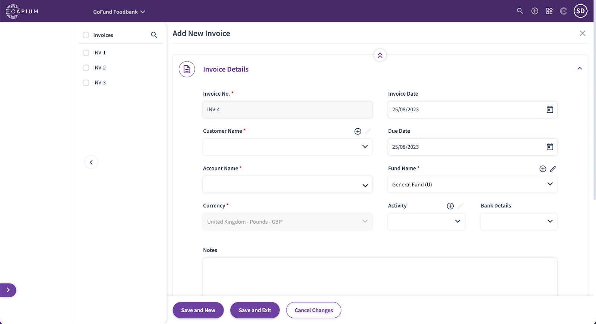
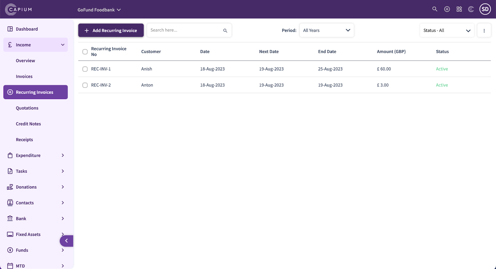
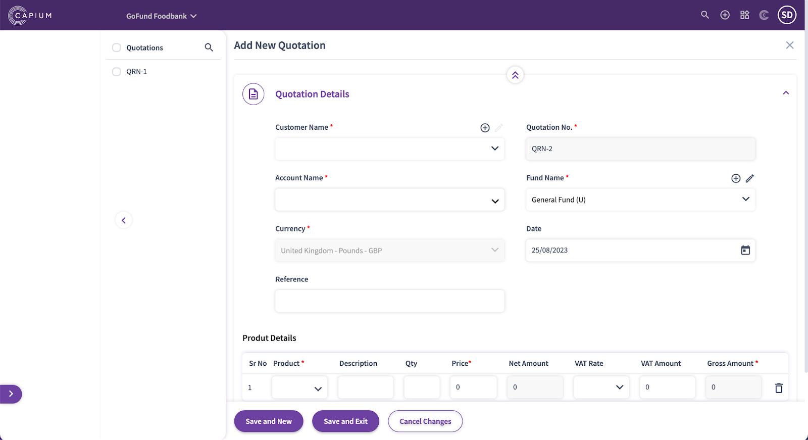
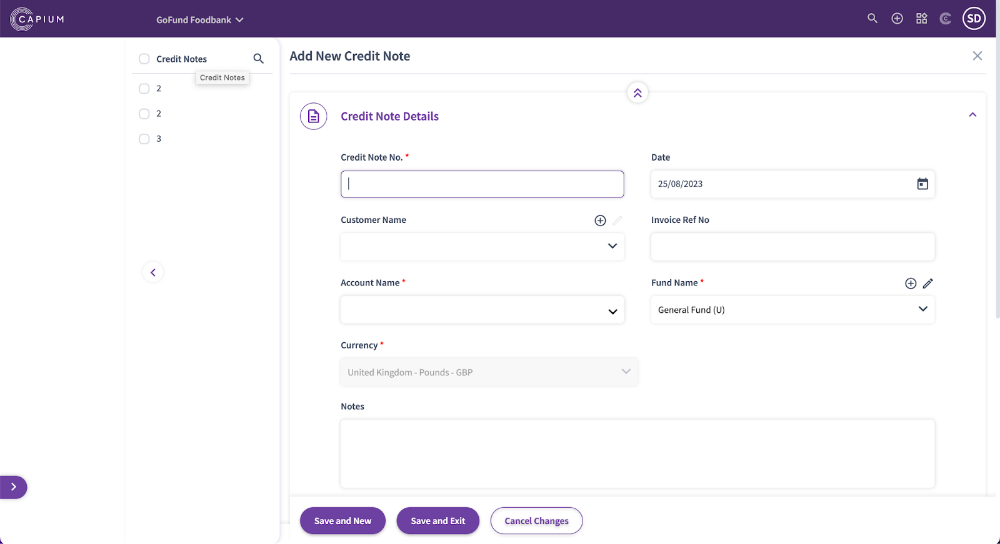
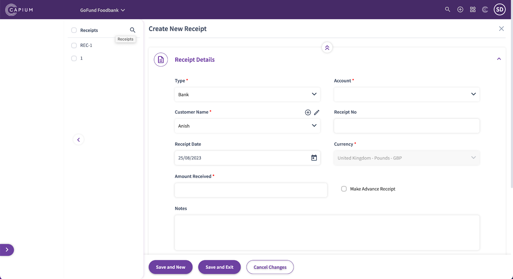

# Charity- Income
	 	
			
			Print

- **Category:** Charities
- **Folder:** Getting Started
- **Source URL:** [https://capium.freshdesk.com/support/solutions/articles/9000231703-charity-income](https://capium.freshdesk.com/support/solutions/articles/9000231703-charity-income)
- **Article ID:** 9000231703

## Content

Solution home 
		Charities
		Getting Started

### Charity- Income

			Print

	Modified on: Fri, 22 Dec, 2023 at 12:19 PM

Navigation:  Charities > Dashboard > Income > Overview

In the Charities income overview section, you can see a breakdown for the following data:

Income Breakdown

Receivable Ageing summary

Income flow

Edit the period for how long you need the reports by using the custom date filter. You can also see a breakdown of the type of expenses inputted by using the filter in the income breakdown graph.

Navigation:  Charities > Dashboard > Income > Invoices

Here, you can create custom invoices, you’ll need to include the following

Invoice number

Customer name

Account name

Currency

Fund name (for which the invoice is related to)

Product details

You can also link the invoice to a specific charity so you can keep track of how much the activity has generated and is performing through the reports

You can add the bank account, so the bank details auto populate into the invoice when sending it.

You have the ability to input receipts & attachments once product details have been inputted.

Navigation:  Charities > Dashboard > Income > Recurring Invoices

You have the ability to create recurring invoices, this follows the same steps as the above invoices, but you can also choose the frequency of how often the invoice auto generates. 

You can choose from daily, weekly, monthly, yearly or a custom time frame. You can choose when the invoice first generates by also setting an end date or selecting ‘never’ if you do not want the invoice to stop generating until you manually switch it off.

Navigation:  Charities > Dashboard > Income > Quote

Quotes can also be created on Capium, they will need to include the same information as invoices. 

You can also add the fund type & product information for quotes too.

Navigation:  Charities > Dashboard > Income > Credit Notes

You can create credit notes for customers on the system and include the following data:

Product info across multiple lines 

Add attachments for backing

Receipt allocation 

Credit allocation 

Additional notes

Navigation:  Charities > Dashboard > Income > Receipts

Here, you have the option to manually create receipts in whichever method of payment was used, bank or cash and allocate to the relevant account code.

Add attachments for the receipts

Export receipts as PDF & edit them

										Did you find it helpful?
								Yes
								No

Send feedback	Sorry we couldn't be helpful. Help us improve this article with your feedback.

## Screenshots & Diagrams (6)

