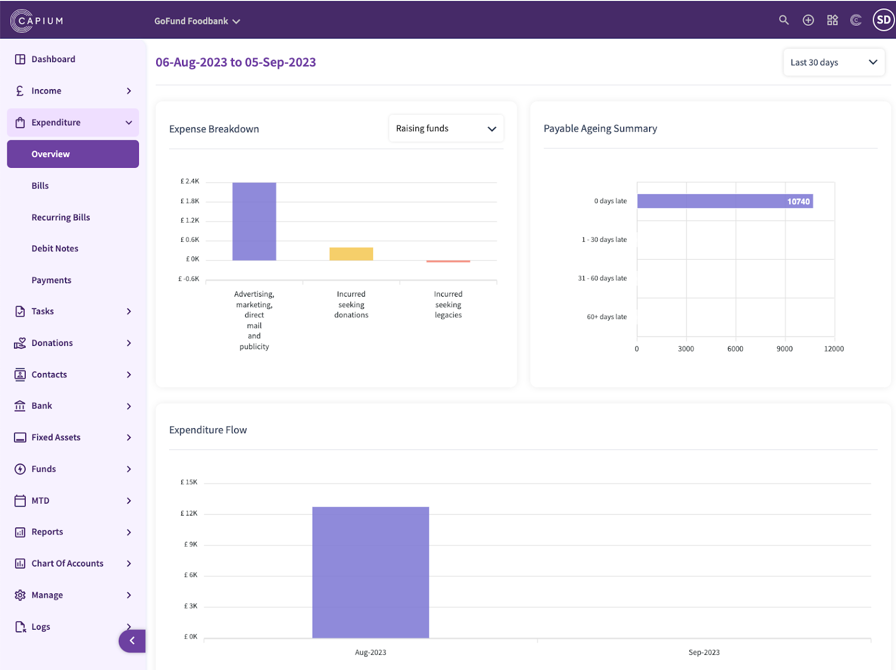
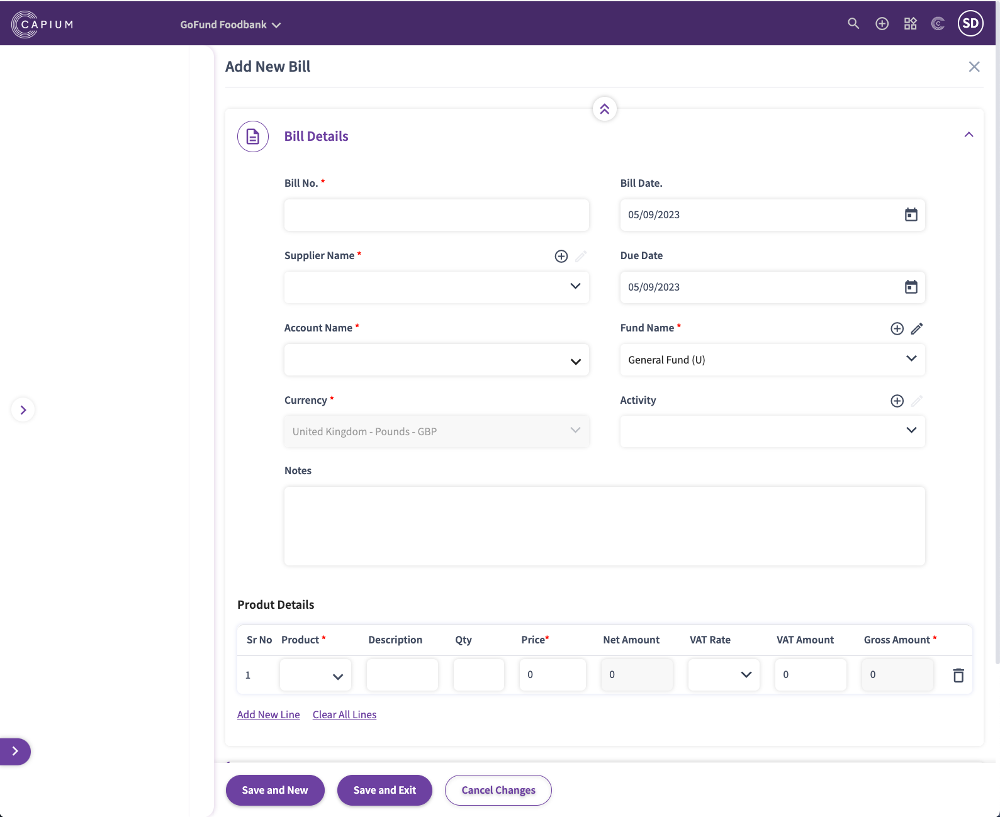
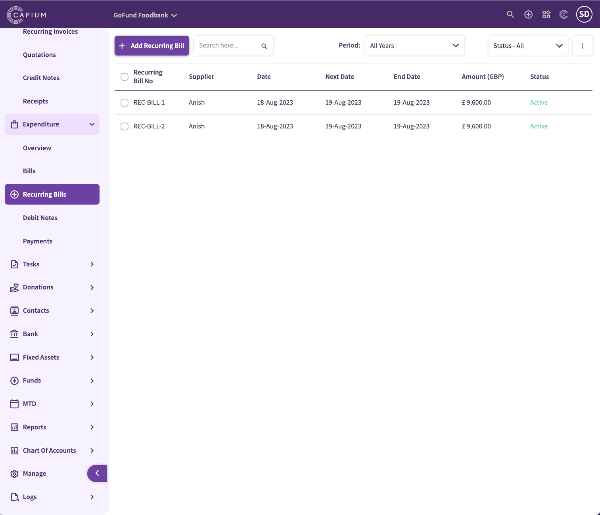
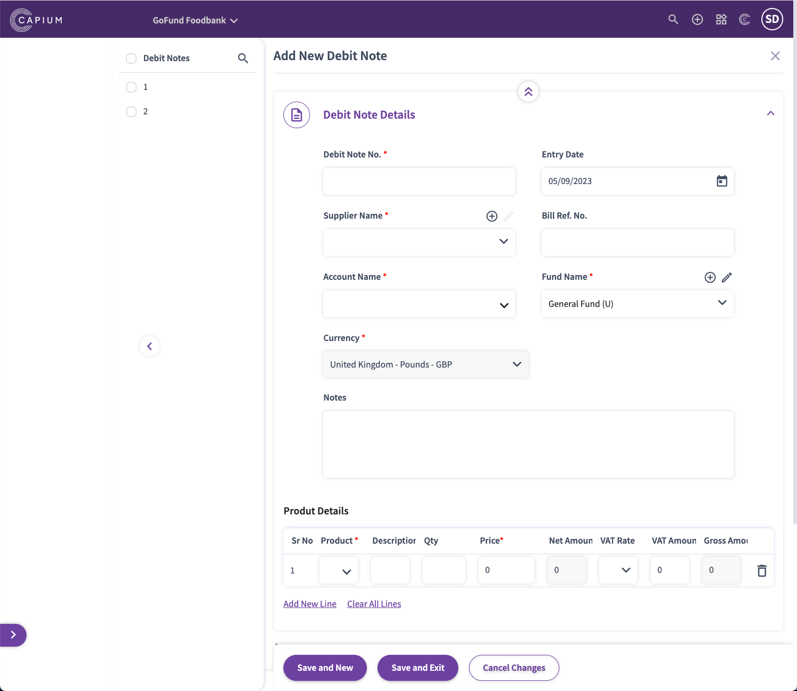

# Charity - Expenditure
	 	
			
			Print

- **Category:** Charities
- **Folder:** Getting Started
- **Source URL:** [https://capium.freshdesk.com/support/solutions/articles/9000231704-charity-expenditure](https://capium.freshdesk.com/support/solutions/articles/9000231704-charity-expenditure)
- **Article ID:** 9000231704

## Content

Solution home 
		Charities
		Getting Started

### Charity - Expenditure

			Print

	Modified on: Fri, 22 Dec, 2023 at 12:19 PM

Navigation:  Charities > Dashboard > Expenditure > Overview

In the Charities Expenditure overview section, you can see a breakdown for the following data:

Expense Breakdown

Payable Ageing summary

Expenditure flow

Edit the period for how long you need the reports by using the custom date filters as well as seeing a breakdown for the type of expenses by using the expense breakdown filter.

Navigation:  Charities > Dashboard > Expenditure > Bills

Here, you can create custom bills, you’ll need to include the following:

Bill number

Bill date

Supplier name

Account name

Currency

Fund name (for which the invoice is related to)

Product details

You can also link the bill to a specific charity activity, so you can keep track of how much the activity has generated and is performing through the reports.

You have the ability to input payments to match the bill to & attachments below once the product details have been populated.

Navigation:  Charities > Dashboard > Expenditure > Recurring Bills

You have the ability to create recurring bills, this follows the same steps as the above bills, but you can also choose the frequency of how often the bill auto generates. 

You can choose from daily, weekly, monthly, yearly or a custom time frame. You can choose when the bill first generates by also setting an end date or selecting ‘never’ if you do not want the bill to stop generating until you manually switch it off.

Navigation:  Charities > Dashboard > Expenditure > Debit Notes

Debit notes can also be inputted on the system. You can select a specific supplier and account code using the drop down. Once these fields have been inputted, the system will automatically try to select the relevant receipt allocation for you.

Navigation:  Charities > Dashboard > Expenditure > Payments

In the payments section, any payments from the bills section can be kept track of as well as adding in manual payments for any bills that have been raised to match them off.

When a payment is added manually inside the payment section, this will also add an entry in the bank or cash accounts for you automatically.

Note: There are also areas where you can match payments and bills together, this can also be done through the bank section inside the bank account itself too.

										Did you find it helpful?
								Yes
								No

Send feedback	Sorry we couldn't be helpful. Help us improve this article with your feedback.

## Screenshots & Diagrams (4)

