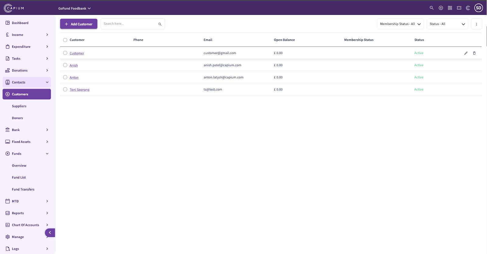
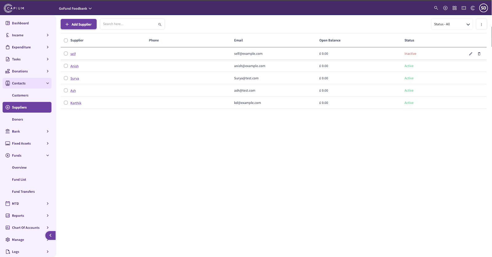
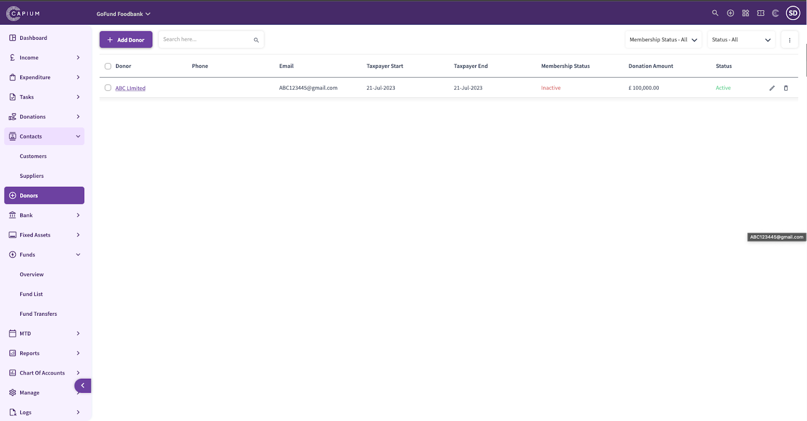

# Charity - Contacts
	 	
			
			Print

- **Category:** Charities
- **Folder:** Getting Started
- **Source URL:** [https://capium.freshdesk.com/support/solutions/articles/9000231738-charity-contacts](https://capium.freshdesk.com/support/solutions/articles/9000231738-charity-contacts)
- **Article ID:** 9000231738

## Content

Solution home 
		Charities
		Getting Started

### Charity - Contacts

			Print

	Modified on: Fri, 22 Dec, 2023 at 12:19 PM

Customers

Navigation: Charity > Contacts > Customers

To add customers, you have two options:

Select ‘+Add Customer’ to create customers individually.

Use ‘Import’ to create customers in bulk by utilising the provided template XLSX file.

For each customer, ensure you provide the following details:

Contact Details

Commercial Details

Membership / Subscription Details

Suppliers

Navigation: Charity > Contacts > Suppliers

To add suppliers, you have two options:

Select ‘+Add Supplier’ to create suppliers individually.

Use ‘Import’ to create suppliers in bulk by utilising the provided template XLSX file.

For each supplier, ensure you provide the following details:

Contact Details

Commercial Details

Donors

Navigation: Charity > Contacts > Donors

To add Donors, select ‘+Add Donors’ to create Donors individually.

For each supplier, ensure you provide the following details:

Contact Details

Membership / Subscription Details

										Did you find it helpful?
								Yes
								No

Send feedback	Sorry we couldn't be helpful. Help us improve this article with your feedback.

## Screenshots & Diagrams (3)

