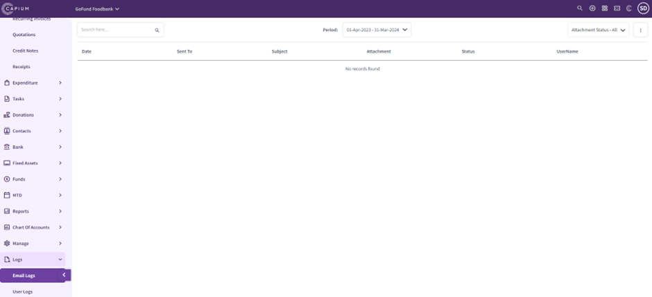
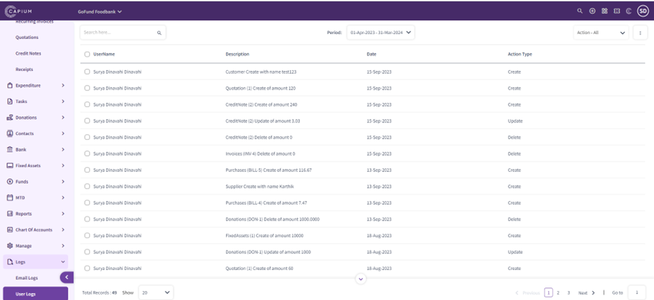

# Charity – Logs
	 	
			
			Print

- **Category:** Charities
- **Folder:** Getting Started
- **Source URL:** [https://capium.freshdesk.com/support/solutions/articles/9000231743-charity-logs](https://capium.freshdesk.com/support/solutions/articles/9000231743-charity-logs)
- **Article ID:** 9000231743

## Content

Solution home 
		Charities
		Getting Started

### Charity – Logs

			Print

	Modified on: Fri, 15 Sep, 2023 at  4:07 PM

		Navigation:  Charities > Dashboard > Logs > Email Logs

In the Charities Logs section, you can keep track of what emails have been sent and to whom they have been sent. 

You will be able to:

Search logs

Filter by date

Filter by status

Navigation:  Charities > Dashboard > Logs > User Logs

In the Charities Logs section, you can keep track of what user made changes within the Charity module and what changes have been made.

You will be able to:

Search logs

Filter by date

Filter by status

										Did you find it helpful?
								Yes
								No

Send feedback	Sorry we couldn't be helpful. Help us improve this article with your feedback.

## Screenshots & Diagrams (2)

