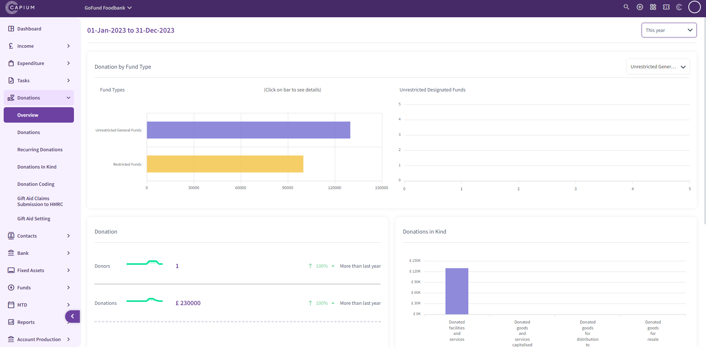
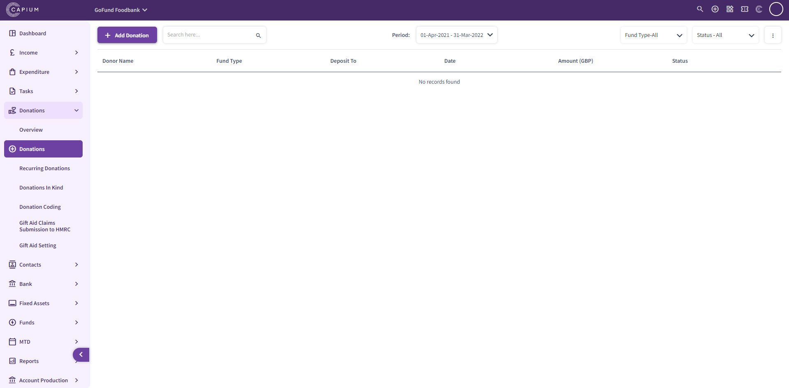
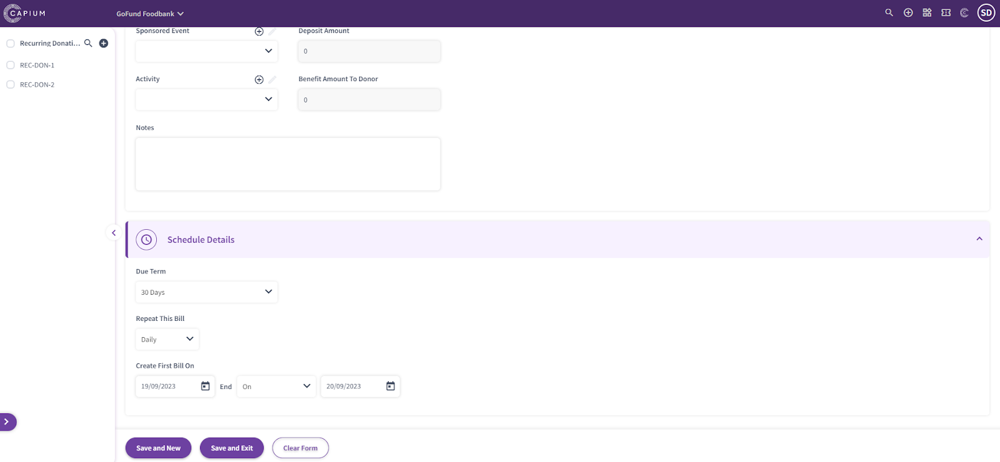
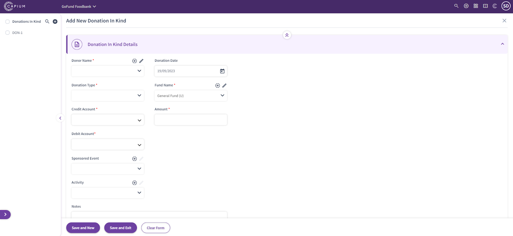
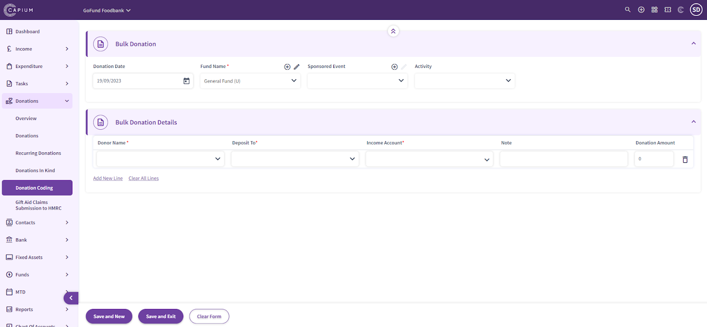
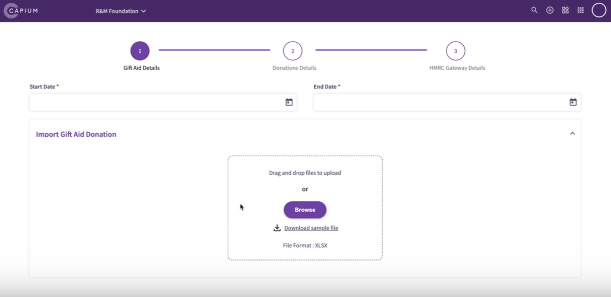
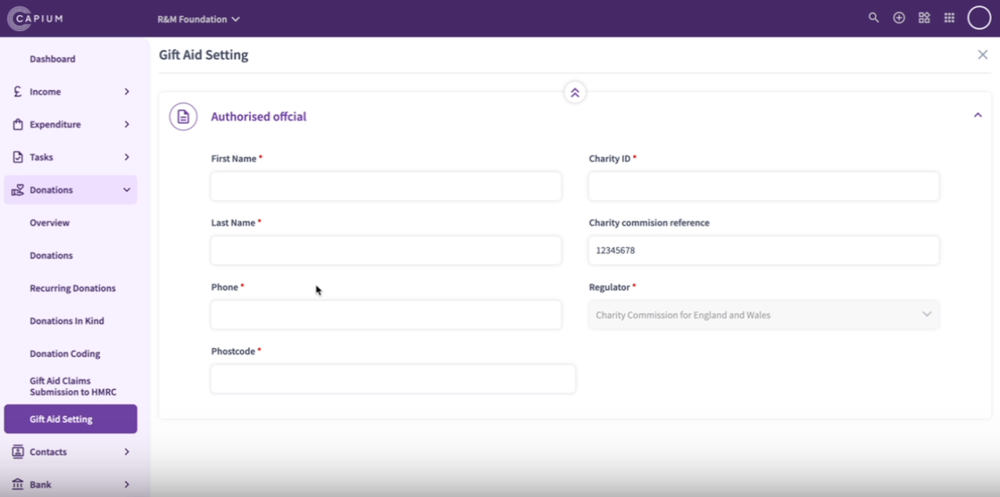

# Charities - Donations
	 	
			
			Print

- **Category:** Charities
- **Folder:** Getting Started
- **Source URL:** [https://capium.freshdesk.com/support/solutions/articles/9000231821-charities-donations](https://capium.freshdesk.com/support/solutions/articles/9000231821-charities-donations)
- **Article ID:** 9000231821

## Content

Solution home 
		Charities
		Getting Started

### Charities - Donations

			Print

	Modified on: Fri, 22 Dec, 2023 at 12:19 PM

Navigation:  Charities > Dashboard > Donations > Overview

In the Charities Donation Overview section, you can see a breakdown for the following options:

Donation funds

Donations

Donors

Donations in Kind

Donation Flow

You can also filter the information by date and by donation fund.

Navigation:  Charities > Dashboard > Donations > Donations

In the Charities Donation section, you can add donations by populating the relevant fields:

Donor Name

Donation Date

Deposited To

Fund Name

Income Account

Donation Amount

Sponsored Event

Activity 

You can also add attachments and create notes. 

Navigation:  Charities > Dashboard > Donations > Recurring Donations

In the Charities Recurring Donation section, you can add recurring donations by populating the relevant fields:

Donor Name

Donation Date

Deposited To

Fund Name

Income Account

Donation Amount

Sponsored Event

Activity 

Schedule Details (Due date, repeat bill, create first bill)

You can also add attachments and create notes. 

Navigation:  Charities > Dashboard > Donations > Donations in Kind

In the Charities Donations in Kind section, you can add donations in kind by populating the relevant fields:

Donor Name

Donation Date

Donation Type

Fund Name

Credit Account

Debit Account

Donation Amount

Sponsored Event

Activity 

You can also add attachments and create notes. 

Navigation:  Charities > Dashboard > Donations > Donation Coding

In the Charities Donation Coding section, you can add bulk donations by populating the relevant fields:

Donation Date

Fund Name

Sponsored Event

Activity

Bulk Donation Details:

Donor Name

Deposit To

Income Account

Note

Amount

Navigation:  Charities > Dashboard > Donations > Gift Aid Claims Submission to HMRC

In the Charities Gift Aid Claims Submission to HMRC section, you can submit claims to HMRC by populating the relevant fields:

Start Date 

End Date

Upload files to make a submission

Navigation:  Charities > Dashboard > Donations > Gift Aid Setting

In the Charities Gift Aid Setting section, you can authorise official for the gift aid by populating the relevant fields:

First Name

Last Name

Charity ID

Charity Commission Reference

Phone Number

Postcode

Regulator

										Did you find it helpful?
								Yes
								No

Send feedback	Sorry we couldn't be helpful. Help us improve this article with your feedback.

## Screenshots & Diagrams (8)

