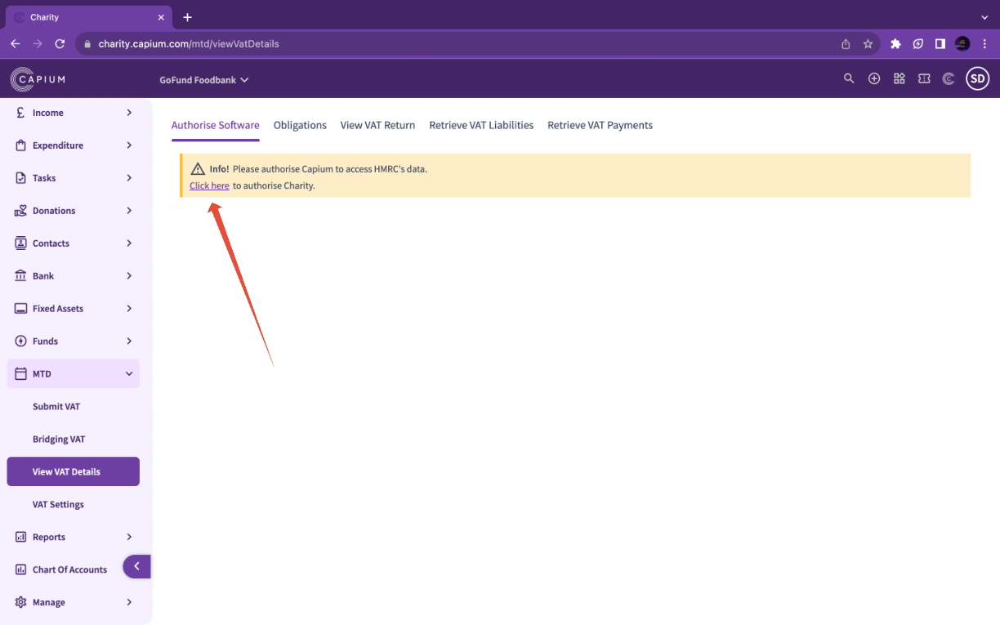
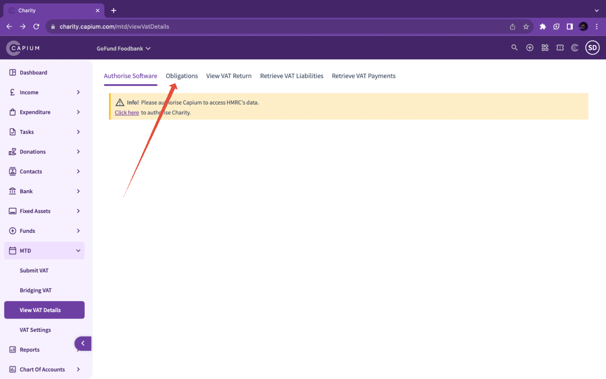

# Charity - MTD VAT Setup
	 	
			
			Print

- **Category:** Charities
- **Folder:** Getting Started
- **Source URL:** [https://capium.freshdesk.com/support/solutions/articles/9000231917-charity-mtd-vat-setup](https://capium.freshdesk.com/support/solutions/articles/9000231917-charity-mtd-vat-setup)
- **Article ID:** 9000231917

## Content

Solution home 
		Charities
		Getting Started

### Charity - MTD VAT Setup

			Print

	Modified on: Fri, 17 Oct, 2025 at 12:12 PM

		Navigation: Charity Module > Select Client > MTD > View VAT Details 

Please Note: You will have to authorise the software on a client by client basis

Help Guide 

1. To begin, head to the MTD section by following the navigation above where you'll greeted with the below screen.

2. Once you have navigated to this section you will see five tabs appear. You will need to navigate to 'Authorise Software' tab. Once you are here click on the authorise button as illustrated in the above picture. 

3. You will now be redirected to the HMRC page, where you will finish the forms to authorise Capium to do MTD VAT submission. 

Once the software is recognised from the HMRC side, you will be redirected back to Capium. 

4. To verify the authorisation from Capium please navigate back to MTD > View VAT Details. Then select 'Obligations' as shown on the screenshot below. 

										Did you find it helpful?
								Yes
								No

Send feedback	Sorry we couldn't be helpful. Help us improve this article with your feedback.

## Screenshots & Diagrams (2)

