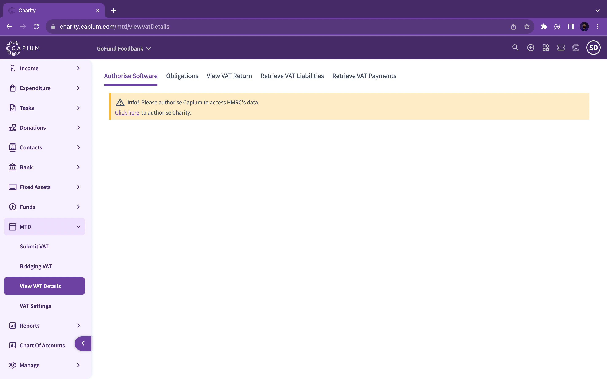

# Charity - MTD VAT
	 	
			
			Print

- **Category:** Charities
- **Folder:** Getting Started
- **Source URL:** [https://capium.freshdesk.com/support/solutions/articles/9000231919-charity-mtd-vat](https://capium.freshdesk.com/support/solutions/articles/9000231919-charity-mtd-vat)
- **Article ID:** 9000231919

## Content

Solution home 
		Charities
		Getting Started

### Charity - MTD VAT

			Print

	Modified on: Fri, 22 Dec, 2023 at 12:19 PM

Once you have authorised the MTD VAT as shown in this article. 

You can proceed to use MTD VAT in two forms. 

1. Direct MTD Submission 

2. Bridging MTD Submission

The direct MTD submissions can be used when you do your charity's bookkeeping within Capium. 

Bridging VAT Submissions can be used when you have your bookkeeping records outside Capium. This tool is also recommended to be used when you are submitting for multiple VAT periods. 

										Did you find it helpful?
								Yes
								No

Send feedback	Sorry we couldn't be helpful. Help us improve this article with your feedback.

## Screenshots & Diagrams (1)

