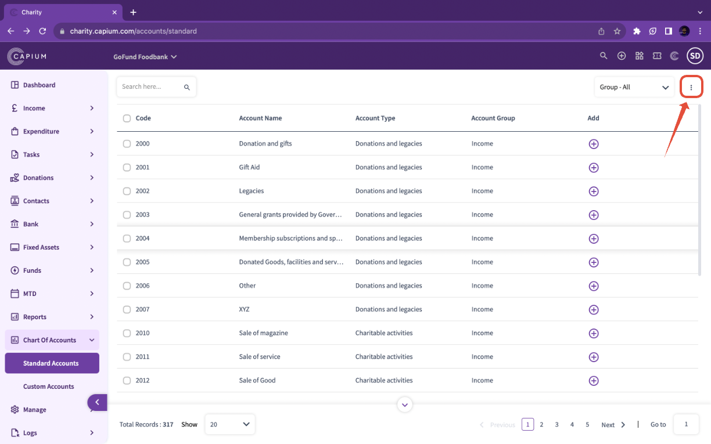
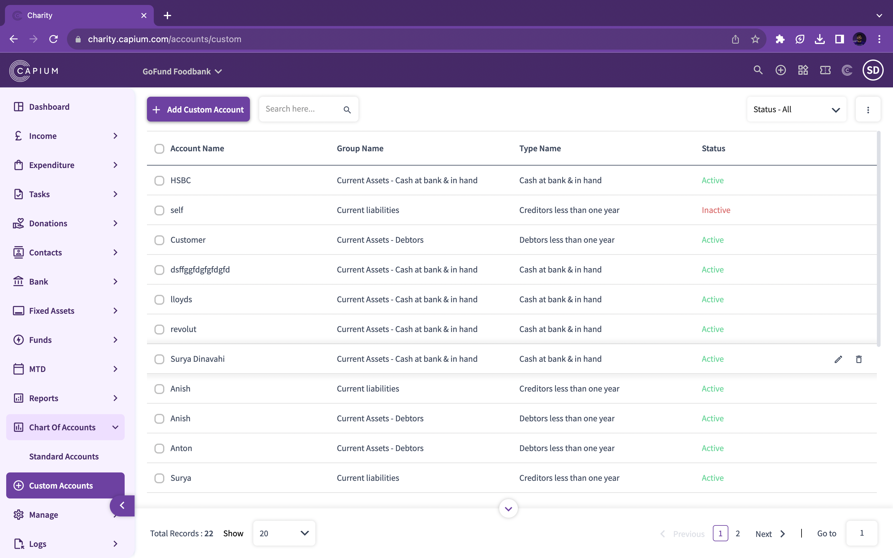
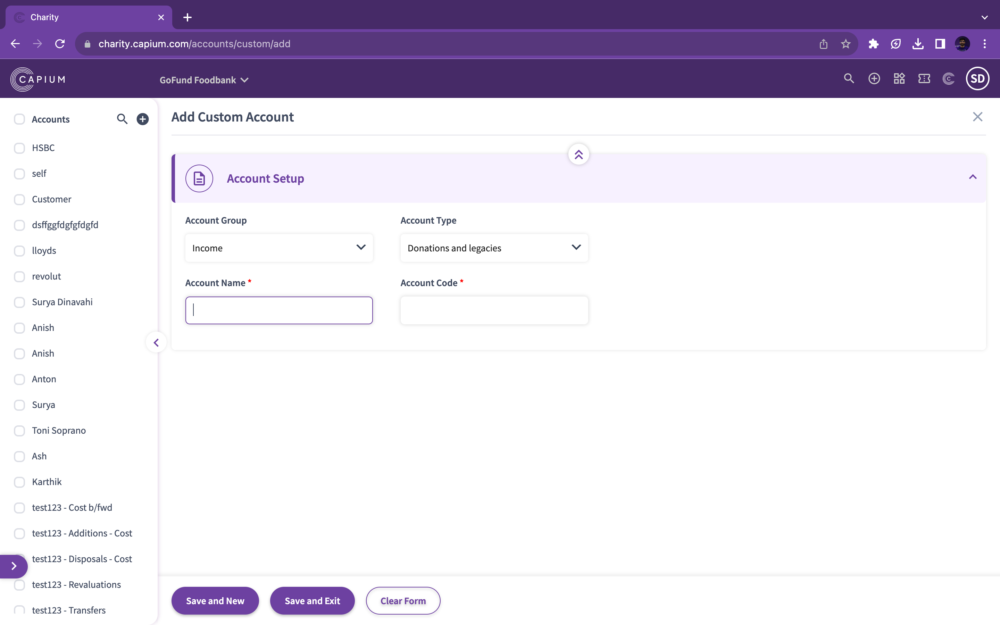

# Charity - Charts of Accounts
	 	
			
			Print

- **Category:** Charities
- **Folder:** Getting Started
- **Source URL:** [https://capium.freshdesk.com/support/solutions/articles/9000231920-charity-charts-of-accounts](https://capium.freshdesk.com/support/solutions/articles/9000231920-charity-charts-of-accounts)
- **Article ID:** 9000231920

## Content

Solution home 
		Charities
		Getting Started

### Charity - Charts of Accounts

			Print

	Modified on: Thu, 21 Sep, 2023 at  9:24 AM

Location: Charity module > Select a client >  Charts of Accounts

Alternatively please click on this link to be redirected. 

Chart of Accounts display the list of various accounts that are maintained with their codes that are inbuilt. The list of accounts showing the account name, type under which account is grouped with their codes. 

There are several functions that you can perform when working with charts of accounts. 

Red Arrow points towards the bulk export sections where you will be able to export all the charts of accounts into either a PDF or Excel Format. 

### 

### Custom Charts of Accounts

You can add multiple subcategories within each account type  the details related to the account using the Action drop-down. On editing, the Account Type and Account Code cannot be changed/edited.

### 

### Add Custom Account

You may add a new account relating to Profit & Loss Account, by clicking on ‘+ Add Account’.

Select the account type under which the created account will be classified.

Account code is to be selected from the drop-down list, to give a code number to the created account.

On saving the created account, it will be added to the list of custom chart of accounts.

You can filter the accounts by specifying the code or account name.

Accounts can be filtered alphabetically, by selecting the alphabet all the accounts starting with that alphabet will be filtered and listed.

Accounts can be filtered according to its type. This can be done by the Status drop-down. There are two types:

Normal: To use this filter you will have to specify the account name in the text box. This will filter the respective account.

Archive: On selecting the archive all the accounts which are inactive and saved as archive will be displayed. The account can be un-archived by editing it and putting a tick on the active checkbox.

You may download the list of the chart of accounts in a PDF form or an excel sheet. These buttons are provided on the upper right corner of the screen.

										Did you find it helpful?
								Yes
								No

Send feedback	Sorry we couldn't be helpful. Help us improve this article with your feedback.

## Screenshots & Diagrams (3)

