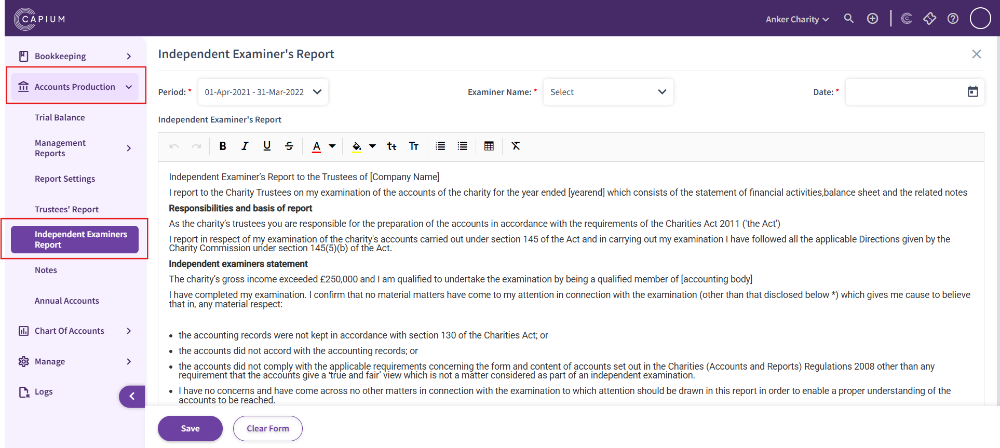
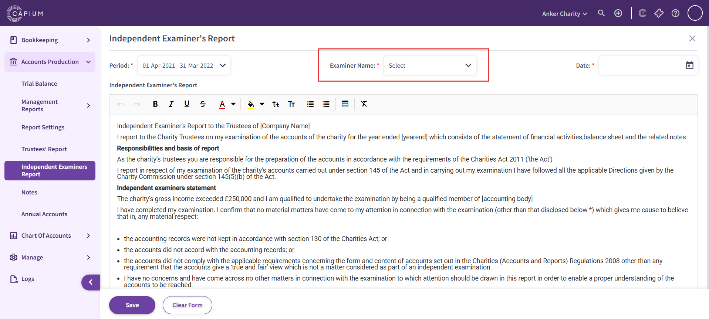

# Charity - Independent Examiner&#39;s Report
	 	
			
			Print

- **Category:** Charities
- **Folder:** Getting Started
- **Source URL:** [https://capium.freshdesk.com/support/solutions/articles/9000268923-charity-independent-examiner-s-report](https://capium.freshdesk.com/support/solutions/articles/9000268923-charity-independent-examiner-s-report)
- **Article ID:** 9000268923

## Content

Solution home 
		Charities
		Getting Started

### Charity - Independent Examiner&#39;s Report

			Print

	Modified on: Fri, 4 Jul, 2025 at  9:16 AM

		Navigation: Charity > [Client Specific] > Accounts Production > Independent Examiner's Report

Capium has introduced a refreshed version of the Independent Examiner's Report section. Users will now find a new default report template available in this area.

Please note, if you have previously completed this section, your existing content will remain unchanged and the new default report will not appear. However, if the section is currently blank, the updated report template will be accessible for use.

As always, you retain full control over the content—this report can be edited or deleted according to your preferences.

This new report template can be seen below:

Independent Examiner’s Report to the Trustees of [Company Name]

I report to the Charity Trustees on my examination of the accounts of the charity for the year ended [yearend] which consists of the statement of financial activities,balance sheet and the related notes

Responsibilities and basis of report

As the charity’s trustees you are responsible for the preparation of the accounts in accordance with the requirements of the Charities Act 2011 ('the Act')

I report in respect of my examination of the charity's accounts carried out under section 145 of the Act and in carrying out my examination I have followed all the applicable Directions given by the Charity Commission under section 145(5)(b) of the Act.

Independent examiners statement

The charity’s gross income exceeded £250,000 and I am qualified to undertake the examination by being a qualified member of [accounting body]

I have completed my examination. I confirm that no material matters have come to my attention in connection with the examination (other than that disclosed below *) which gives me cause to believe that in, any material respect:

 - the accounting records were not kept in accordance with section 130 of the Charities Act; or
 - the accounts did not accord with the accounting records; or
 - the accounts did not comply with the applicable requirements concerning the form and content of accounts set out in the Charities (Accounts and Reports) Regulations 2008 other than any requirement that the accounts give a ‘true and fair’ view which is not a matter considered as part of an independent examination.
I have no concerns and have come across no other matters in connection with the examination to which attention should be drawn in this report in order to enable a proper understanding of the accounts to be reached.

When producing the annual accounts, if you wish to include this report, ensure to select the examiner's name from the dropdown menu:

Once the Independent Examiner's Report is done and all aspects have been completed, make sure to press 'Save' at the bottom to implement these changes.

										Did you find it helpful?
								Yes
								No

Send feedback	Sorry we couldn't be helpful. Help us improve this article with your feedback.

## Screenshots & Diagrams (2)

