# Charity Updates - July 2025
	 	
			
			Print

- **Category:** Charities
- **Folder:** Getting Started
- **Source URL:** [https://capium.freshdesk.com/support/solutions/articles/9000269219-charity-updates-july-2025](https://capium.freshdesk.com/support/solutions/articles/9000269219-charity-updates-july-2025)
- **Article ID:** 9000269219

## Content

Solution home 
		Charities
		Getting Started

### Charity Updates - July 2025

			Print

	Modified on: Fri, 4 Jul, 2025 at  1:12 AM

		Within our Charity module, we have released a few new updates. This article aims to inform you of these changes, which are listed below.

 - Additional Disclosures - Accounts Production
 - Setting up a Bank
 - Bank and Fund Transfers
 - Fund Wise Balance Sheet

### Additional Disclosures - Accounts Production

Navigation: Charity > Accounts Production > Additional Disclosures

Within Accounts Production, we have added a new section called 'Additional Disclosures'. Within this drop down you will find 'Additional Notes' and 'Additional Accounting Policy'.

These disclosures will appear below the 'Notes' section on your accounts.

To add an additional note or accounting policy, navigate to the 'Additional Notes' or 'Additional Accounting Policy' section. You will find a purple button at the top left of the screen labelled '+ Add Notes', or '+ Add Accounting Policies'.

Once clicked on, you can fill out the pop-up that appears and press 'Save'.

If you would like to edit this note, you can press the pen icon at the end of the row:

To make the note active or inactive, you can click on the checkbox next to the name, and at the bottom of the screen you will be able to find options on this.

### Setting up a Bank

Navigation: Charity > Bookkeeping > Bank > Overview

Previously, when setting up a bank account, it was not imperative to link it to a fund.

However, in this update, when setting up bank accounts you now have to link it to a fund:

If you have previously set up a bank account in our charities module, it will be allocated to a fund automatically. To change and check this fund, navigate to the below:

Navigation: Charity > Chart of Accounts > Custom Accounts

Once in this screen, you can click the pen icon at the end of the row where your bank is listed to edit.

In this area, you will be able to see a 'Fund Name' drop down. In this drop down, you can click to add fund types in, or press the 'x' next to the fund name to remove them from that bank.

Once done, please press 'Save'.

### Bank and Fund Transfers

There are now two ways to do transfers in your charity module the first being a Bank transfer. For this navigate to the below:

Navigation: Charity > Bookkeeping > Bank > Bank Transfers

To do a bank transfer, press the '+ Add Bank Transfer' button in the top left. In the page that pops up, you will have to add in:

The bank account being transferred from;
The fund being transferred from;
The bank account being transferred to;
The fund transferred to;
The amount; and
The reference.

Ensure to press 'Save'.

To do a fund transfer, navigate to the below:

Navigation: Charity > Bookkeeping > Funds > Fund Transfers

To do a fund transfer, press the '+ Add Fund Transfer' button in the top left. In the page that pops up, you will have to add in:

The fund being transferred from;
The fund transferred to;
The amount; and
The reference.

Ensure to press 'Save'.

### Fund Wise Balance Sheet

The last change we have made is the ability to view a Fund Wise Balance Sheet.

To do this, please navigate to the below:

Navigation: Charity > Manage > Charity Profile

A fund wise balance sheet is only available to an Un-incorporated charity type and a CIO.

You will find the option to turn it on here:

Once turned on, your balance sheet becomes fund wise, and you can check this by going to the below:

Navigation: Charity > Accounts Production > Management Reports > Balance Sheet

If this is turned off, you will just see the total funds column and the prior year funds column.

										Did you find it helpful?
								Yes
								No

Send feedback	Sorry we couldn't be helpful. Help us improve this article with your feedback.

## Screenshots & Diagrams (16)

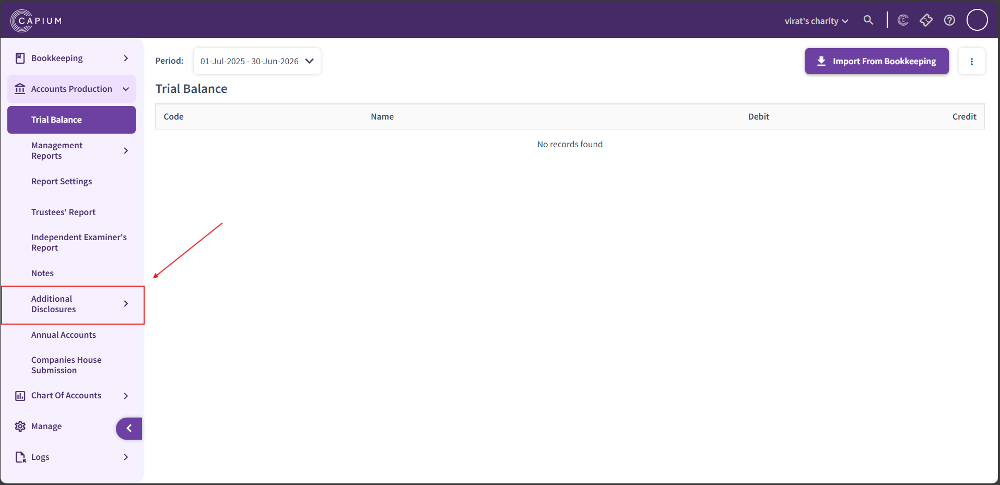

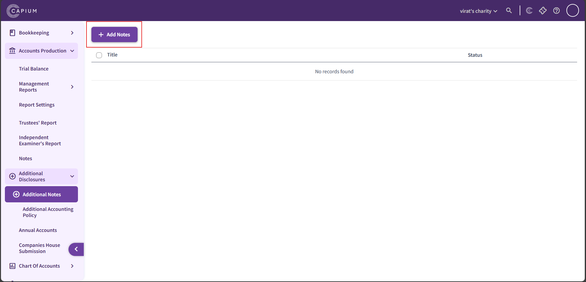

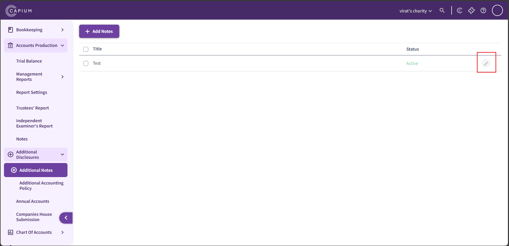

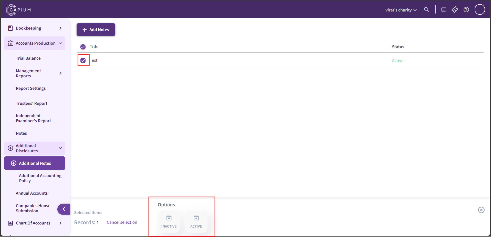

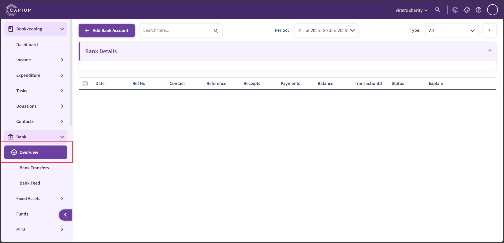

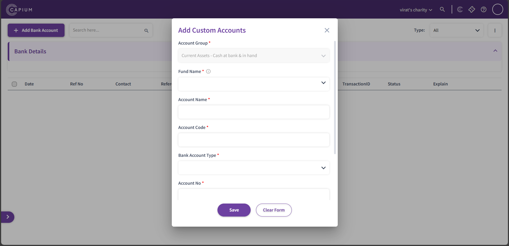

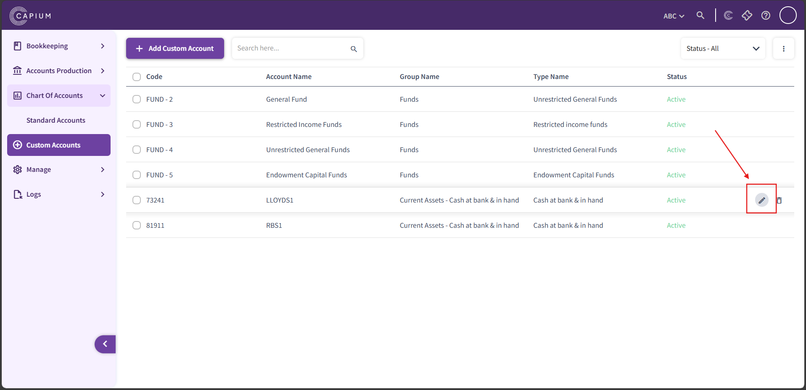

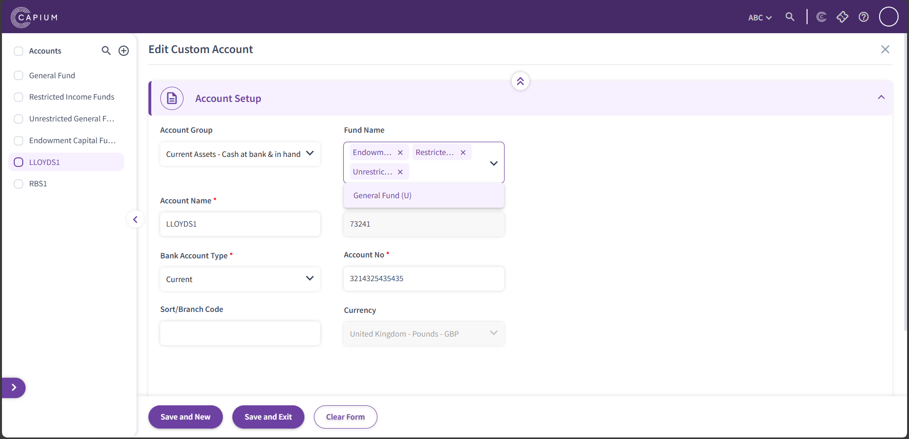

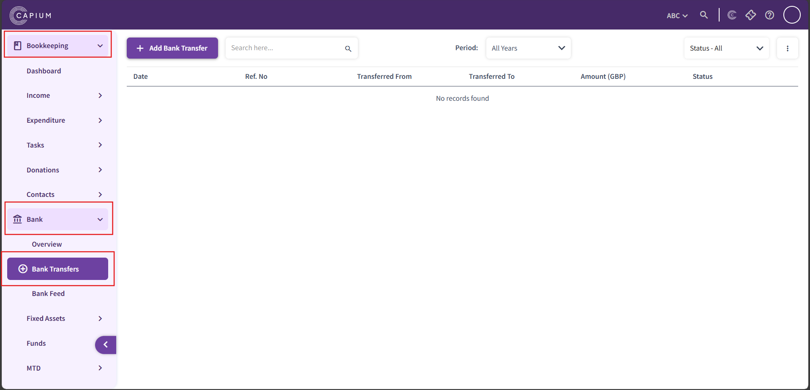

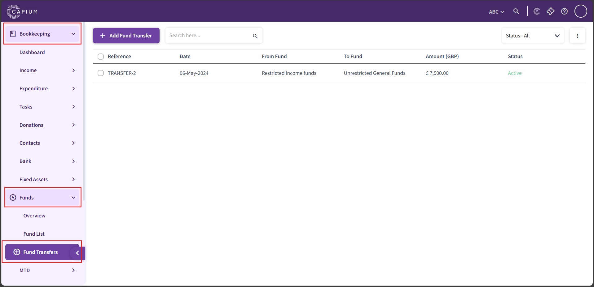

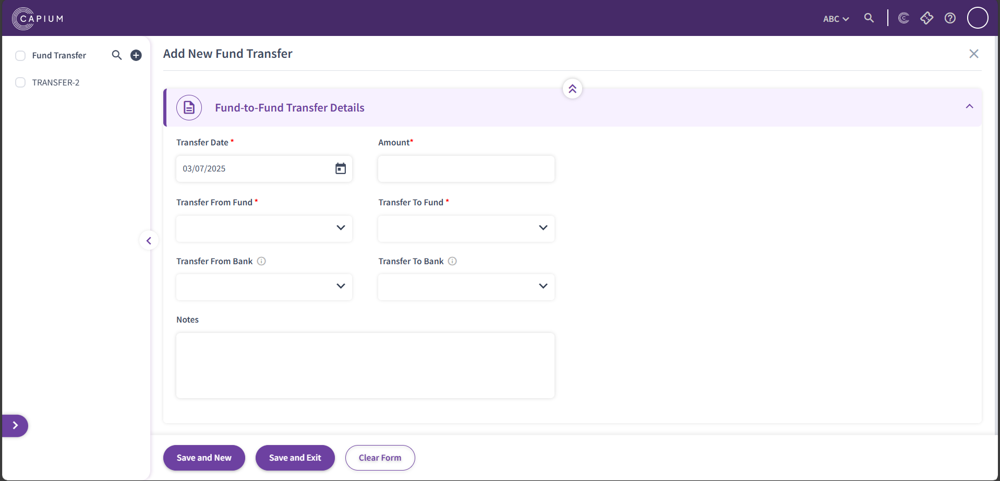

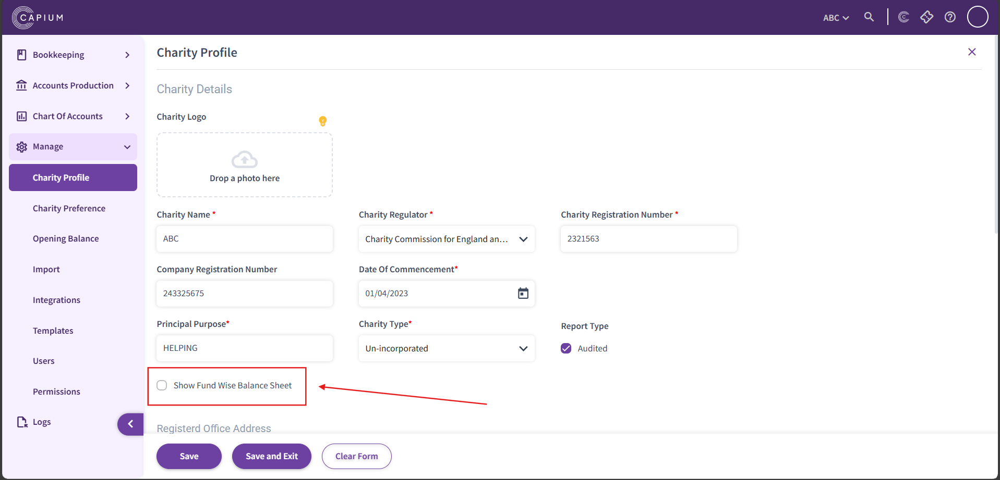

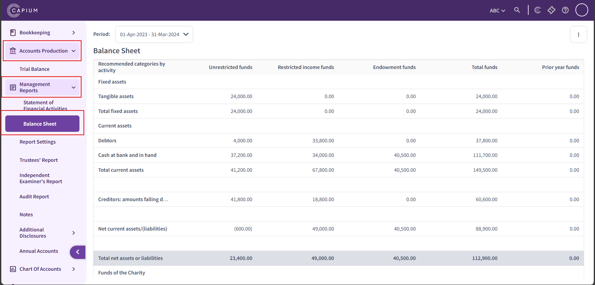

