# How to Submit Corporation Tax for Charity accounts
	 	
			
			Print

- **Category:** Charities
- **Folder:** Getting Started
- **Source URL:** [https://capium.freshdesk.com/support/solutions/articles/9000277518-how-to-submit-corporation-tax-for-charity-accounts](https://capium.freshdesk.com/support/solutions/articles/9000277518-how-to-submit-corporation-tax-for-charity-accounts)
- **Article ID:** 9000277518

## Content

Solution home 
		Charities
		Getting Started

### How to Submit Corporation Tax for Charity accounts

			Print

	Modified on: Tue, 30 Jun, 2026 at 11:54 AM

1. Create annual accounts for a charitable company limited by guarantee using the Charity module.

 Navigation : Charity > Client specific > Manage Profile > Charity type >Charitable company (Limited by Guarantee).

Navigation : Charity > Accounts Production > Annual accounts 

2. Download these accounts in the form of a PDF. 

3. Create a CT600 in the CT module, attach these PDF accounts to the CT600 using the file attachment option.
 
 Navigation : Corporation Tax > Client specific > Add CT600 > Attach file

4. Select the type of company as Charity by navigating to the CT module >> Client Specific >> Edit the return >> Main form >> box-4 of CT600 page 1. 

5. Add a CT600E supplementary form by navigating to Main form >>box-115 of CT600 page 2. 

6. Prepare the CT600 by entering the relevant incomes and make the necessary tax adjustments in the CT600 main form and the CT600E supplementary form in order to get tax exemption.

7. Once done with the CT600, click Submit option to make the submissions.

										Did you find it helpful?
								Yes
								No

Send feedback	Sorry we couldn't be helpful. Help us improve this article with your feedback.

## Screenshots & Diagrams (11)

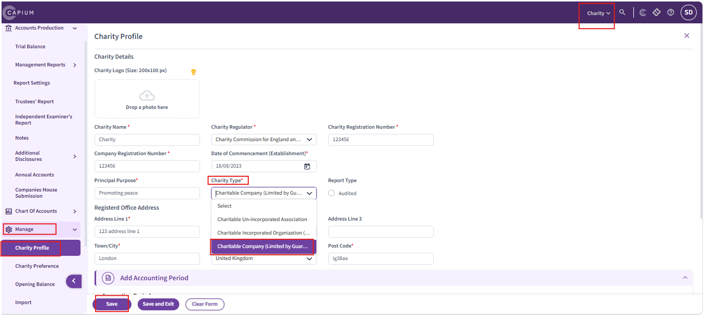

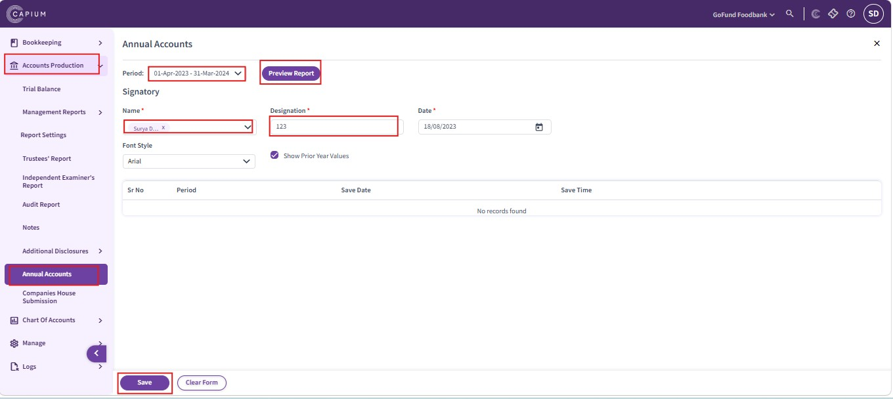

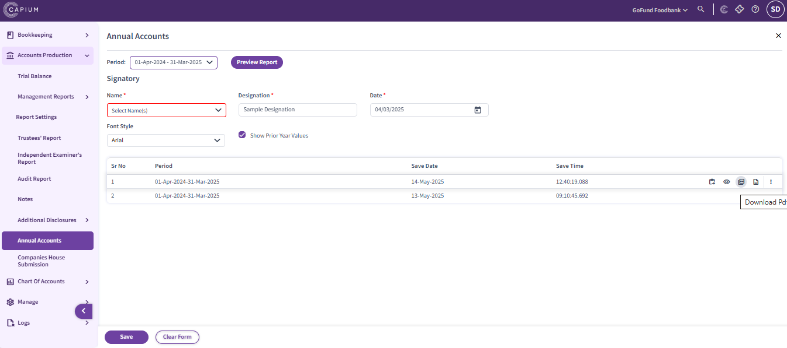

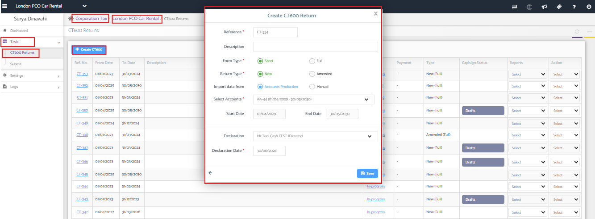

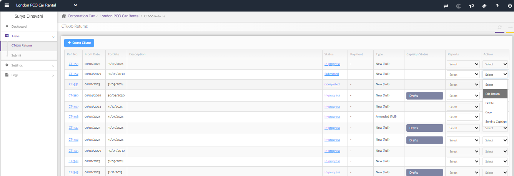

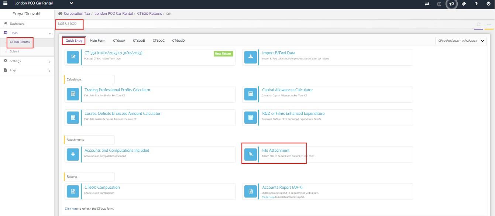

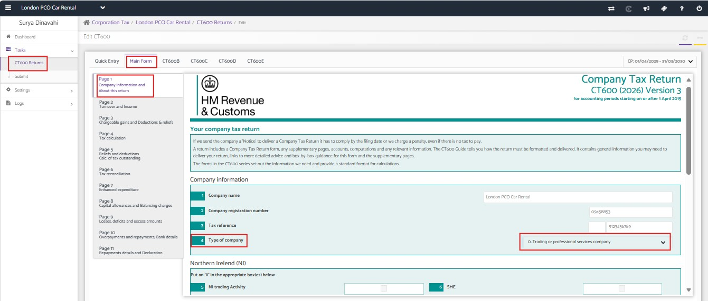

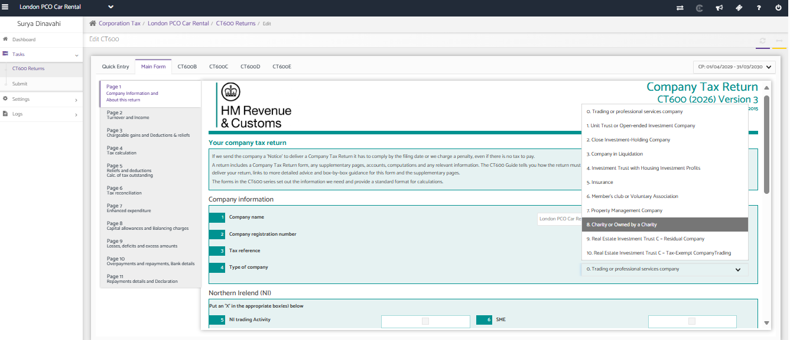

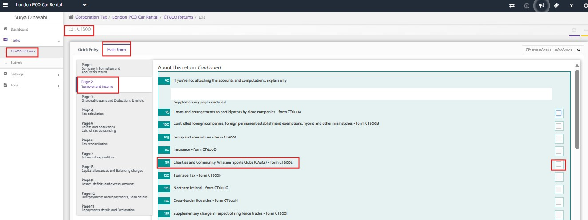

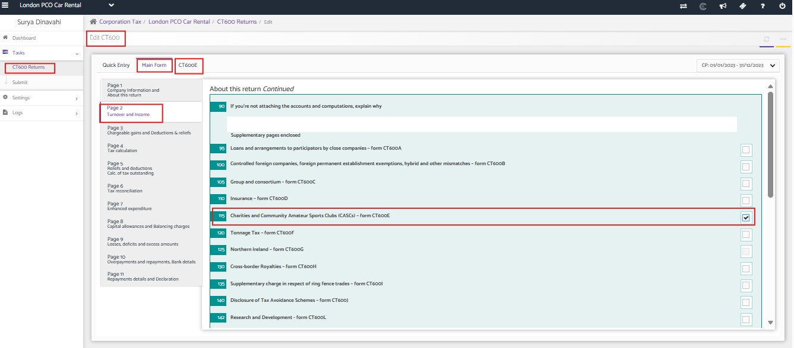

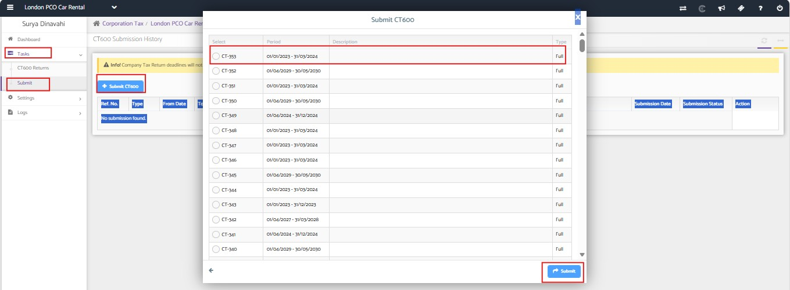

