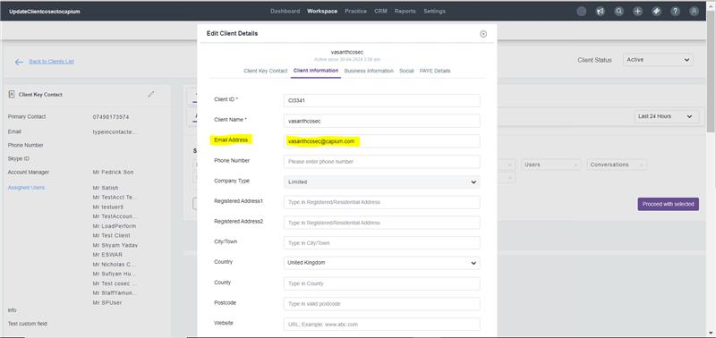
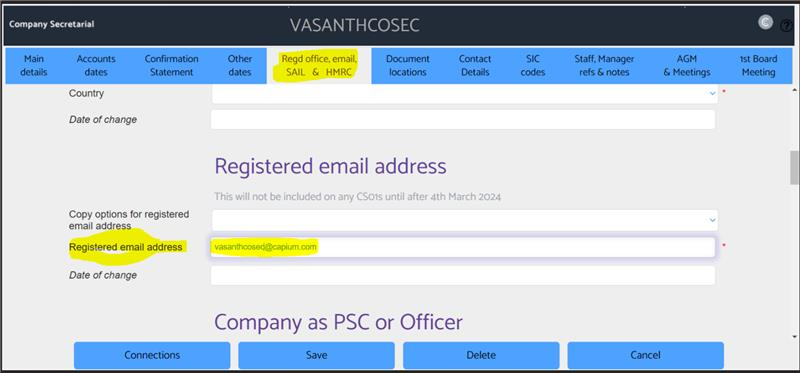

# Company Secretarial Module - Knowledge Base & Feature Index

> Total Articles: **12** | Module Directory: `d:/sansuite/Company Secretarial`

## Articles List & Local Assets

### 1. Capium Company Secretarial Services
- **Folder:** Company Secretarial Help Guide
- **Article ID:** `9000175603` | **Slug:** `capium-company-secretarial-services`
- **Markdown File:** [raw_articles/9000175603_capium-company-secretarial-services.md](../raw_articles/9000175603_capium-company-secretarial-services.md)
- **Images Count:** 4
- **Screenshots:**
  - 
  - 
  - 
  - 

---

### 2. How to add a Client through Company Secretarial
- **Folder:** Company Secretarial Help Guide
- **Article ID:** `9000200190` | **Slug:** `how-to-add-a-client-through-company-secretarial`
- **Markdown File:** [raw_articles/9000200190_how-to-add-a-client-through-company-secretarial.md](../raw_articles/9000200190_how-to-add-a-client-through-company-secretarial.md)
- **Images Count:** 2
- **Screenshots:**
  - 
  - 

---

### 3. Company Secretarial Synchronisation with Capium
- **Folder:** Company Secretarial Help Guide
- **Article ID:** `9000202625` | **Slug:** `company-secretarial-synchronisation-with-capium`
- **Markdown File:** [raw_articles/9000202625_company-secretarial-synchronisation-with-capium.md](../raw_articles/9000202625_company-secretarial-synchronisation-with-capium.md)
- **Images Count:** 5
- **Screenshots:**
  - 
  - 
  - 
  - 
  - 

---

### 4. How to add / link staff users to Company Secretarial
- **Folder:** Company Secretarial Help Guide
- **Article ID:** `9000203190` | **Slug:** `how-to-add-link-staff-users-to-company-secretarial`
- **Markdown File:** [raw_articles/9000203190_how-to-add-link-staff-users-to-company-secretarial.md](../raw_articles/9000203190_how-to-add-link-staff-users-to-company-secretarial.md)
- **Images Count:** 4
- **Screenshots:**
  - 
  - 
  - 
  - 

---

### 5. Latest Company Secretarial Webinar
- **Folder:** Company Secretarial Help Guide
- **Article ID:** `9000205762` | **Slug:** `latest-company-secretarial-webinar`
- **Markdown File:** [raw_articles/9000205762_latest-company-secretarial-webinar.md](../raw_articles/9000205762_latest-company-secretarial-webinar.md)
- **Images Count:** 0

---

### 6. Add Clients into Capium that you have downloaded from Companies House in the Cosec Module
- **Folder:** Company Secretarial Help Guide
- **Article ID:** `9000224253` | **Slug:** `add-clients-into-capium-that-you-have-downloaded-from-companies-house-in-the-cosec-module`
- **Markdown File:** [raw_articles/9000224253_add-clients-into-capium-that-you-have-downloaded-from-companies-house-in-the-cosec-module.md](../raw_articles/9000224253_add-clients-into-capium-that-you-have-downloaded-from-companies-house-in-the-cosec-module.md)
- **Images Count:** 5
- **Screenshots:**
  - 
  - 
  - 
  - 
  - 

---

### 7. Company Secretarial Support Details
- **Folder:** Company Secretarial Help Guide
- **Article ID:** `9000225844` | **Slug:** `company-secretarial-support-details`
- **Markdown File:** [raw_articles/9000225844_company-secretarial-support-details.md](../raw_articles/9000225844_company-secretarial-support-details.md)
- **Images Count:** 0

---

### 8. How to delete/archive a client in Cosec
- **Folder:** Company Secretarial Help Guide
- **Article ID:** `9000225975` | **Slug:** `how-to-delete-archive-a-client-in-cosec`
- **Markdown File:** [raw_articles/9000225975_how-to-delete-archive-a-client-in-cosec.md](../raw_articles/9000225975_how-to-delete-archive-a-client-in-cosec.md)
- **Images Count:** 0

---

### 9. Company Secretarial &amp; Capium Email address Exchange!
- **Folder:** Company Secretarial Help Guide
- **Article ID:** `9000237737` | **Slug:** `company-secretarial-capium-email-address-exchange-`
- **Markdown File:** [raw_articles/9000237737_company-secretarial-capium-email-address-exchange-.md](../raw_articles/9000237737_company-secretarial-capium-email-address-exchange-.md)
- **Images Count:** 2
- **Screenshots:**
  - 
  - 

---

### 10. Company Secretarial Formation Pricing
- **Folder:** Company Secretarial Help Guide
- **Article ID:** `9000238267` | **Slug:** `company-secretarial-formation-pricing`
- **Markdown File:** [raw_articles/9000238267_company-secretarial-formation-pricing.md](../raw_articles/9000238267_company-secretarial-formation-pricing.md)
- **Images Count:** 0

---

### 11. Restrictions on Company Formation Names
- **Folder:** Company Secretarial Help Guide
- **Article ID:** `9000238435` | **Slug:** `restrictions-on-company-formation-names`
- **Markdown File:** [raw_articles/9000238435_restrictions-on-company-formation-names.md](../raw_articles/9000238435_restrictions-on-company-formation-names.md)
- **Images Count:** 0

---

### 12. Company Secretarial User Guides
- **Folder:** Company Secretarial Help Guide
- **Article ID:** `9000240406` | **Slug:** `company-secretarial-user-guides`
- **Markdown File:** [raw_articles/9000240406_company-secretarial-user-guides.md](../raw_articles/9000240406_company-secretarial-user-guides.md)
- **Images Count:** 0

---

