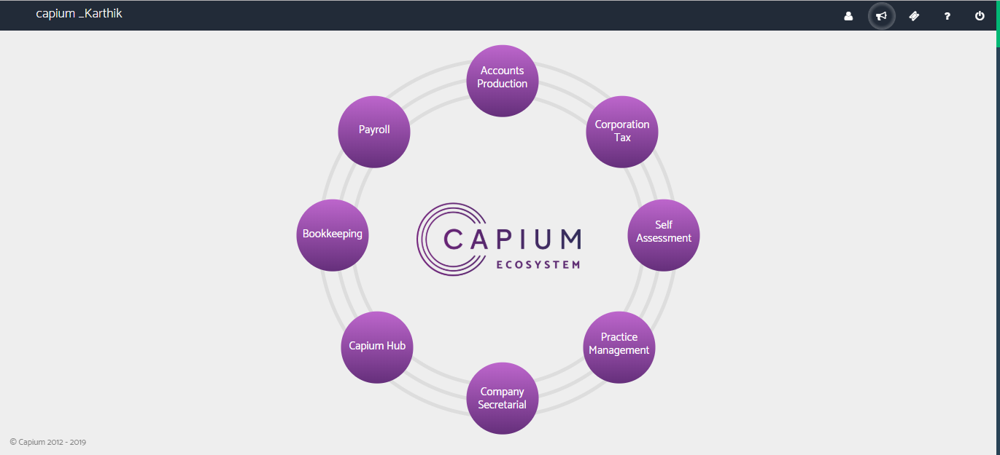
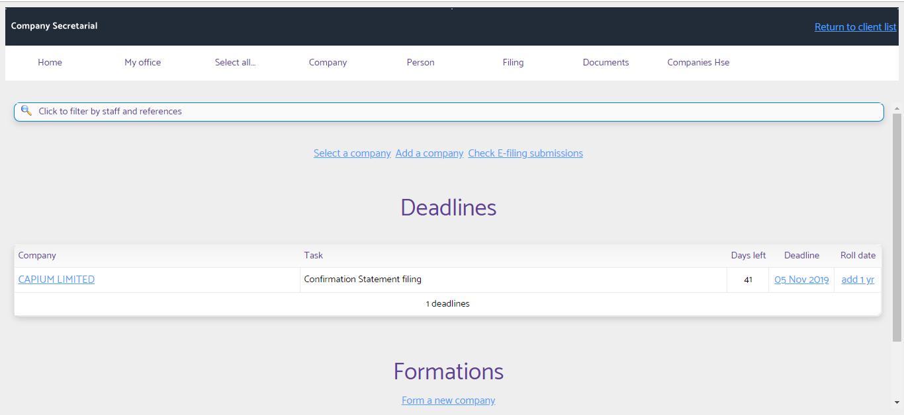
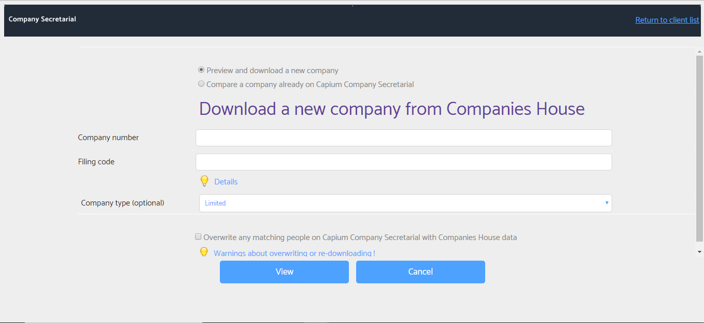
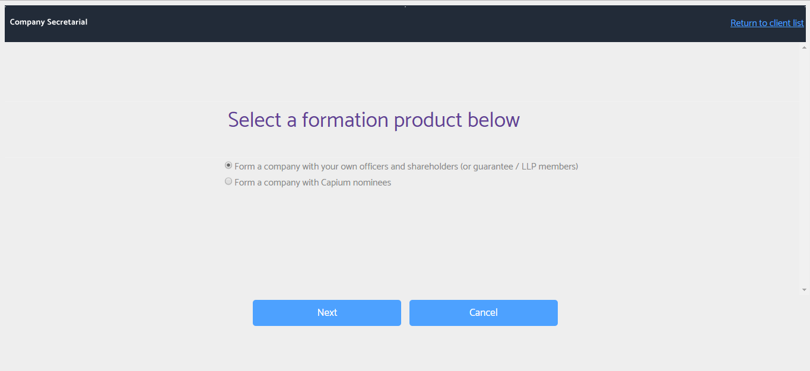

# Capium Company Secretarial Services
	 	
			
			Print

- **Category:** Company Secretarial
- **Folder:** Company Secretarial Help Guide
- **Source URL:** [https://capium.freshdesk.com/support/solutions/articles/9000175603-capium-company-secretarial-services](https://capium.freshdesk.com/support/solutions/articles/9000175603-capium-company-secretarial-services)
- **Article ID:** 9000175603

## Content

Solution home 
		Company Secretarial
		Company Secretarial Help Guide

### Capium Company Secretarial Services

			Print

	Modified on: Tue, 25 May, 2021 at 11:26 AM

		Capium Company Secretarial (CoSec) is our newest service to the Capium Ecosystem and this guide is intended to give you an in-depth look at the new module.

You will find the Company Secretarial module on your homepage as shown below. Upon purchasing a license, you will be able to access the module by clicking on the icon, to which you will be directed to the CoSec Homepage. 

Through the Capium's Company Secretarial module, you will have access to Company Formation services, management of Confirmation Statement and Annual Accounts and much more!

Homepage

Add a company via Companies House

Company Formation

Please click here to watch a in depth webinar on our Company Secretarial module

										Did you find it helpful?
								Yes
								No

Send feedback	Sorry we couldn't be helpful. Help us improve this article with your feedback.

## Screenshots & Diagrams (4)

