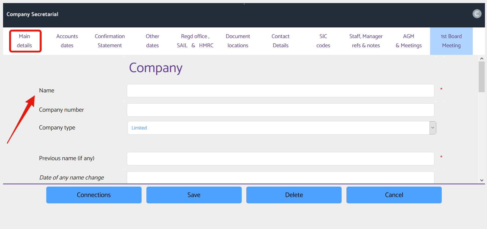
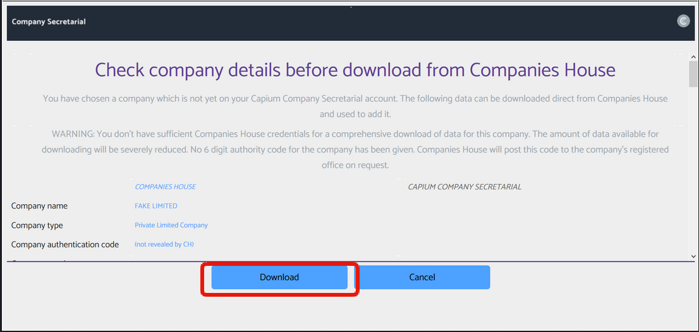

# How to add a Client through Company Secretarial
	 	
			
			Print

- **Category:** Company Secretarial
- **Folder:** Company Secretarial Help Guide
- **Source URL:** [https://capium.freshdesk.com/support/solutions/articles/9000200190-how-to-add-a-client-through-company-secretarial](https://capium.freshdesk.com/support/solutions/articles/9000200190-how-to-add-a-client-through-company-secretarial)
- **Article ID:** 9000200190

## Content

Solution home 
		Company Secretarial
		Company Secretarial Help Guide

### How to add a Client through Company Secretarial

			Print

	Modified on: Mon, 14 Jul, 2025 at  3:31 PM

		Note: Any clients added in Company Secretarial will be automatically added to your main Capium database If the Sync is on

Navigation: Company Secretarial > Company > Add a Company > Type your own data or Download from Companies House

Help Guide

Type your own data 

1. Select the type of company you want to add (limited by shares, limited by guarantee or LLP) then click next.
2. Enter all relevant details you have of the company into the various tabs available (shown below)

3. There are 3 mandatory fields: Name (of company), Registered Office Address and SIC Code(s)

Download from Companies House

1. Enter the clients company's reg no and click view

2. Check the downloaded company details from Companies House before proceeding

3. If happy click Download or to stop the process click Cancel

Click here to watch how to add a Client in Company Secretarial 

										Did you find it helpful?
								Yes
								No

Send feedback	Sorry we couldn't be helpful. Help us improve this article with your feedback.

## Screenshots & Diagrams (2)

