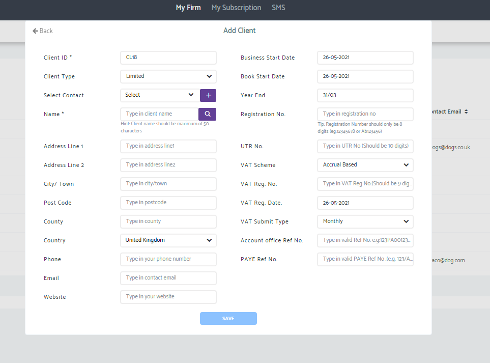
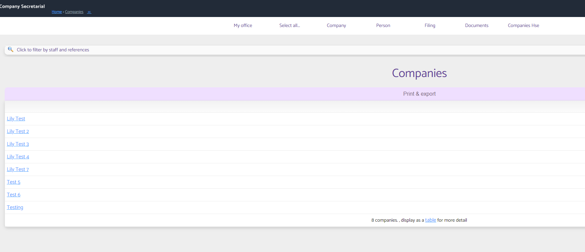
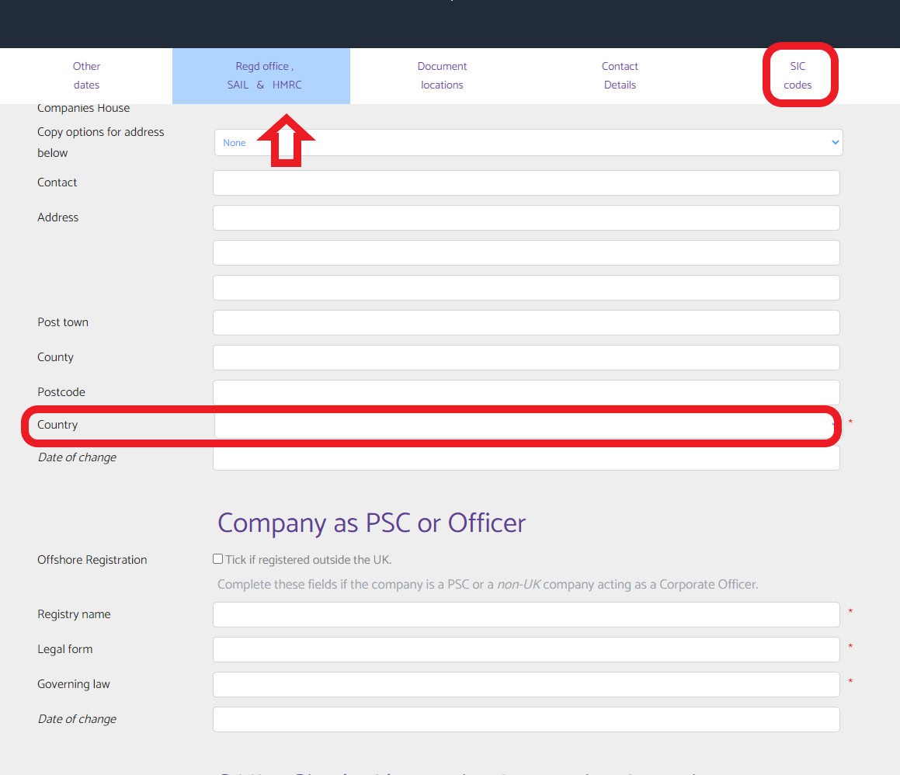
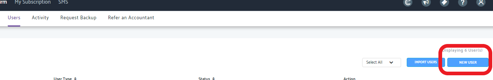
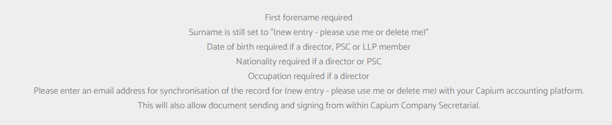

# Company Secretarial Synchronisation with Capium
	 	
			
			Print

- **Category:** Company Secretarial
- **Folder:** Company Secretarial Help Guide
- **Source URL:** [https://capium.freshdesk.com/support/solutions/articles/9000202625-company-secretarial-synchronisation-with-capium](https://capium.freshdesk.com/support/solutions/articles/9000202625-company-secretarial-synchronisation-with-capium)
- **Article ID:** 9000202625

## Content

Solution home 
		Company Secretarial
		Company Secretarial Help Guide

### Company Secretarial Synchronisation with Capium

			Print

	Modified on: Fri, 16 Jan, 2026 at  3:47 PM

There are two ways to add client directly into Capium or Cosec.

Option 1 (Recommended)

 - Add data in COSEC first (manually or via bulk upload - the bulk upload sheet will be provided by the COSEC team). 
 - Once complete, the Sales team will turn on the sync.
️ Important: Inform the Sales Team, who will contact COSEC on you behalf for Bulk upload.

Option 2

 - Turn on the sync first.
 - Add data directly into Capium.
️ Important: Sync must be enabled by the Capium Sales team before adding data.

Contact them on 020 3322 5578 or Sales@capium.com.

Please click here to watch how clients/users are now added to Company Secretarial

Navigation: My Admin> Clients> New Client

Help Guide: adding a client in Capium My Admin

Please add a client in Capium My Admin by clicking on the new client button, under the clients tab

A pop up will appear to add in the details

Please make sure you add in all the mandatory fields

Once all mandatory fields are completed please click save.

Log out and log back in again.

When you log into Company Secretarial, the newly added client will be in Company>show all companies>live companies

Help Guide: adding a client in Company Secretarial 

Click on the Company Secretarial button in Capium

Head to Company> add a company

Either pick 'type your own data' or 'download from companies house'

If typing your own data please ensure the following fields are entered

Company Name (found under 'main details' tab)
Country (found under 'Redg office, SAIL & HMRC' tab) 
SIC Codes

Once data is entered please click save at the bottom of the page.

Please log out and log back in again.

This company, will now live in your 'client' list in the Capium modules.

Help Guide: adding a User in Capium My Admin

Please add a user in Capium My Admin by clicking on the new user button under the users tab

A pop up will appear to add in the details

Please make sure you add in all the mandatory fields

Once all mandatory fields are completed please click save.

Log out and log back in again.

When you log into Company Secretarial, the newly added user will be in Person>show all people> people for live companies

Help Guide: adding a person in Company Secretarial 

Click on the Company Secretarial button in Capium

Head to Person> add a person

A form will appear to be filled out; please ensure the following fields are entered

Once data is entered please click save at the bottom of the page.

Please log out and log back in again.

This person, will now live in your 'users' list in Capium My Admin

										Did you find it helpful?
								Yes
								No

Send feedback	Sorry we couldn't be helpful. Help us improve this article with your feedback.

## Screenshots & Diagrams (5)

