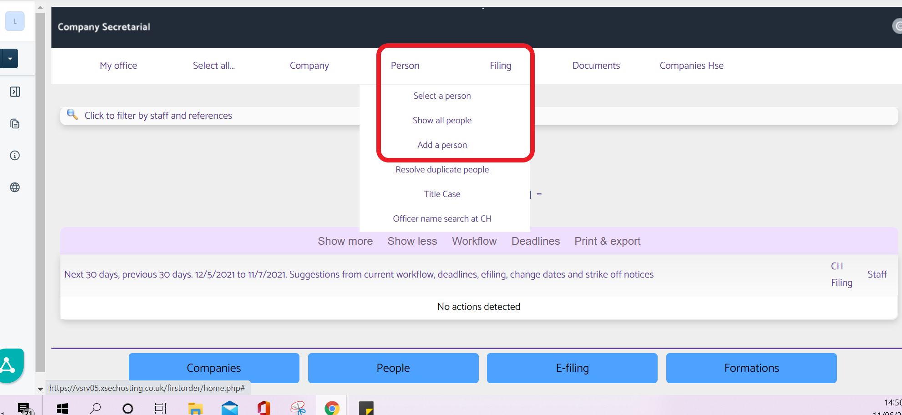
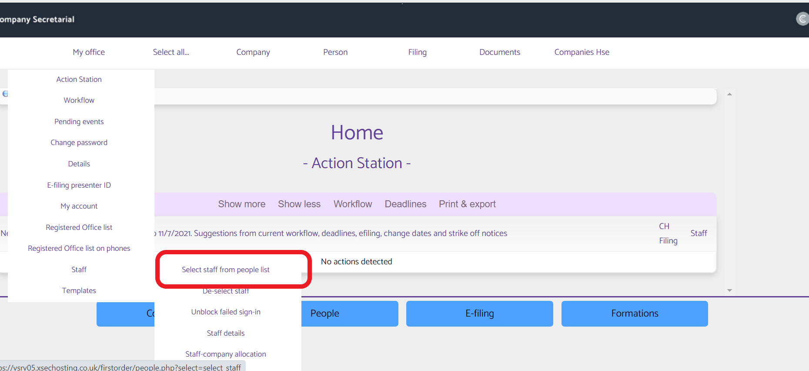
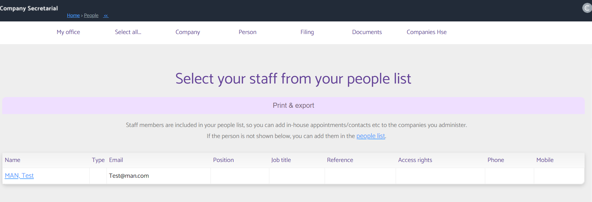
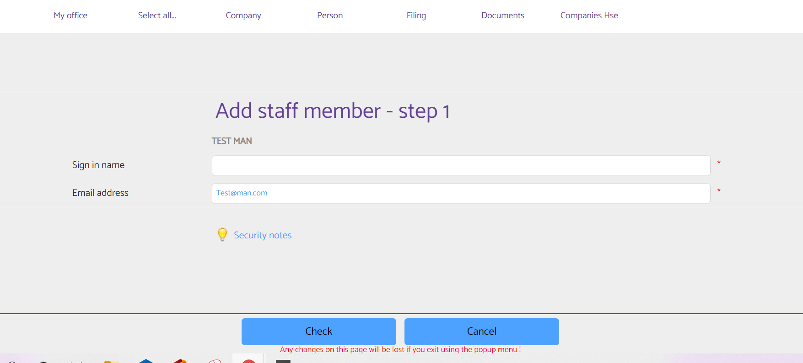

# How to add / link staff users to Company Secretarial
	 	
			
			Print

- **Category:** Company Secretarial
- **Folder:** Company Secretarial Help Guide
- **Source URL:** [https://capium.freshdesk.com/support/solutions/articles/9000203190-how-to-add-link-staff-users-to-company-secretarial](https://capium.freshdesk.com/support/solutions/articles/9000203190-how-to-add-link-staff-users-to-company-secretarial)
- **Article ID:** 9000203190

## Content

Solution home 
		Company Secretarial
		Company Secretarial Help Guide

### How to add / link staff users to Company Secretarial

			Print

	Modified on: Tue, 7 Oct, 2025 at 11:59 AM

		Please click here to watch how to connect users to CoSec

Navigation: Company Secretarial

Help/Guide

When first connecting Company Secretarial to your Capium account only the Capium Super Accountant (the email address the account was signed up with) will be able to access the server.

As the Super Accountant please connect your other staff members for their accounts to be connected.

To do this please log onto your Capium account and select Company Secretarial from the home page

Please head to the Menu  click on person > add a person.

Please then proceed to add the staff users details and click save.

Then go back to the homepage.

Please then go to Menu My office > staff > select staff from person list

Please click on the staff member to add

Please enter the information required. In particular the email address must match the Capium sign in email address.

Please click check and then the user will be connected to the company secretarial account.

										Did you find it helpful?
								Yes
								No

Send feedback	Sorry we couldn't be helpful. Help us improve this article with your feedback.

## Screenshots & Diagrams (4)

