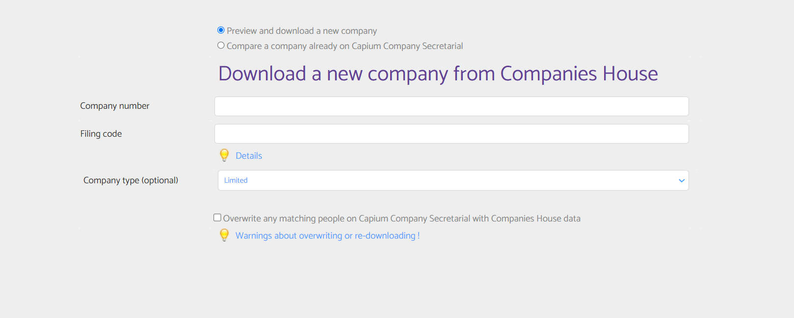
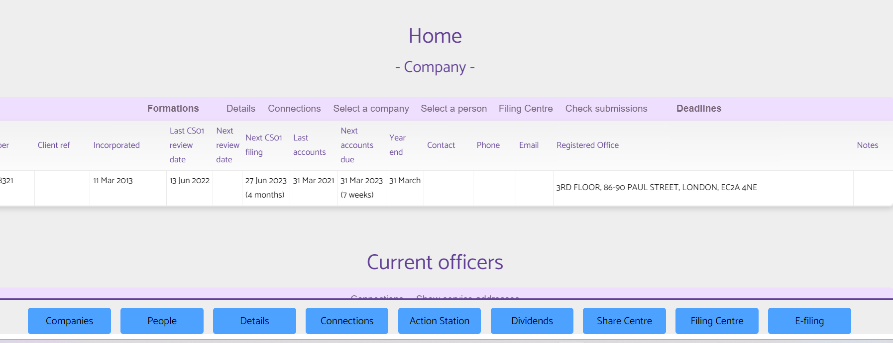
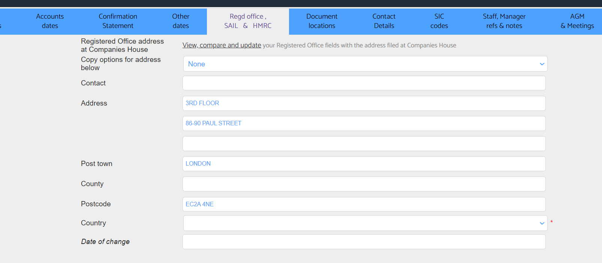
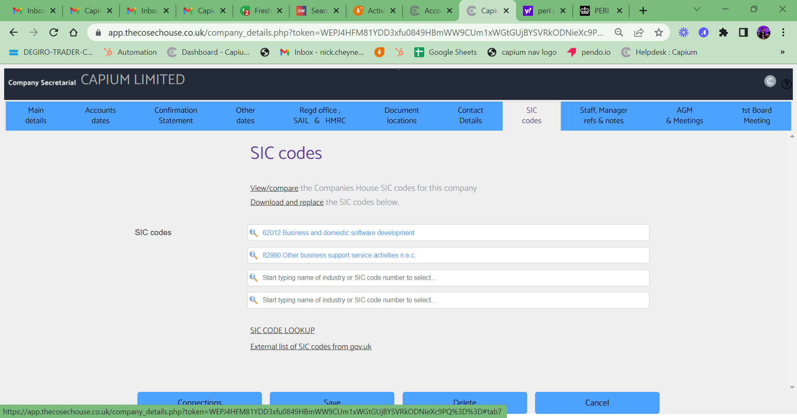
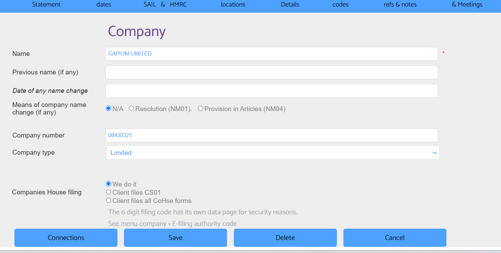

# Add Clients into Capium that you have downloaded from Companies House in the Cosec Module
	 	
			
			Print

- **Category:** Company Secretarial
- **Folder:** Company Secretarial Help Guide
- **Source URL:** [https://capium.freshdesk.com/support/solutions/articles/9000224253-add-clients-into-capium-that-you-have-downloaded-from-companies-house-in-the-cosec-module](https://capium.freshdesk.com/support/solutions/articles/9000224253-add-clients-into-capium-that-you-have-downloaded-from-companies-house-in-the-cosec-module)
- **Article ID:** 9000224253

## Content

Solution home 
		Company Secretarial
		Company Secretarial Help Guide

### Add Clients into Capium that you have downloaded from Companies House in the Cosec Module

			Print

	Modified on: Tue, 14 Feb, 2023 at  3:51 PM

Please add the company you want by downloading the information from Companies House

 Company > Add a Company

Then select a company & click on details

Select all > Live Companies > Details

Ensure it has Country populated as 'United Kingdom' and ensure that SIC code/s is selected.

Then click Save

If you add a client manually in the company secretarial module, please ensure the country and SIC fields are populated

										Did you find it helpful?
								Yes
								No

Send feedback	Sorry we couldn't be helpful. Help us improve this article with your feedback.

## Screenshots & Diagrams (5)

