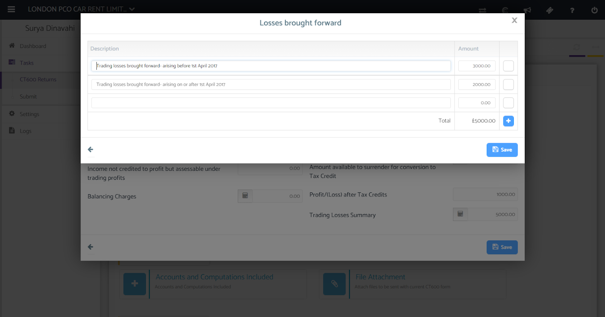
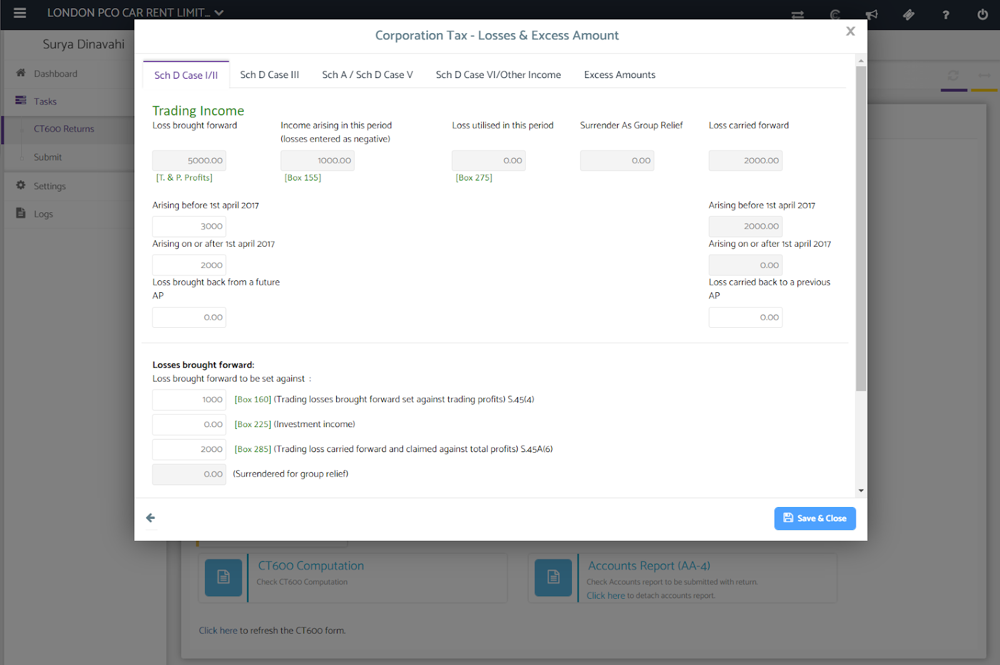
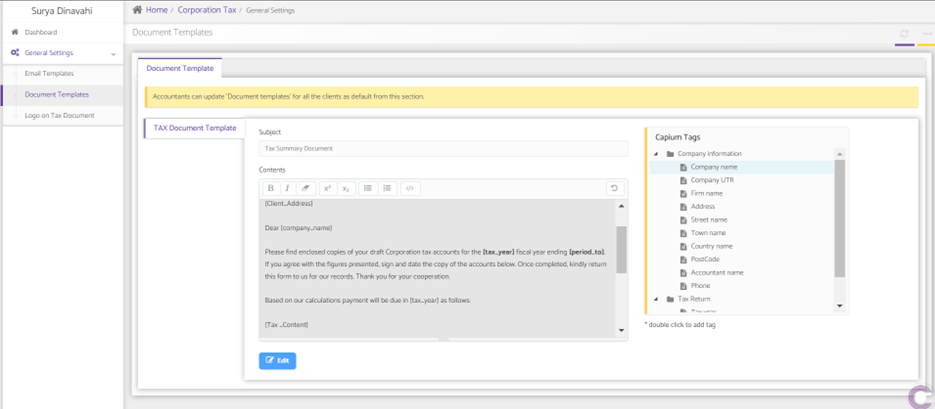
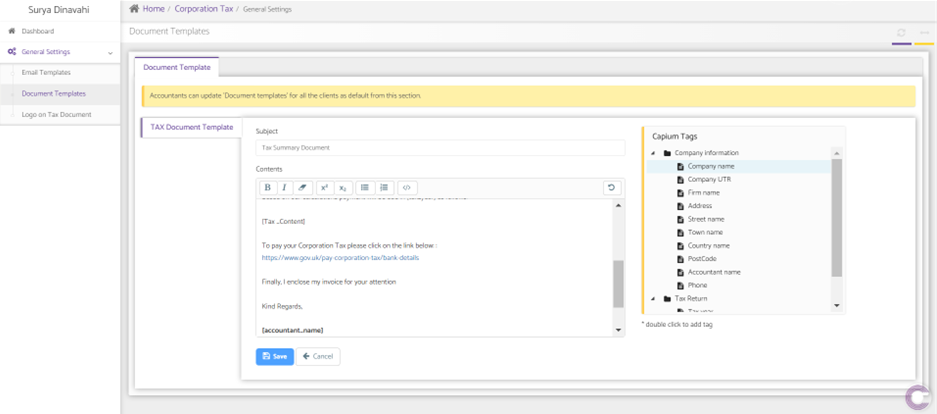
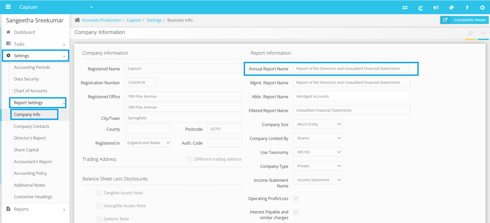
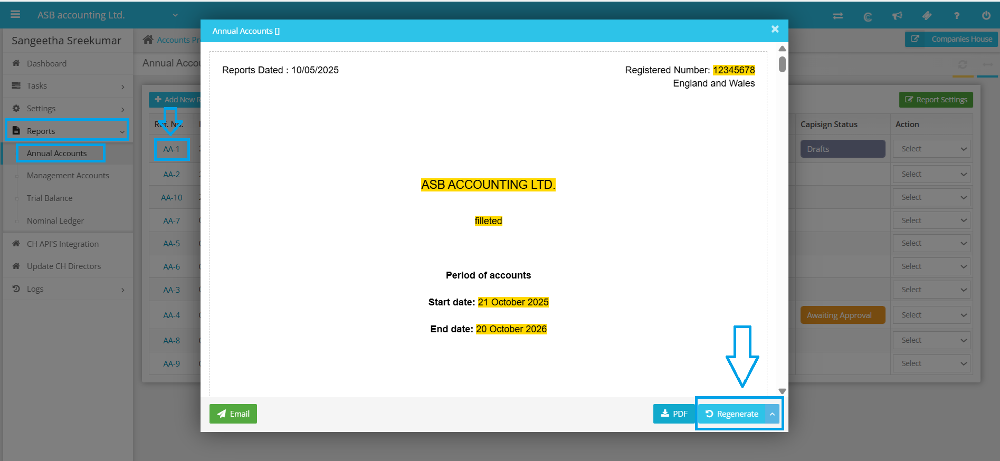
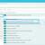
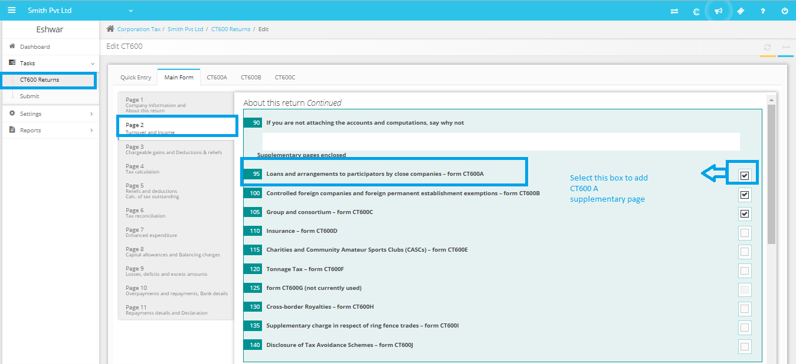

# Corporation Tax Module - Knowledge Base & Feature Index

> Total Articles: **59** | Module Directory: `d:/sansuite/Corporation Tax`

## Articles List & Local Assets

### 1. CT600 Requirements
- **Folder:** Corporation Tax Help Guide
- **Article ID:** `9000165504` | **Slug:** `ct600-requirements`
- **Markdown File:** [raw_articles/9000165504_ct600-requirements.md](../raw_articles/9000165504_ct600-requirements.md)
- **Images Count:** 0

---

### 2. Corporation Tax Dashboard
- **Folder:** Corporation Tax Help Guide
- **Article ID:** `9000165505` | **Slug:** `corporation-tax-dashboard`
- **Markdown File:** [raw_articles/9000165505_corporation-tax-dashboard.md](../raw_articles/9000165505_corporation-tax-dashboard.md)
- **Images Count:** 1
- **Screenshots:**
  - 

---

### 3. Creating a New CT600 Returns
- **Folder:** Corporation Tax Help Guide
- **Article ID:** `9000165507` | **Slug:** `creating-a-new-ct600-returns`
- **Markdown File:** [raw_articles/9000165507_creating-a-new-ct600-returns.md](../raw_articles/9000165507_creating-a-new-ct600-returns.md)
- **Images Count:** 4
- **Screenshots:**
  - 
  - 
  - 
  - 

---

### 4. CT600 Returns - Quick Entry
- **Folder:** Corporation Tax Help Guide
- **Article ID:** `9000165508` | **Slug:** `ct600-returns-quick-entry`
- **Markdown File:** [raw_articles/9000165508_ct600-returns-quick-entry.md](../raw_articles/9000165508_ct600-returns-quick-entry.md)
- **Images Count:** 8
- **Screenshots:**
  - 
  - 
  - 
  - 
  - 
  - 
  - 
  - 

---

### 5. CT600 Returns - Calculators
- **Folder:** Corporation Tax Help Guide
- **Article ID:** `9000165509` | **Slug:** `ct600-returns-calculators`
- **Markdown File:** [raw_articles/9000165509_ct600-returns-calculators.md](../raw_articles/9000165509_ct600-returns-calculators.md)
- **Images Count:** 9
- **Screenshots:**
  - 
  - 
  - 
  - 
  - 
  - 
  - 
  - 
  - 

---

### 6. CT600 Computation
- **Folder:** Corporation Tax Help Guide
- **Article ID:** `9000165510` | **Slug:** `ct600-computation`
- **Markdown File:** [raw_articles/9000165510_ct600-computation.md](../raw_articles/9000165510_ct600-computation.md)
- **Images Count:** 2
- **Screenshots:**
  - 
  - 

---

### 7. CT600 Returns - Attachments
- **Folder:** Corporation Tax Help Guide
- **Article ID:** `9000165511` | **Slug:** `ct600-returns-attachments`
- **Markdown File:** [raw_articles/9000165511_ct600-returns-attachments.md](../raw_articles/9000165511_ct600-returns-attachments.md)
- **Images Count:** 2
- **Screenshots:**
  - 
  - 

---

### 8. Download Individual Supplementary Pages
- **Folder:** Corporation Tax Help Guide
- **Article ID:** `9000188494` | **Slug:** `download-individual-supplementary-pages`
- **Markdown File:** [raw_articles/9000188494_download-individual-supplementary-pages.md](../raw_articles/9000188494_download-individual-supplementary-pages.md)
- **Images Count:** 2
- **Screenshots:**
  - 
  - 

---

### 9. Document Password Protection - Corporation Tax
- **Folder:** Corporation Tax Help Guide
- **Article ID:** `9000191276` | **Slug:** `document-password-protection-corporation-tax`
- **Markdown File:** [raw_articles/9000191276_document-password-protection-corporation-tax.md](../raw_articles/9000191276_document-password-protection-corporation-tax.md)
- **Images Count:** 1
- **Screenshots:**
  - 

---

### 10. Government and SEISS Grants in the accounts and tax return
- **Folder:** Corporation Tax Help Guide
- **Article ID:** `9000203077` | **Slug:** `government-and-seiss-grants-in-the-accounts-and-tax-return`
- **Markdown File:** [raw_articles/9000203077_government-and-seiss-grants-in-the-accounts-and-tax-return.md](../raw_articles/9000203077_government-and-seiss-grants-in-the-accounts-and-tax-return.md)
- **Images Count:** 10
- **Screenshots:**
  - 
  - 
  - 
  - 
  - 
  - 
  - 
  - 
  - 
  - 

---

### 11. Super deduction @ 130% and First year allowance @ 50%
- **Folder:** Corporation Tax Help Guide
- **Article ID:** `9000203687` | **Slug:** `super-deduction-130-and-first-year-allowance-50-`
- **Markdown File:** [raw_articles/9000203687_super-deduction-130-and-first-year-allowance-50-.md](../raw_articles/9000203687_super-deduction-130-and-first-year-allowance-50-.md)
- **Images Count:** 6
- **Screenshots:**
  - 
  - 
  - 
  - 
  - 
  - 

---

### 12. How to Amend the CT600
- **Folder:** Corporation Tax Help Guide
- **Article ID:** `9000220713` | **Slug:** `how-to-amend-the-ct600`
- **Markdown File:** [raw_articles/9000220713_how-to-amend-the-ct600.md](../raw_articles/9000220713_how-to-amend-the-ct600.md)
- **Images Count:** 3
- **Screenshots:**
  - 
  - 
  - 

---

### 13. Corporation Tax- How to carry forward losses &amp; offset them against a current years trading profits
- **Folder:** Corporation Tax Help Guide
- **Article ID:** `9000222922` | **Slug:** `corporation-tax-how-to-carry-forward-losses-offset-them-against-a-current-years-trading-profits`
- **Markdown File:** [raw_articles/9000222922_corporation-tax-how-to-carry-forward-losses-offset-them-against-a-current-years-trading-profits.md](../raw_articles/9000222922_corporation-tax-how-to-carry-forward-losses-offset-them-against-a-current-years-trading-profits.md)
- **Images Count:** 2
- **Screenshots:**
  - 
  - 

---

### 14. How to get CT600 tax due document
- **Folder:** Corporation Tax Help Guide
- **Article ID:** `9000228291` | **Slug:** `how-to-get-ct600-tax-due-document`
- **Markdown File:** [raw_articles/9000228291_how-to-get-ct600-tax-due-document.md](../raw_articles/9000228291_how-to-get-ct600-tax-due-document.md)
- **Images Count:** 2
- **Screenshots:**
  - 
  - 

---

### 15. How to change tax-due document template
- **Folder:** Corporation Tax Help Guide
- **Article ID:** `9000228366` | **Slug:** `how-to-change-tax-due-document-template`
- **Markdown File:** [raw_articles/9000228366_how-to-change-tax-due-document-template.md](../raw_articles/9000228366_how-to-change-tax-due-document-template.md)
- **Images Count:** 2
- **Screenshots:**
  - 
  - 

---

### 16. Corporation Tax CT600P
- **Folder:** Corporation Tax Help Guide
- **Article ID:** `9000267558` | **Slug:** `corporation-tax-ct600p`
- **Markdown File:** [raw_articles/9000267558_corporation-tax-ct600p.md](../raw_articles/9000267558_corporation-tax-ct600p.md)
- **Images Count:** 3
- **Screenshots:**
  - 
  - 
  - 

---

### 17. Carry forward and set off losses
- **Folder:** Corporation Tax Help Guide
- **Article ID:** `9000271519` | **Slug:** `carry-forward-and-set-off-losses`
- **Markdown File:** [raw_articles/9000271519_carry-forward-and-set-off-losses.md](../raw_articles/9000271519_carry-forward-and-set-off-losses.md)
- **Images Count:** 3
- **Screenshots:**
  - 
  - 
  - 

---

### 18. How to include CT600E to CT 600 return?
- **Folder:** Corporation Tax Help Guide
- **Article ID:** `9000271490` | **Slug:** `how-to-include-ct600e-to-ct-600-return-`
- **Markdown File:** [raw_articles/9000271490_how-to-include-ct600e-to-ct-600-return-.md](../raw_articles/9000271490_how-to-include-ct600e-to-ct-600-return-.md)
- **Images Count:** 0

---

### 19. How to Include CT600L Supplementary Form
- **Folder:** Corporation Tax Help Guide
- **Article ID:** `9000271492` | **Slug:** `how-to-include-ct600l-supplementary-form`
- **Markdown File:** [raw_articles/9000271492_how-to-include-ct600l-supplementary-form.md](../raw_articles/9000271492_how-to-include-ct600l-supplementary-form.md)
- **Images Count:** 0

---

### 20. Corporation Tax - Company Ceased
- **Folder:** Corporation Tax Help Guide
- **Article ID:** `9000271486` | **Slug:** `corporation-tax-company-ceased`
- **Markdown File:** [raw_articles/9000271486_corporation-tax-company-ceased.md](../raw_articles/9000271486_corporation-tax-company-ceased.md)
- **Images Count:** 4
- **Screenshots:**
  - 
  - 
  - 
  - 

---

### 21. IR Mark Not Found
- **Folder:** Corporation Tax Help Guide
- **Article ID:** `9000271498` | **Slug:** `ir-mark-not-found`
- **Markdown File:** [raw_articles/9000271498_ir-mark-not-found.md](../raw_articles/9000271498_ir-mark-not-found.md)
- **Images Count:** 0

---

### 22. CT submission error - If the type of company is 0 then an applicable tax rate from one of [FULL RATE OF CT], [SMALL CO RATE OF CT], [EQUIV. LOW CT RATE], [FULL RF RATE OF CT], [RF SMALL CO RATE OF CT] or [CT RATE FOR NI TRADING PROFITS]
- **Folder:** Corporation Tax Help Guide
- **Article ID:** `9000271760` | **Slug:** `ct-submission-error-if-the-type-of-company-is-0-then-an-applicable-tax-rate-from-one-of-full-rate-`
- **Markdown File:** [raw_articles/9000271760_ct-submission-error-if-the-type-of-company-is-0-then-an-applicable-tax-rate-from-one-of-full-rate-.md](../raw_articles/9000271760_ct-submission-error-if-the-type-of-company-is-0-then-an-applicable-tax-rate-from-one-of-full-rate-.md)
- **Images Count:** 0

---

### 23. IXBRL Error message
- **Folder:** Corporation Tax Help Guide
- **Article ID:** `9000271723` | **Slug:** `ixbrl-error-message`
- **Markdown File:** [raw_articles/9000271723_ixbrl-error-message.md](../raw_articles/9000271723_ixbrl-error-message.md)
- **Images Count:** 0

---

### 24. How to carry back the losses from current year to prior AP?
- **Folder:** Corporation Tax Help Guide
- **Article ID:** `9000271554` | **Slug:** `how-to-carry-back-the-losses-from-current-year-to-prior-ap-`
- **Markdown File:** [raw_articles/9000271554_how-to-carry-back-the-losses-from-current-year-to-prior-ap-.md](../raw_articles/9000271554_how-to-carry-back-the-losses-from-current-year-to-prior-ap-.md)
- **Images Count:** 5
- **Screenshots:**
  - 
  - 
  - 
  - 
  - 

---

### 25. What are the HMRC submission response errors
- **Folder:** Corporation Tax Help Guide
- **Article ID:** `9000272187` | **Slug:** `what-are-the-hmrc-submission-response-errors`
- **Markdown File:** [raw_articles/9000272187_what-are-the-hmrc-submission-response-errors.md](../raw_articles/9000272187_what-are-the-hmrc-submission-response-errors.md)
- **Images Count:** 0

---

### 26. CT600: File for a Registered Charity (Charitable Company Limited by Guarantee)
- **Folder:** Corporation Tax Help Guide
- **Article ID:** `9000272887` | **Slug:** `ct600-file-for-a-registered-charity-charitable-company-limited-by-guarantee-`
- **Markdown File:** [raw_articles/9000272887_ct600-file-for-a-registered-charity-charitable-company-limited-by-guarantee-.md](../raw_articles/9000272887_ct600-file-for-a-registered-charity-charitable-company-limited-by-guarantee-.md)
- **Images Count:** 0

---

### 27. How to show deduction allowance claim in ct600
- **Folder:** Corporation Tax Help Guide
- **Article ID:** `9000275459` | **Slug:** `how-to-show-deduction-allowance-claim-in-ct600`
- **Markdown File:** [raw_articles/9000275459_how-to-show-deduction-allowance-claim-in-ct600.md](../raw_articles/9000275459_how-to-show-deduction-allowance-claim-in-ct600.md)
- **Images Count:** 3
- **Screenshots:**
  - 
  - 
  - 

---

### 28. How to manually submit CT600 for iXBRL accounts.
- **Folder:** Corporation Tax Help Guide
- **Article ID:** `9000277519` | **Slug:** `how-to-manually-submit-ct600-for-ixbrl-accounts-`
- **Markdown File:** [raw_articles/9000277519_how-to-manually-submit-ct600-for-ixbrl-accounts-.md](../raw_articles/9000277519_how-to-manually-submit-ct600-for-ixbrl-accounts-.md)
- **Images Count:** 5
- **Screenshots:**
  - 
  - 
  - 
  - 
  - 

---

### 29. How can I report loans to participators?
- **Folder:** Corporation Tax FAQs
- **Article ID:** `9000165563` | **Slug:** `how-can-i-report-loans-to-participators-`
- **Markdown File:** [raw_articles/9000165563_how-can-i-report-loans-to-participators-.md](../raw_articles/9000165563_how-can-i-report-loans-to-participators-.md)
- **Images Count:** 1
- **Screenshots:**
  - 

---

### 30. How to create and submit an amended CT600?
- **Folder:** Corporation Tax FAQs
- **Article ID:** `9000165564` | **Slug:** `how-to-create-and-submit-an-amended-ct600-`
- **Markdown File:** [raw_articles/9000165564_how-to-create-and-submit-an-amended-ct600-.md](../raw_articles/9000165564_how-to-create-and-submit-an-amended-ct600-.md)
- **Images Count:** 0

---

### 31. Which Accounts report has to be submitted to HMRC along with CT600?
- **Folder:** Corporation Tax FAQs
- **Article ID:** `9000165565` | **Slug:** `which-accounts-report-has-to-be-submitted-to-hmrc-along-with-ct600-`
- **Markdown File:** [raw_articles/9000165565_which-accounts-report-has-to-be-submitted-to-hmrc-along-with-ct600-.md](../raw_articles/9000165565_which-accounts-report-has-to-be-submitted-to-hmrc-along-with-ct600-.md)
- **Images Count:** 0

---

### 32. How can we add supplementary pages in CT600?
- **Folder:** Corporation Tax FAQs
- **Article ID:** `9000165566` | **Slug:** `how-can-we-add-supplementary-pages-in-ct600-`
- **Markdown File:** [raw_articles/9000165566_how-can-we-add-supplementary-pages-in-ct600-.md](../raw_articles/9000165566_how-can-we-add-supplementary-pages-in-ct600-.md)
- **Images Count:** 6
- **Screenshots:**
  - 
  - 
  - 
  - 
  - 
  - 

---

### 33. How can I show the tax credit claimed on software development (R&amp;D)?
- **Folder:** Corporation Tax FAQs
- **Article ID:** `9000165567` | **Slug:** `how-can-i-show-the-tax-credit-claimed-on-software-development-r-d-`
- **Markdown File:** [raw_articles/9000165567_how-can-i-show-the-tax-credit-claimed-on-software-development-r-d-.md](../raw_articles/9000165567_how-can-i-show-the-tax-credit-claimed-on-software-development-r-d-.md)
- **Images Count:** 0

---

### 34. How to create a CT600?
- **Folder:** Corporation Tax FAQs
- **Article ID:** `9000165568` | **Slug:** `how-to-create-a-ct600-`
- **Markdown File:** [raw_articles/9000165568_how-to-create-a-ct600-.md](../raw_articles/9000165568_how-to-create-a-ct600-.md)
- **Images Count:** 0

---

### 35. Where do I say that the CT600 is for a dormant company and so no accounts are attached?
- **Folder:** Corporation Tax FAQs
- **Article ID:** `9000165569` | **Slug:** `where-do-i-say-that-the-ct600-is-for-a-dormant-company-and-so-no-accounts-are-attached-`
- **Markdown File:** [raw_articles/9000165569_where-do-i-say-that-the-ct600-is-for-a-dormant-company-and-so-no-accounts-are-attached-.md](../raw_articles/9000165569_where-do-i-say-that-the-ct600-is-for-a-dormant-company-and-so-no-accounts-are-attached-.md)
- **Images Count:** 1
- **Screenshots:**
  - 

---

### 36. How to inform in the financial statements that the company ceased to trade?
- **Folder:** Corporation Tax FAQs
- **Article ID:** `9000165570` | **Slug:** `how-to-inform-in-the-financial-statements-that-the-company-ceased-to-trade-`
- **Markdown File:** [raw_articles/9000165570_how-to-inform-in-the-financial-statements-that-the-company-ceased-to-trade-.md](../raw_articles/9000165570_how-to-inform-in-the-financial-statements-that-the-company-ceased-to-trade-.md)
- **Images Count:** 1
- **Screenshots:**
  - 

---

### 37. How to pass a tax Journal Entry from CT module to Accounts Production module?
- **Folder:** Corporation Tax FAQs
- **Article ID:** `9000165571` | **Slug:** `how-to-pass-a-tax-journal-entry-from-ct-module-to-accounts-production-module-`
- **Markdown File:** [raw_articles/9000165571_how-to-pass-a-tax-journal-entry-from-ct-module-to-accounts-production-module-.md](../raw_articles/9000165571_how-to-pass-a-tax-journal-entry-from-ct-module-to-accounts-production-module-.md)
- **Images Count:** 1
- **Screenshots:**
  - 

---

### 38. Where do I enter the office reference for corporation tax
- **Folder:** Corporation Tax FAQs
- **Article ID:** `9000166989` | **Slug:** `where-do-i-enter-the-office-reference-for-corporation-tax`
- **Markdown File:** [raw_articles/9000166989_where-do-i-enter-the-office-reference-for-corporation-tax.md](../raw_articles/9000166989_where-do-i-enter-the-office-reference-for-corporation-tax.md)
- **Images Count:** 4
- **Screenshots:**
  - 
  - 
  - 
  - 

---

### 39. How to delete a CT600 return from the system?
- **Folder:** Corporation Tax FAQs
- **Article ID:** `9000165572` | **Slug:** `how-to-delete-a-ct600-return-from-the-system-`
- **Markdown File:** [raw_articles/9000165572_how-to-delete-a-ct600-return-from-the-system-.md](../raw_articles/9000165572_how-to-delete-a-ct600-return-from-the-system-.md)
- **Images Count:** 0

---

### 40. How do we run a CT600 for greater than 12 months?
- **Folder:** Corporation Tax FAQs
- **Article ID:** `9000165573` | **Slug:** `how-do-we-run-a-ct600-for-greater-than-12-months-`
- **Markdown File:** [raw_articles/9000165573_how-do-we-run-a-ct600-for-greater-than-12-months-.md](../raw_articles/9000165573_how-do-we-run-a-ct600-for-greater-than-12-months-.md)
- **Images Count:** 0

---

### 41. How does the Corporation Tax Dashboard work?
- **Folder:** Corporation Tax FAQs
- **Article ID:** `9000165574` | **Slug:** `how-does-the-corporation-tax-dashboard-work-`
- **Markdown File:** [raw_articles/9000165574_how-does-the-corporation-tax-dashboard-work-.md](../raw_articles/9000165574_how-does-the-corporation-tax-dashboard-work-.md)
- **Images Count:** 1
- **Screenshots:**
  - 

---

### 42. How to attach PDF accounts to CT600 manually?
- **Folder:** Corporation Tax FAQs
- **Article ID:** `9000165575` | **Slug:** `how-to-attach-pdf-accounts-to-ct600-manually-`
- **Markdown File:** [raw_articles/9000165575_how-to-attach-pdf-accounts-to-ct600-manually-.md](../raw_articles/9000165575_how-to-attach-pdf-accounts-to-ct600-manually-.md)
- **Images Count:** 3
- **Screenshots:**
  - 
  - 
  - 

---

### 43. Is there any way of printing the HMRC response after submitting CT600?
- **Folder:** Corporation Tax FAQs
- **Article ID:** `9000165576` | **Slug:** `is-there-any-way-of-printing-the-hmrc-response-after-submitting-ct600-`
- **Markdown File:** [raw_articles/9000165576_is-there-any-way-of-printing-the-hmrc-response-after-submitting-ct600-.md](../raw_articles/9000165576_is-there-any-way-of-printing-the-hmrc-response-after-submitting-ct600-.md)
- **Images Count:** 1
- **Screenshots:**
  - 

---

### 44. Why does the CT calculation not pick up Depreciation from Trial balance?
- **Folder:** Corporation Tax FAQs
- **Article ID:** `9000165577` | **Slug:** `why-does-the-ct-calculation-not-pick-up-depreciation-from-trial-balance-`
- **Markdown File:** [raw_articles/9000165577_why-does-the-ct-calculation-not-pick-up-depreciation-from-trial-balance-.md](../raw_articles/9000165577_why-does-the-ct-calculation-not-pick-up-depreciation-from-trial-balance-.md)
- **Images Count:** 0

---

### 45. Where do I enter the written down value (WDV) b/fwd (balance brought forward)?
- **Folder:** Corporation Tax FAQs
- **Article ID:** `9000165578` | **Slug:** `where-do-i-enter-the-written-down-value-wdv-b-fwd-balance-brought-forward-`
- **Markdown File:** [raw_articles/9000165578_where-do-i-enter-the-written-down-value-wdv-b-fwd-balance-brought-forward-.md](../raw_articles/9000165578_where-do-i-enter-the-written-down-value-wdv-b-fwd-balance-brought-forward-.md)
- **Images Count:** 1
- **Screenshots:**
  - 

---

### 46. How would I claim 100% of the AIA?
- **Folder:** Corporation Tax FAQs
- **Article ID:** `9000165579` | **Slug:** `how-would-i-claim-100-of-the-aia-`
- **Markdown File:** [raw_articles/9000165579_how-would-i-claim-100-of-the-aia-.md](../raw_articles/9000165579_how-would-i-claim-100-of-the-aia-.md)
- **Images Count:** 1
- **Screenshots:**
  - 

---

### 47. How can we get the Indexation Relief into the calculation?
- **Folder:** Corporation Tax FAQs
- **Article ID:** `9000165580` | **Slug:** `how-can-we-get-the-indexation-relief-into-the-calculation-`
- **Markdown File:** [raw_articles/9000165580_how-can-we-get-the-indexation-relief-into-the-calculation-.md](../raw_articles/9000165580_how-can-we-get-the-indexation-relief-into-the-calculation-.md)
- **Images Count:** 0

---

### 48. How to update the rental income under CT600 Returns?
- **Folder:** Corporation Tax FAQs
- **Article ID:** `9000165581` | **Slug:** `how-to-update-the-rental-income-under-ct600-returns-`
- **Markdown File:** [raw_articles/9000165581_how-to-update-the-rental-income-under-ct600-returns-.md](../raw_articles/9000165581_how-to-update-the-rental-income-under-ct600-returns-.md)
- **Images Count:** 1
- **Screenshots:**
  - 

---

### 49. How do I create accounts and corporation tax (CT600) in one go?
- **Folder:** Corporation Tax FAQs
- **Article ID:** `9000165725` | **Slug:** `how-do-i-create-accounts-and-corporation-tax-ct600-in-one-go-`
- **Markdown File:** [raw_articles/9000165725_how-do-i-create-accounts-and-corporation-tax-ct600-in-one-go-.md](../raw_articles/9000165725_how-do-i-create-accounts-and-corporation-tax-ct600-in-one-go-.md)
- **Images Count:** 0

---

### 50. submission error:-  You must provide a set of iXBRL accounts if the &#39;No accounts reason&#39; is absent.  I have attached a PDF copy of the statutory accounts.
- **Folder:** Corporation Tax FAQs
- **Article ID:** `9000165814` | **Slug:** `submission-error-you-must-provide-a-set-of-ixbrl-accounts-if-the-no-accounts-reason-is-absent-`
- **Markdown File:** [raw_articles/9000165814_submission-error-you-must-provide-a-set-of-ixbrl-accounts-if-the-no-accounts-reason-is-absent-.md](../raw_articles/9000165814_submission-error-you-must-provide-a-set-of-ixbrl-accounts-if-the-no-accounts-reason-is-absent-.md)
- **Images Count:** 4
- **Screenshots:**
  - 
  - 
  - 
  - 

---

### 51. Errors (2):  3001 - The submission of this document has failed due to departmental specific business logic in the Body tag. 3315 - Generic dimension member (bus:OrdinaryShareClass1)
- **Folder:** Corporation Tax FAQs
- **Article ID:** `9000165816` | **Slug:** `errors-2-3001-the-submission-of-this-document-has-failed-due-to-departmental-specific-business-`
- **Markdown File:** [raw_articles/9000165816_errors-2-3001-the-submission-of-this-document-has-failed-due-to-departmental-specific-business-.md](../raw_articles/9000165816_errors-2-3001-the-submission-of-this-document-has-failed-due-to-departmental-specific-business-.md)
- **Images Count:** 0

---

### 52. We need to raise a corp tax S455, tax effect on director loans, for this client. I cannot see how to have this raised in the corp tax module
- **Folder:** Corporation Tax FAQs
- **Article ID:** `9000165817` | **Slug:** `we-need-to-raise-a-corp-tax-s455-tax-effect-on-director-loans-for-this-client-i-cannot-see-how-to-`
- **Markdown File:** [raw_articles/9000165817_we-need-to-raise-a-corp-tax-s455-tax-effect-on-director-loans-for-this-client-i-cannot-see-how-to-.md](../raw_articles/9000165817_we-need-to-raise-a-corp-tax-s455-tax-effect-on-director-loans-for-this-client-i-cannot-see-how-to-.md)
- **Images Count:** 2
- **Screenshots:**
  - 
  - 

---

### 53. How to create two CT600s when the accounting period is over one year?
- **Folder:** Corporation Tax FAQs
- **Article ID:** `9000202129` | **Slug:** `how-to-create-two-ct600s-when-the-accounting-period-is-over-one-year-`
- **Markdown File:** [raw_articles/9000202129_how-to-create-two-ct600s-when-the-accounting-period-is-over-one-year-.md](../raw_articles/9000202129_how-to-create-two-ct600s-when-the-accounting-period-is-over-one-year-.md)
- **Images Count:** 3
- **Screenshots:**
  - 
  - 
  - 

---

### 54. Tax Summary Download/Export
- **Folder:** Corporation Tax FAQs
- **Article ID:** `9000225815` | **Slug:** `tax-summary-download-export`
- **Markdown File:** [raw_articles/9000225815_tax-summary-download-export.md](../raw_articles/9000225815_tax-summary-download-export.md)
- **Images Count:** 2
- **Screenshots:**
  - 
  - 

---

### 55. How to carry back the losses from current year to prior within the CT600 return?
- **Folder:** Corporation Tax FAQs
- **Article ID:** `9000236761` | **Slug:** `how-to-carry-back-the-losses-from-current-year-to-prior-within-the-ct600-return-`
- **Markdown File:** [raw_articles/9000236761_how-to-carry-back-the-losses-from-current-year-to-prior-within-the-ct600-return-.md](../raw_articles/9000236761_how-to-carry-back-the-losses-from-current-year-to-prior-within-the-ct600-return-.md)
- **Images Count:** 5
- **Screenshots:**
  - 
  - 
  - 
  - 
  - 

---

### 56. How to add supplementary pages in CT600 return?
- **Folder:** Corporation Tax FAQs
- **Article ID:** `9000237008` | **Slug:** `how-to-add-supplementary-pages-in-ct600-return-`
- **Markdown File:** [raw_articles/9000237008_how-to-add-supplementary-pages-in-ct600-return-.md](../raw_articles/9000237008_how-to-add-supplementary-pages-in-ct600-return-.md)
- **Images Count:** 1
- **Screenshots:**
  - 

---

### 57. How to set off brought forward losses with current year profit
- **Folder:** Corporation Tax FAQs
- **Article ID:** `9000237009` | **Slug:** `how-to-set-off-brought-forward-losses-with-current-year-profit`
- **Markdown File:** [raw_articles/9000237009_how-to-set-off-brought-forward-losses-with-current-year-profit.md](../raw_articles/9000237009_how-to-set-off-brought-forward-losses-with-current-year-profit.md)
- **Images Count:** 2
- **Screenshots:**
  - 
  - 

---

### 58. Corporation Tax - Test Submissions
- **Folder:** Corporation Tax FAQs
- **Article ID:** `9000240391` | **Slug:** `corporation-tax-test-submissions`
- **Markdown File:** [raw_articles/9000240391_corporation-tax-test-submissions.md](../raw_articles/9000240391_corporation-tax-test-submissions.md)
- **Images Count:** 3
- **Screenshots:**
  - 
  - 
  - 

---

### 59. Management Expenses in the CT 600
- **Folder:** Corporation Tax FAQs
- **Article ID:** `9000271668` | **Slug:** `management-expenses-in-the-ct-600`
- **Markdown File:** [raw_articles/9000271668_management-expenses-in-the-ct-600.md](../raw_articles/9000271668_management-expenses-in-the-ct-600.md)
- **Images Count:** 0

---

