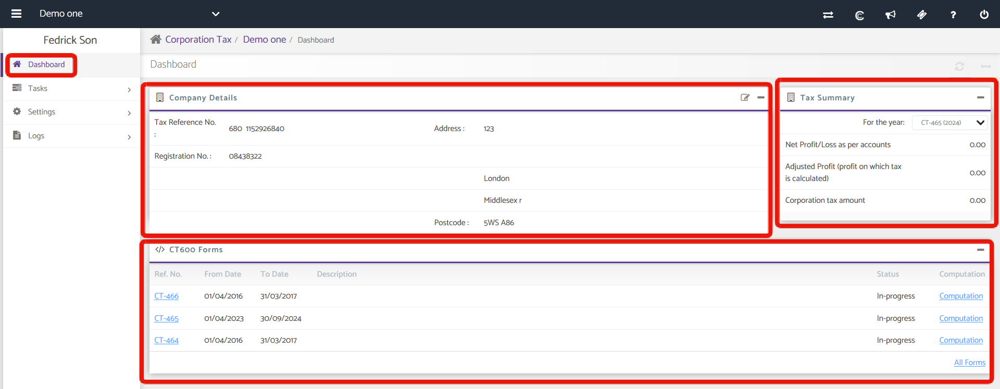

# Corporation Tax Dashboard
	 	
			
			Print

- **Category:** Corporation Tax
- **Folder:** Corporation Tax Help Guide
- **Source URL:** [https://capium.freshdesk.com/support/solutions/articles/9000165505-corporation-tax-dashboard](https://capium.freshdesk.com/support/solutions/articles/9000165505-corporation-tax-dashboard)
- **Article ID:** 9000165505

## Content

Solution home 
		Corporation Tax
		Corporation Tax Help Guide

### Corporation Tax Dashboard

			Print

	Modified on: Mon, 18 Jan, 2021 at  4:40 PM

		Location: Corporate Tax module > Client Specific > Tasks > CT600 Returns > Create Return

A tax on the taxable profits of limited companies and some organizations including charities, clubs, societies, associations, cooperatives and other unincorporated bodies. 

Companies self-assess their own Corporation Tax by filing a Company Tax Form CT600 or CT600 (short) and relevant supplementary pages accounts, computations and other supporting documentation as appropriate. 

To submit the Form, you need to select the module from the home page of My Capium or if you are on other modules then to switch over to this module select Corporation Tax from drop-down list on the top right of the page.

Top of the page displays the name of the company whose CT600 is to be prepared. The first box on the dashboard entails the following Company Details:

Tax Ref. No.

Registration No.

Address

Postcode

Company details can be updated from this section by clicking on ‘Edit’ button. The second box is related to ‘Tax Summary’. It has various functionalities such as:

For the Year drop-down: You may select a particular CT Return which in turn shows the details of the CT created.

Net Profit/Loss as per accounts: It shows the Profit or loss incurred.

Adjusted Profit: It shows the adjusted profit i.e. the profit on which Tax is calculated.

Corporation Tax Amount: It shows the amount which is to be paid in form of Corporation Tax.

The dashboard of Corporation Tax module provides the summary of recent three CT600 forms prepared or submitted to the HMRC along with their computation and submit status.

Following is the description of the table:

Clicking on Ref. no. will generate an overview of the form so prepared.

From Date and To Date shows the period for which form is prepared. The maximum period for which Form will be submitted is 18 months.

Description will display the description of the Form.

Click on Computation column for the related form to preview the computation.

Submit Status lists the current submission status of each form.

Clicking on ‘All Forms’ will list all the forms that are prepared so far by you (submitted or not).

										Did you find it helpful?
								Yes
								No

Send feedback	Sorry we couldn't be helpful. Help us improve this article with your feedback.

## Screenshots & Diagrams (1)

