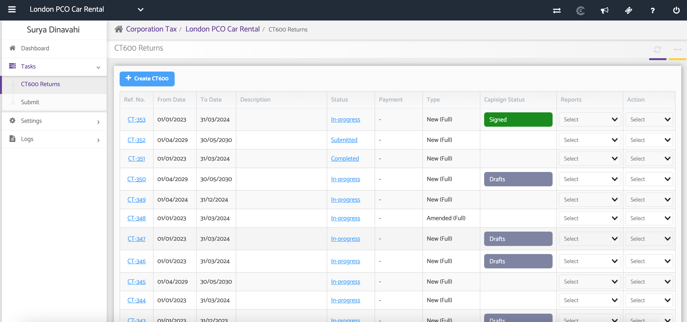
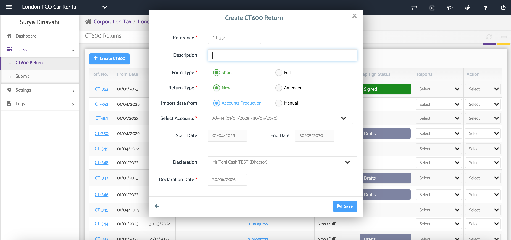
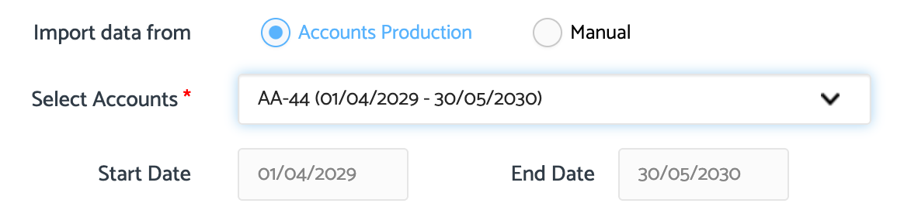
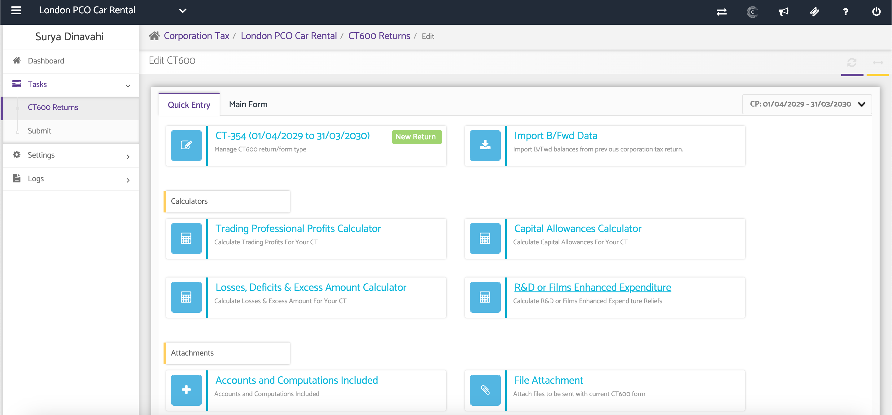

# Creating a New CT600 Returns
	 	
			
			Print

- **Category:** Corporation Tax
- **Folder:** Corporation Tax Help Guide
- **Source URL:** [https://capium.freshdesk.com/support/solutions/articles/9000165507-creating-a-new-ct600-returns](https://capium.freshdesk.com/support/solutions/articles/9000165507-creating-a-new-ct600-returns)
- **Article ID:** 9000165507

## Content

Solution home 
		Corporation Tax
		Corporation Tax Help Guide

### Creating a New CT600 Returns

			Print

	Modified on: Tue, 30 Jun, 2026 at  4:01 PM

### Overview

The CT600 Returns section allows you to create and manage Corporation Tax returns for a company. A CT600 return includes the CT600 form, supporting Accounts, and Tax Computations required for submission to HMRC.

You can create either a Full or Short CT600 return, depending on the company's reporting requirements, and import data directly from Accounts Production or enter it manually.

### Navigation

Corporate Tax > Client Specific > Tasks > CT600 Returns

### Support Videos

Adding a Supplementary Form to a CT600

Claiming Group Relief Through a Supplementary Form

Creating an Amended CT600 Return

### Step 1: Create a CT Return and enter the CT600 Details

Complete the required fields to create the return.

### 

### Reference Number:

A reference number is automatically generated with the prefix CT. You can edit this reference if required.

### Description:

Enter a description for the CT600 return (optional).

### Form Type

Select the appropriate form type:

 - Full – Used when submitting full annual accounts prepared in the Accounts Production module.

 - Short – Typically used for small and medium-sized companies.

### 

### Return Type:

Select whether the return is:

 - New Return

 - Amended Return

### Step 2: Select the Data Source

Choose how the CT600 data will be prepared.

 - Accounts Production – Import data from an existing Accounts Production report.

 - Manual – Enter the data manually.

Note: If creating a manual CT600, you must first create the relevant accounting period under Corporate Tax Settings.

If importing from Accounts Production, select the required Full Accounts Report from the drop-down list.
This report will be used as the basis for preparing the CT600 return.
The Start Date and End Date will automatically populate based on the selected accounts.

### Step 3: Create the CT600 Return

After completing all required information, click Create New CT600.

The CT600 return will be created, and you will be taken to the main CT600 workspace where you can complete the tax calculations, computations, and supplementary forms before submission.

### Additional Help

### Need Help?

If you need assistance or guidance, please contact your onboarding manager or email Support@capium.com, or call us on 020 3322 5578.

### Related Articles

CT600 Requirements 

CT600 Returns - Quick Entry

 - CT600 Returns - Calculators

										Did you find it helpful?
								Yes
								No

Send feedback	Sorry we couldn't be helpful. Help us improve this article with your feedback.

## Screenshots & Diagrams (4)

