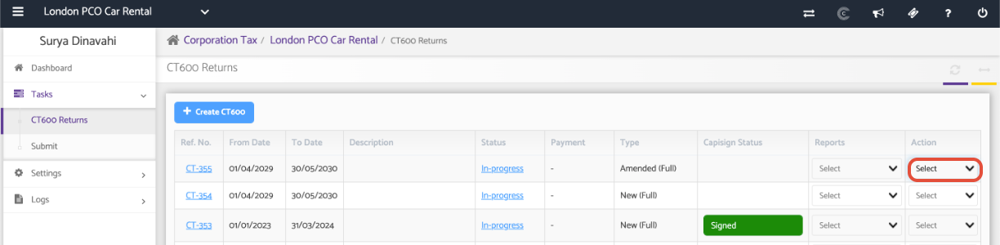
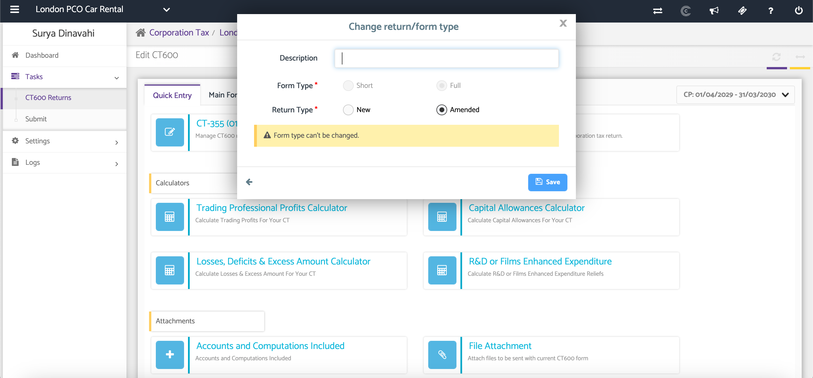
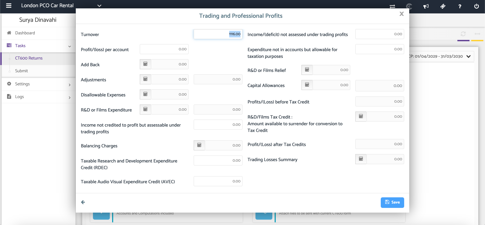
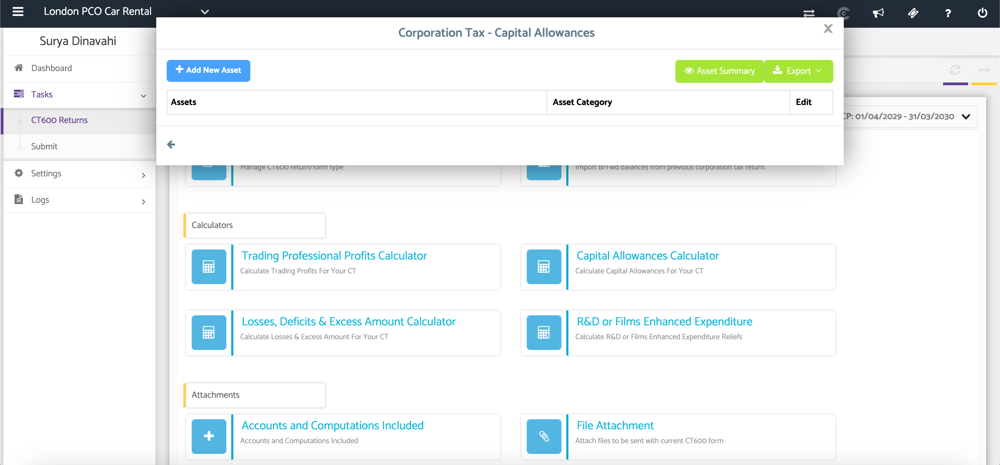
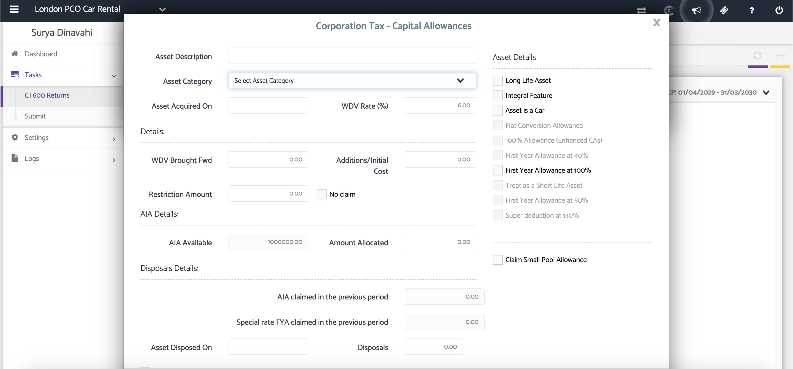
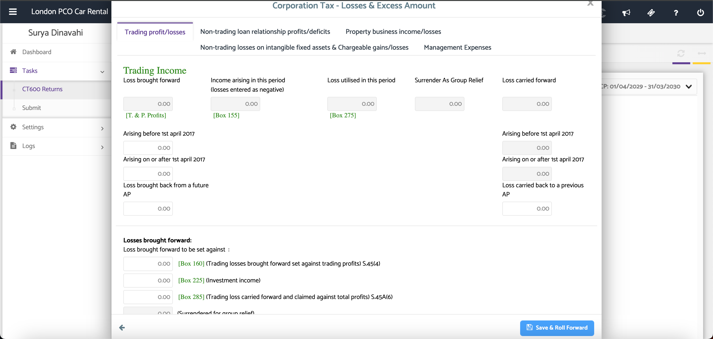
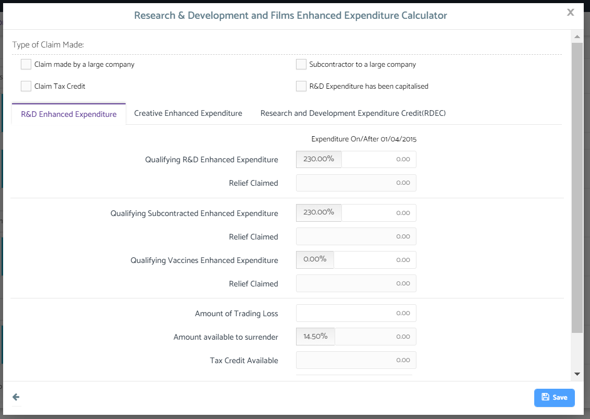
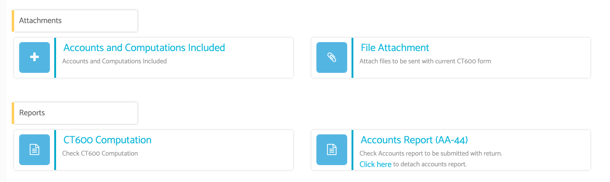

# CT600 Returns - Quick Entry
	 	
			
			Print

- **Category:** Corporation Tax
- **Folder:** Corporation Tax Help Guide
- **Source URL:** [https://capium.freshdesk.com/support/solutions/articles/9000165508-ct600-returns-quick-entry](https://capium.freshdesk.com/support/solutions/articles/9000165508-ct600-returns-quick-entry)
- **Article ID:** 9000165508

## Content

Solution home 
		Corporation Tax
		Corporation Tax Help Guide

### CT600 Returns - Quick Entry

			Print

	Modified on: Tue, 30 Jun, 2026 at  4:36 PM

### Overview

The Quick Entry form provides a simplified way to complete your CT600 return. Each section links directly to the corresponding part of the CT600, making it easier to enter and review tax information. If your return was created from Accounts Production, relevant financial data will be populated automatically.

### Navigation

Corporate Tax > Select Client >  CT600 Returns > Action > Select 'Edit Return'

### Video

Accounting for Depreciated Intangible Assets

### Step 1: Open the Quick Entry Form

Open the Quick Entry form after creating a CT600 return. Select the blue boxes to access each section of the return.

Review and complete the following sections where applicable:

 - CT-355

 - Trading & Professional Profits

 - Capital Allowances 

 - Losses and Excess Amounts 

 - R&D Relief 

Note: Only complete the sections relevant to your company.

### Step 2: Review the Main CT600 Form

The Main CT600 Form is linked directly to the Quick Entry screen.

Any information entered within the Quick Entry form updates the CT600 return automatically.

If your return was created using Accounts Production, relevant financial information will already be populated.

### Change the Return Type (CT-355)

Use the CT-35 section to change the return type if required.

You can switch between:

 - New Return

 - Amended Return

### Complete the Trading and Professional Profits Calculator

Open the Trading and Professional Profits calculator.

If data has been imported from Accounts Production, items such as:

 - Trading losses

 - Depreciation (Disallowable Expenses)

will be brought through automatically.

Enter any additional information where required.

### Capital Allowances

Open the Capital Allowances calculator.

If fixed assets have been recorded in the Bookkeeping module, they will automatically appear here.

If additional assets need to be included, click Add New Asset and complete the required details.

### Enter Losses and Excess Amounts

Open the Losses and Excess Amounts section.

Complete the relevant schedules based on the company's tax position.

Only enter information where applicable.

### 

### Complete the R&D Relief Section

Open the R&D Relief section.

Enter the qualifying expenditure in the appropriate fields.

The claimable percentage will be calculated using the qualifying amounts entered.

### Attach Supporting Documents

Review the Attachments section.

If the accounts were prepared within Capium Accounts Production, they will automatically be attached to the CT600 return.

If additional documents are required, click the relevant blue box to upload supporting attachments.

### Additional Help

### Need Help?

If you need assistance or guidance, please contact your onboarding manager or email Support@capium.com, or call us on 020 3322 5578.

### Related Articles

CT600 Requirements 

CT600 Returns - Calculators

Creating a New CT600 Returns

										Did you find it helpful?
								Yes
								No

Send feedback	Sorry we couldn't be helpful. Help us improve this article with your feedback.

## Screenshots & Diagrams (8)

