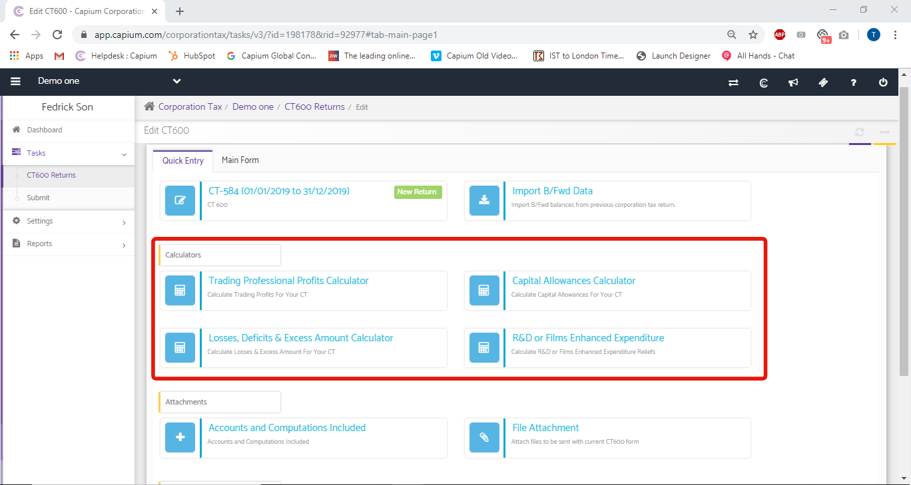
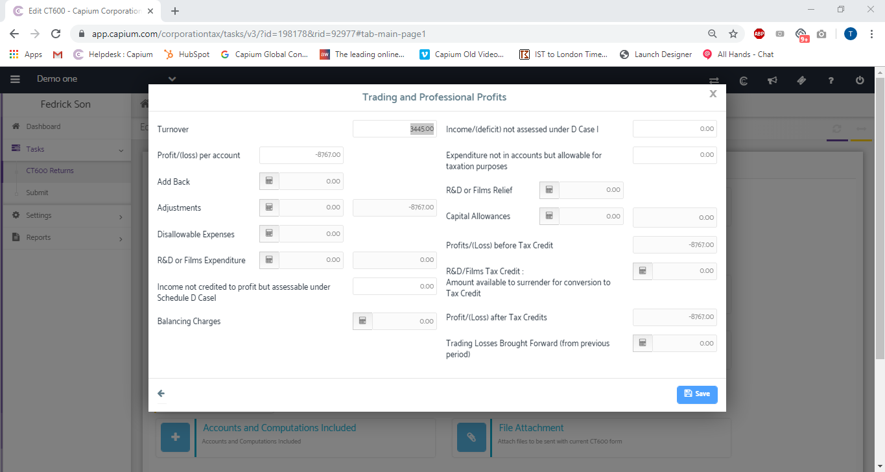
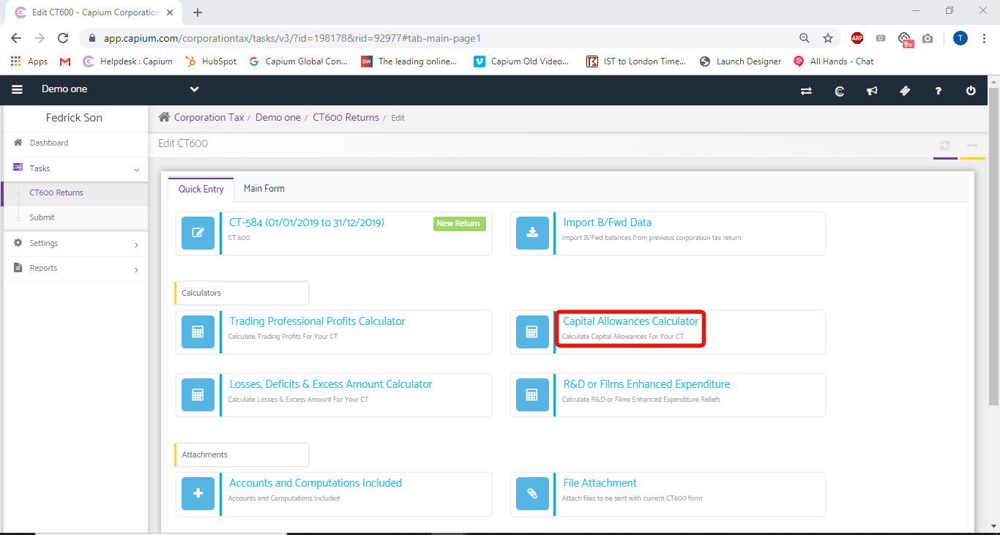
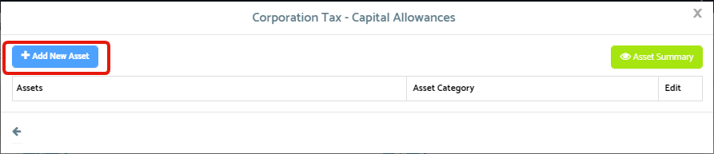
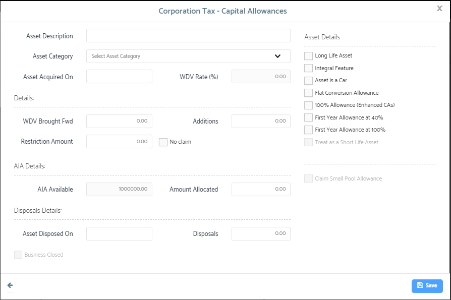
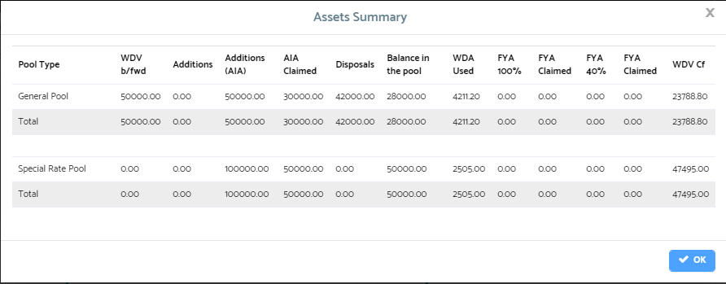
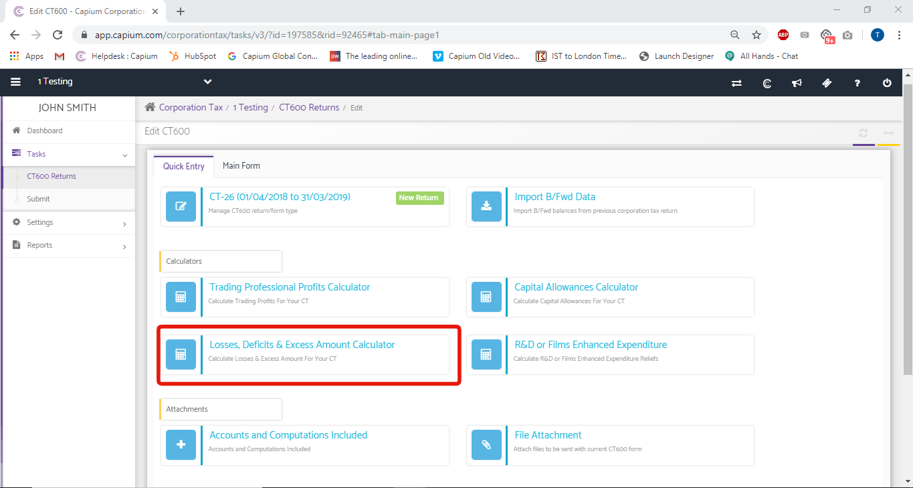
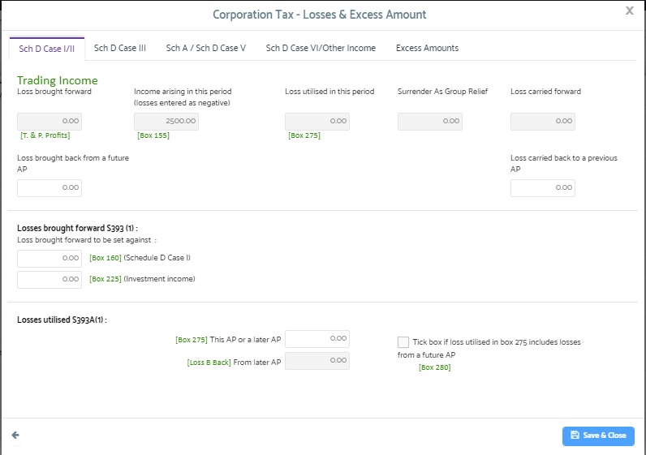

# CT600 Returns - Calculators
	 	
			
			Print

- **Category:** Corporation Tax
- **Folder:** Corporation Tax Help Guide
- **Source URL:** [https://capium.freshdesk.com/support/solutions/articles/9000165509-ct600-returns-calculators](https://capium.freshdesk.com/support/solutions/articles/9000165509-ct600-returns-calculators)
- **Article ID:** 9000165509

## Content

Solution home 
		Corporation Tax
		Corporation Tax Help Guide

### CT600 Returns - Calculators

			Print

	Modified on: Mon, 18 Jan, 2021 at  4:48 PM

		This section covers the following;

Trading Professional Profits Calculator

Capital Allowance Calculator

Losses Deficit & Excess Amount Calculator

### Trading Professional Profits Calculator

This is the basic part where Trading Profits are calculated automatically by the software which takes the values from the Annual Full Accounts Report so imported. A new box for showing profit calculation appears:

The details so filled are taken from the Annual Account Report automatically and the other details (if any) are to be filled by clicking on calculators given in front of different fields.

Add Back: If any items that are allowed as per accounts purpose but are not allowed for calculation of tax purpose is to be added back. Here the user will fill in the details by selecting the tag (the reason) from the drop-down list and giving the description with the amount. If a new item is to be 

added, click on ‘+ Add New Item’ and after all save it. The total of all the items will come on the form.

Adjustments: Adjustments for tax purpose can be made here. Here you need to fill in the details by selecting the tag (the reason) from the drop-down list and giving the description with the amount. If a new item is to be added, click on ‘+ Add New Item’ and after all save it. The total (+/-) of all the items will come on the form. The calculated amount can be filled into related fields by clicking on calculator Icon.

Disallowable Expenses: These are the expenses which are allowed for accounting purpose but are disallowed for tax purpose and are added back. Details are filled by clicking on the calculator icon. Here you need to fill in the details by selecting the tag (the reason) from the drop-down list and giving the description with the amount. If a new item is to be added, click on ‘+ Add New Item’ and after all save it. The total of all the items will come on the form.

Balancing Charges: The amount by which the sale price of an asset will exceed its written down value. This written down value is actually thought to be the actual value of that asset for purposes of taxation. Therefore, the balancing charge will be considered as profit and it will be taxable.

### Capital Allowance Calculator

A Capital Allowance refers to sums of money a UK business can deduct from the overall corporate or income tax on its profits. These sums derive from certain purchases or investments.

Click on ’Add New Asset’ button for adding a new asset on which balancing charge is needed to be applied.

Following box appears when you click on ’Add New Asset’ button:

 Fill in all the details as required and save the data.  On saving the data list of the assets so added will be listed. You may take actions as applicable to the assets:

Edit: You may edit the details as required.

Delete: Asset entry can be deleted if not required.

Asset summary will show the summary chart of all the assets added, the following fields are shown below.

Total of all the assets will come out in the form.

The details of capital allowance can be added from here or from the main page of the calculation from ‘Capital Allowance Calculator’.

Trading Losses B/F: If any trading loss is there which is carried forward from the previous years and set off is to be claimed will be mentioned here. Here the user will fill in the details by writing the description. If a new item is to be added, click on ‘+ Add New Item’ and after all save it. The total of all the items will come on the form.

### Losses Deficit & Excess Amount Calculator

Here the details related to brought forward loss, current year loss with the set-off and adjustments are mentioned. Clicking on this calculator, the following box appears:

1st part shows the trading loss whose details automatically come from the Annual Account Report so imported.

The loss of the previous year to be b/f entered in Trading Professional Profits Calculator >> Trading Loss b/f block will be shown here but will not be set off but will be c/f along with current year loss (if any).

But if the loss is to be set off then the amount to be set off has to be written in Box 4 block.

Click here to watch how to carry back losses from current period to previous

Click here to watch how to enter brought forward written down values

Click here to watch how to enter brought forward balances of a trading loss

										Did you find it helpful?
								Yes
								No

Send feedback	Sorry we couldn't be helpful. Help us improve this article with your feedback.

## Screenshots & Diagrams (9)

