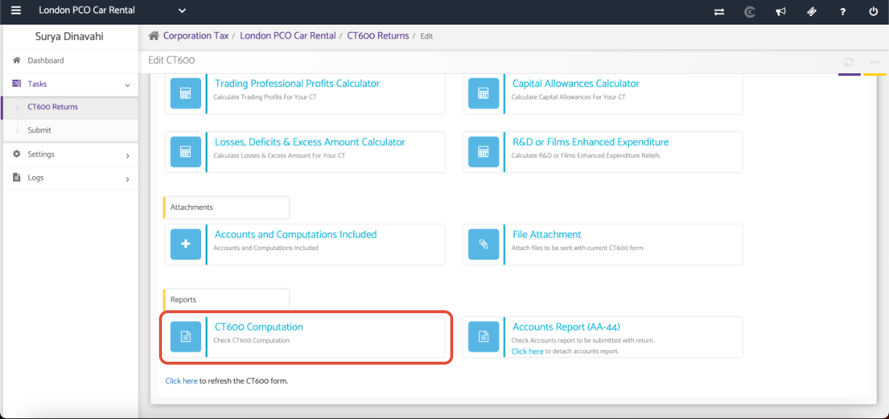
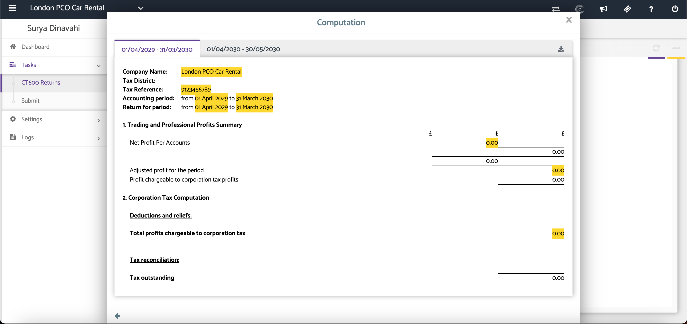

# CT600 Computation
	 	
			
			Print

- **Category:** Corporation Tax
- **Folder:** Corporation Tax Help Guide
- **Source URL:** [https://capium.freshdesk.com/support/solutions/articles/9000165510-ct600-computation](https://capium.freshdesk.com/support/solutions/articles/9000165510-ct600-computation)
- **Article ID:** 9000165510

## Content

Solution home 
		Corporation Tax
		Corporation Tax Help Guide

### CT600 Computation

			Print

	Modified on: Tue, 30 Jun, 2026 at  4:41 PM

### Overview

The CT600 Computation section displays the company's tax computation, showing how the accounting profit has been adjusted to calculate the taxable profit. This computation forms part of the CT600 submission and is included as an attachment when filing with HMRC.

### Navigation

Corporate Tax > Select Client > Tasks > Edit Return > CT600 Returns > CT600 Computation

### Open the CT600 Computation

The computation displays the tax adjustments made to the accounting profit, including non-deductible expenses, non-taxable income, capital allowances, and other tax adjustments.

Review the computation to ensure all figures and adjustments are correct.

If any changes are required, update the relevant sections of the CT600 before proceeding.

### Download the Computation

Click the Download PDF option to generate a PDF copy of the CT600 Computation for review or record-keeping.

See screenshot above.

### Additional Help

### Need Help?

If you need assistance or guidance, please contact your onboarding manager or email Support@capium.com, or call us on 020 3322 5578.

### Related Articles

CT600 Requirements 

CT600 Returns - Calculators

Creating a New CT600 Returns

										Did you find it helpful?
								Yes
								No

Send feedback	Sorry we couldn't be helpful. Help us improve this article with your feedback.

## Screenshots & Diagrams (2)

