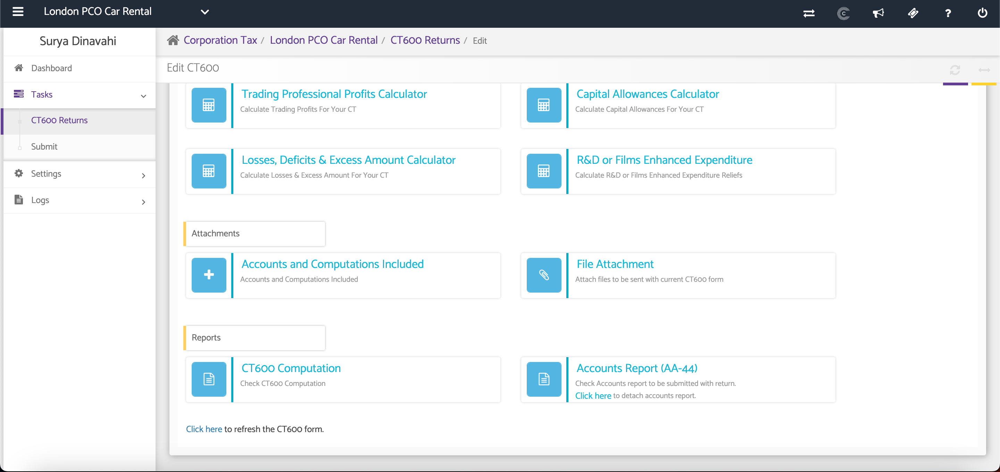
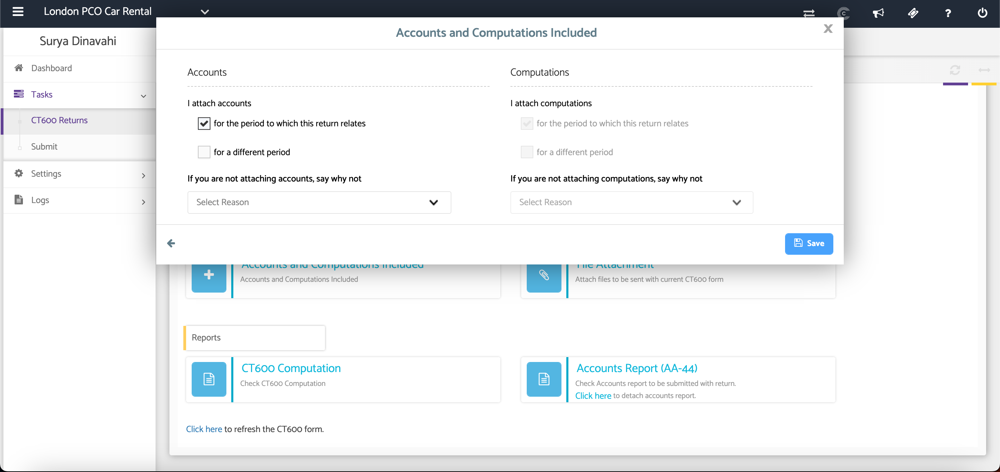

# CT600 Returns - Attachments
	 	
			
			Print

- **Category:** Corporation Tax
- **Folder:** Corporation Tax Help Guide
- **Source URL:** [https://capium.freshdesk.com/support/solutions/articles/9000165511-ct600-returns-attachments](https://capium.freshdesk.com/support/solutions/articles/9000165511-ct600-returns-attachments)
- **Article ID:** 9000165511

## Content

Solution home 
		Corporation Tax
		Corporation Tax Help Guide

### CT600 Returns - Attachments

			Print

	Modified on: Tue, 30 Jun, 2026 at  4:30 PM

### Overview

The Attachments section allows you to specify whether the company Accounts and Tax Computations will be submitted with the CT600 return. If these documents are not being attached, you must provide a reason before saving.

### Navigation

Corporate Tax > Select Client > Tasks > CT600 Returns > Attachments

###  

### Select to Include Accounts and Computations

Tick the appropriate checkbox to indicate whether the Annual Accounts and Tax Computations will be submitted with the CT600 return.

If the Accounts or Tax Computations are not being attached, leave the relevant checkbox unticked and select the reason from the drop-down list.

Once completed, click Save to apply your changes.

### Additional Help

### Need Help?

If you need assistance or guidance, please contact your onboarding manager or email Support@capium.com, or call us on 020 3322 5578.

### Related Articles

CT600 Requirements 

CT600 Returns - Calculators

Creating a New CT600 Returns

										Did you find it helpful?
								Yes
								No

Send feedback	Sorry we couldn't be helpful. Help us improve this article with your feedback.

## Screenshots & Diagrams (2)

