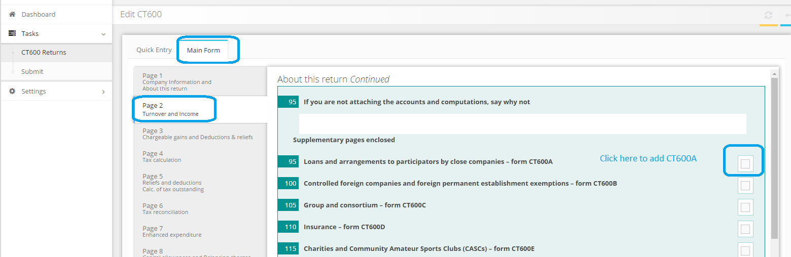

# How can I report loans to participators?
	 	
			
			Print

- **Category:** Corporation Tax
- **Folder:** Corporation Tax FAQs
- **Source URL:** [https://capium.freshdesk.com/support/solutions/articles/9000165563-how-can-i-report-loans-to-participators-](https://capium.freshdesk.com/support/solutions/articles/9000165563-how-can-i-report-loans-to-participators-)
- **Article ID:** 9000165563

## Content

Solution home 
		Corporation Tax
		Corporation Tax FAQs

### How can I report loans to participators?

			Print

	Modified on: Mon, 25 Mar, 2019 at  4:45 PM

		You may update the details of S455 (Director's Loan) under supplementary form CT600A. 

You may include the supplementary form from the main form by selecting the Box 95 under page 2.

Please refer below screenshot for more help

Click here to watch an example video of adding a supplementary form to CT600

Click here to watch how to claim Group Relief through supplementary form

Click here to watch how to add S455 Tax (Loans to Participators)

										Did you find it helpful?
								Yes
								No

Send feedback	Sorry we couldn't be helpful. Help us improve this article with your feedback.

## Screenshots & Diagrams (1)

