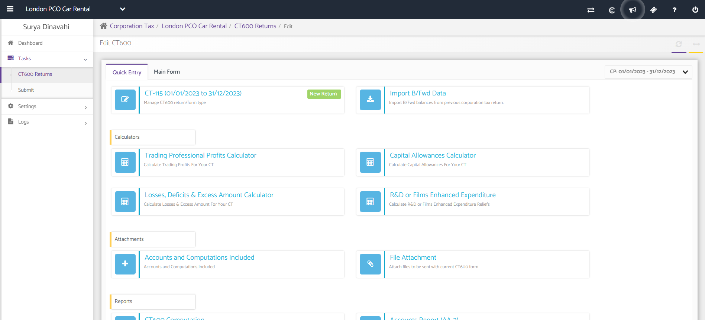
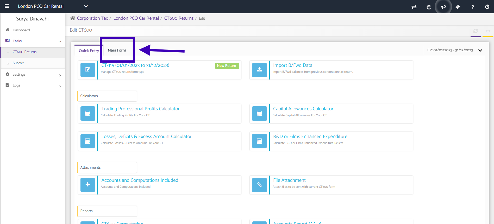
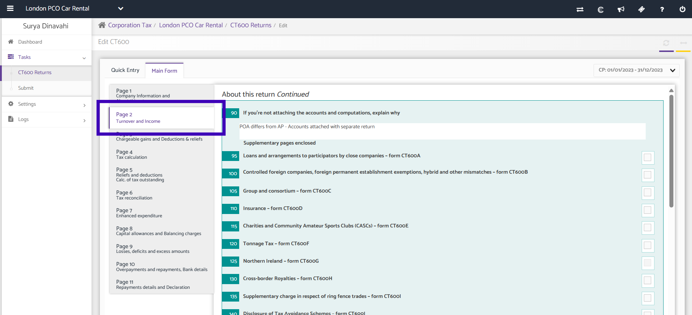
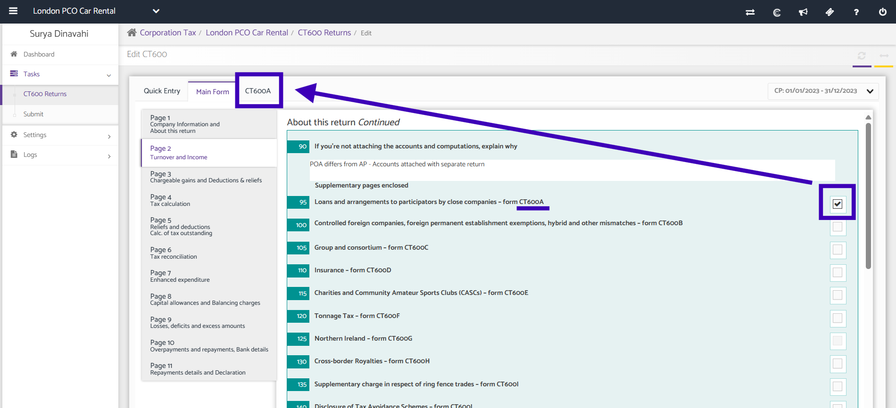
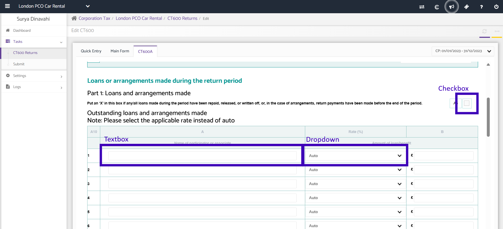
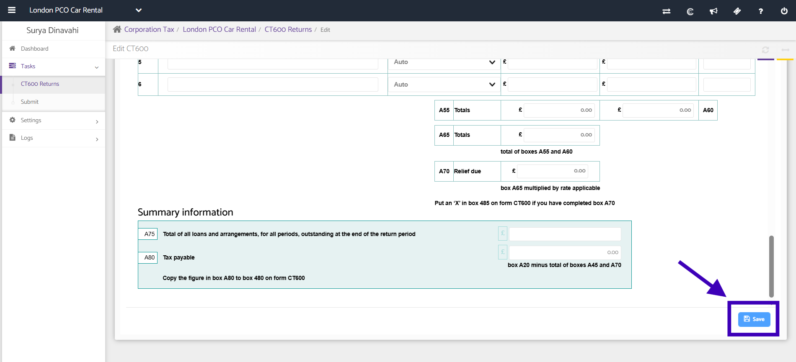

# How can we add supplementary pages in CT600?
	 	
			
			Print

- **Category:** Corporation Tax
- **Folder:** Corporation Tax FAQs
- **Source URL:** [https://capium.freshdesk.com/support/solutions/articles/9000165566-how-can-we-add-supplementary-pages-in-ct600-](https://capium.freshdesk.com/support/solutions/articles/9000165566-how-can-we-add-supplementary-pages-in-ct600-)
- **Article ID:** 9000165566

## Content

Solution home 
		Corporation Tax
		Corporation Tax FAQs

### How can we add supplementary pages in CT600?

			Print

	Modified on: Mon, 14 Apr, 2025 at  2:27 PM

		In this article we will be showing you how to add a supplementary page in your CT600 Return.

After creating your CT600 Return, you will be presented with this screen:

Next, navigate to the 'Main Form' along the top:

Once in the 'Main Form', you will be able to add supplementary pages in Page 2:

In Page 2, you can check the checkbox of the supplementary page you wish to add, which will appear along the top of the form:

The supplementary pages we offer are:

 - CT600A Loans and arrangements to participators by close companies
 - CT600B Controlled foreign companies, foreign permanent establishment exemptions, hybrid and other mismatches
 - CT600C Group and consortium
 - CT600D Insurance
 - CT600E Charities and Community Amateur Sports Club (CASCs)
 - CT600F Tonnage Tax
 - CT600G Northern Ireland
 - CT600H Cross-border Royalties
 - CT600I Supplementary charge in respect of ring fence trades
 - CT600J Disclosure of Tax Avoidance Schemes
 - CT600L Research and Development
 - CT600M Freeports and Investment Zones
 - CT600N Residential property Developer Tax (RPDT)
 - CT600P Creative Industries

To fill out the supplementary page, we offer checkboxes, textboxes, and dropdowns.

These will vary in different supplementary pages.

Once all is completed, ensure to press 'Save' in the bottom right of the screen.

Click here to watch an example video of adding a supplementary form to CT600

Click here to watch how to claim Group Relief through supplementary form

										Did you find it helpful?
								Yes
								No

Send feedback	Sorry we couldn't be helpful. Help us improve this article with your feedback.

## Screenshots & Diagrams (6)

