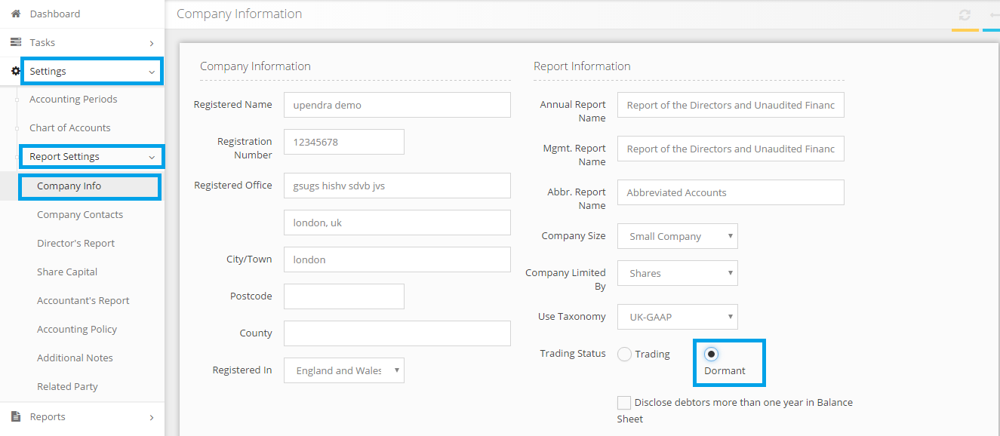

# Where do I say that the CT600 is for a dormant company and so no accounts are attached?
	 	
			
			Print

- **Category:** Corporation Tax
- **Folder:** Corporation Tax FAQs
- **Source URL:** [https://capium.freshdesk.com/support/solutions/articles/9000165569-where-do-i-say-that-the-ct600-is-for-a-dormant-company-and-so-no-accounts-are-attached-](https://capium.freshdesk.com/support/solutions/articles/9000165569-where-do-i-say-that-the-ct600-is-for-a-dormant-company-and-so-no-accounts-are-attached-)
- **Article ID:** 9000165569

## Content

Solution home 
		Corporation Tax
		Corporation Tax FAQs

### Where do I say that the CT600 is for a dormant company and so no accounts are attached?

			Print

	Modified on: Mon, 25 Mar, 2019 at  5:55 PM

		You may simply change the company's Trading Status as "Dormant" in the Accounts Production Module >> Settings >> Report Settings >> Company Info.

Once done, you may prepare the accounts report of a Dormant company as desired and attach to the CT600 then submit to HMRC.

Please refer below screenshot for more help.

Click here to watch how to prepare dormant accounts 

										Did you find it helpful?
								Yes
								No

Send feedback	Sorry we couldn't be helpful. Help us improve this article with your feedback.

## Screenshots & Diagrams (1)

