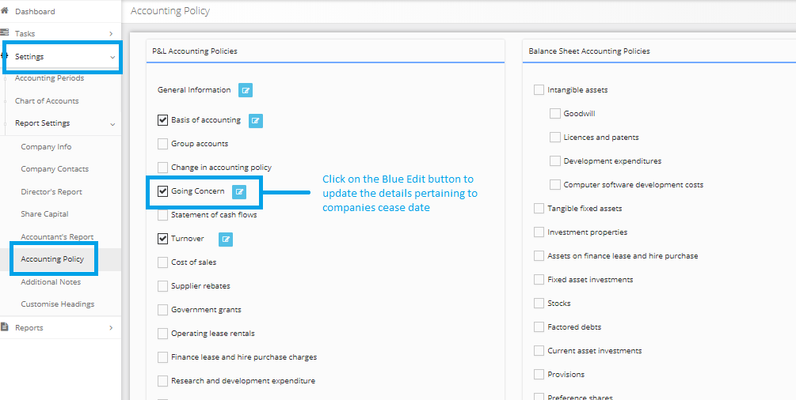

# How to inform in the financial statements that the company ceased to trade?
	 	
			
			Print

- **Category:** Corporation Tax
- **Folder:** Corporation Tax FAQs
- **Source URL:** [https://capium.freshdesk.com/support/solutions/articles/9000165570-how-to-inform-in-the-financial-statements-that-the-company-ceased-to-trade-](https://capium.freshdesk.com/support/solutions/articles/9000165570-how-to-inform-in-the-financial-statements-that-the-company-ceased-to-trade-)
- **Article ID:** 9000165570

## Content

Solution home 
		Corporation Tax
		Corporation Tax FAQs

### How to inform in the financial statements that the company ceased to trade?

			Print

	Modified on: Mon, 25 Mar, 2019 at  5:51 PM

		Please follow the below steps:

1) You first need to inform HMRC from your end separately that the Company is/going to be Ceased.

2) While creating an accounting period, you must check 'Is company ceased?'. If it was already done follow step 3.

3) Navigate to Accounts Production >> Settings >> Accounting Policy.

4) Check the box for 'Going Concern' and click on 'Edit' button.

5) Mention company ceasing details in 'Going concern' policy manually and 'SAVE' the details.

6) If you have already created the accounts report prior to this ceasing configuration as mentioned in the above steps, then you must regenerate the report.

Please refer below screenshot for more help.

Click here to watch how to regenerate accounts

										Did you find it helpful?
								Yes
								No

Send feedback	Sorry we couldn't be helpful. Help us improve this article with your feedback.

## Screenshots & Diagrams (1)

