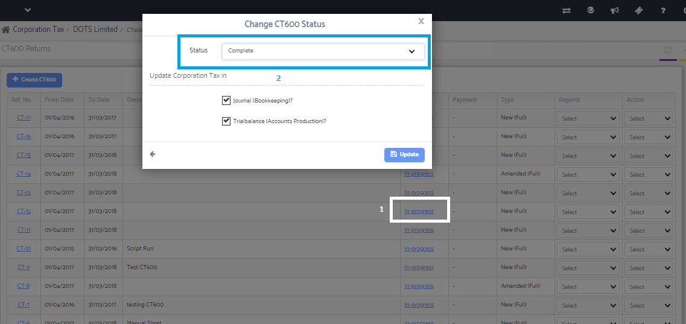

# How to pass a tax Journal Entry from CT module to Accounts Production module?
	 	
			
			Print

- **Category:** Corporation Tax
- **Folder:** Corporation Tax FAQs
- **Source URL:** [https://capium.freshdesk.com/support/solutions/articles/9000165571-how-to-pass-a-tax-journal-entry-from-ct-module-to-accounts-production-module-](https://capium.freshdesk.com/support/solutions/articles/9000165571-how-to-pass-a-tax-journal-entry-from-ct-module-to-accounts-production-module-)
- **Article ID:** 9000165571

## Content

Solution home 
		Corporation Tax
		Corporation Tax FAQs

### How to pass a tax Journal Entry from CT module to Accounts Production module?

			Print

	Modified on: Mon, 25 Mar, 2019 at  1:25 PM

		You may simply click on the status "In Progress" and change the status to "Completed" where it will provide you with the option to post the journal as desired.

Please refer below screenshot for more help.

										Did you find it helpful?
								Yes
								No

Send feedback	Sorry we couldn't be helpful. Help us improve this article with your feedback.

## Screenshots & Diagrams (1)

