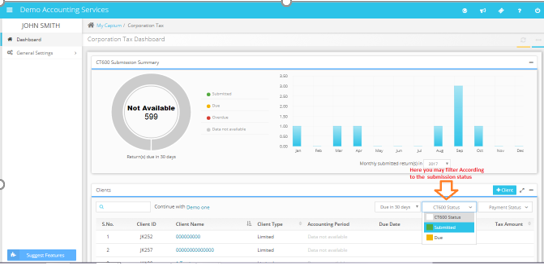

# How does the Corporation Tax Dashboard work?
	 	
			
			Print

- **Category:** Corporation Tax
- **Folder:** Corporation Tax FAQs
- **Source URL:** [https://capium.freshdesk.com/support/solutions/articles/9000165574-how-does-the-corporation-tax-dashboard-work-](https://capium.freshdesk.com/support/solutions/articles/9000165574-how-does-the-corporation-tax-dashboard-work-)
- **Article ID:** 9000165574

## Content

Solution home 
		Corporation Tax
		Corporation Tax FAQs

### How does the Corporation Tax Dashboard work?

			Print

	Modified on: Mon, 25 Mar, 2019 at  1:28 PM

		The dashboard Summary display is also based on the filter options listed there from the right-hand side where you may select different options like the number of days ‘Due in 30 Days’. 

If there's no accounts, fall within these due date categories in accordance with that filter then it would show as Data not available. 

										Did you find it helpful?
								Yes
								No

Send feedback	Sorry we couldn't be helpful. Help us improve this article with your feedback.

## Screenshots & Diagrams (1)

