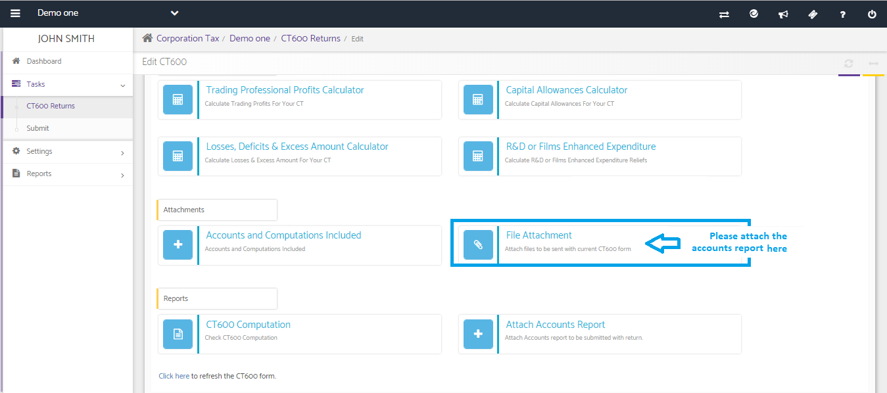
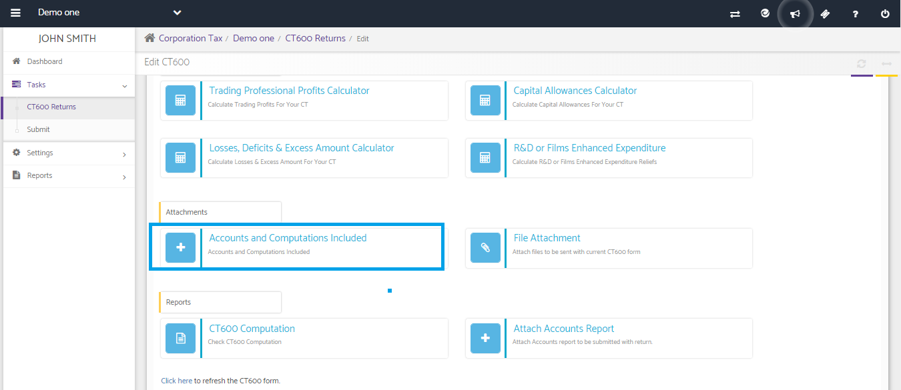
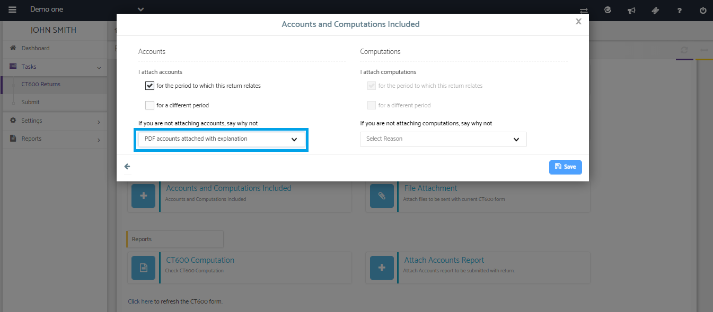

# How to attach PDF accounts to CT600 manually?
	 	
			
			Print

- **Category:** Corporation Tax
- **Folder:** Corporation Tax FAQs
- **Source URL:** [https://capium.freshdesk.com/support/solutions/articles/9000165575-how-to-attach-pdf-accounts-to-ct600-manually-](https://capium.freshdesk.com/support/solutions/articles/9000165575-how-to-attach-pdf-accounts-to-ct600-manually-)
- **Article ID:** 9000165575

## Content

Solution home 
		Corporation Tax
		Corporation Tax FAQs

### How to attach PDF accounts to CT600 manually?

			Print

	Modified on: Mon, 25 Mar, 2019 at  1:30 PM

		You may attach PDF accounts report using File Attachment available in Quick Entry tab by clicking on edit option available for the CT600 return and update the same under Accounts and Computations Included >> If you are not attaching accounts, say why not >> PDF Accounts attached with an explanation. 

Once done, you may proceed to submit the CT600 return to HMRC as desired.

Please refer below screenshot for more help.

										Did you find it helpful?
								Yes
								No

Send feedback	Sorry we couldn't be helpful. Help us improve this article with your feedback.

## Screenshots & Diagrams (3)

