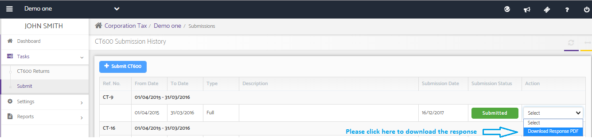

# Is there any way of printing the HMRC response after submitting CT600?
	 	
			
			Print

- **Category:** Corporation Tax
- **Folder:** Corporation Tax FAQs
- **Source URL:** [https://capium.freshdesk.com/support/solutions/articles/9000165576-is-there-any-way-of-printing-the-hmrc-response-after-submitting-ct600-](https://capium.freshdesk.com/support/solutions/articles/9000165576-is-there-any-way-of-printing-the-hmrc-response-after-submitting-ct600-)
- **Article ID:** 9000165576

## Content

Solution home 
		Corporation Tax
		Corporation Tax FAQs

### Is there any way of printing the HMRC response after submitting CT600?

			Print

	Modified on: Mon, 25 Mar, 2019 at  4:20 PM

		You may download the response from HMRC from the Action drop-down.

CT600 >> Tasks >> Submissions

Click here to watch how to download HMRC response for CT600 submissions

										Did you find it helpful?
								Yes
								No

Send feedback	Sorry we couldn't be helpful. Help us improve this article with your feedback.

## Screenshots & Diagrams (1)

