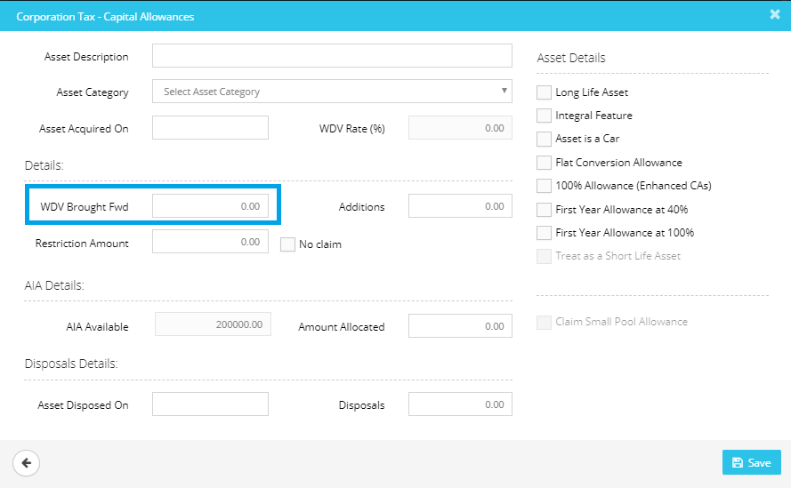

# Where do I enter the written down value (WDV) b/fwd (balance brought forward)?
	 	
			
			Print

- **Category:** Corporation Tax
- **Folder:** Corporation Tax FAQs
- **Source URL:** [https://capium.freshdesk.com/support/solutions/articles/9000165578-where-do-i-enter-the-written-down-value-wdv-b-fwd-balance-brought-forward-](https://capium.freshdesk.com/support/solutions/articles/9000165578-where-do-i-enter-the-written-down-value-wdv-b-fwd-balance-brought-forward-)
- **Article ID:** 9000165578

## Content

Solution home 
		Corporation Tax
		Corporation Tax FAQs

### Where do I enter the written down value (WDV) b/fwd (balance brought forward)?

			Print

	Modified on: Mon, 25 Mar, 2019 at  4:47 PM

		You may input the WDV brought forward under Capital Allowance Calculator.

Please refer below screenshot for more help.

Click here to watch how to enter brought forward written down values

Click here to watch how to enter brought forward balances of a trading loss

										Did you find it helpful?
								Yes
								No

Send feedback	Sorry we couldn't be helpful. Help us improve this article with your feedback.

## Screenshots & Diagrams (1)

