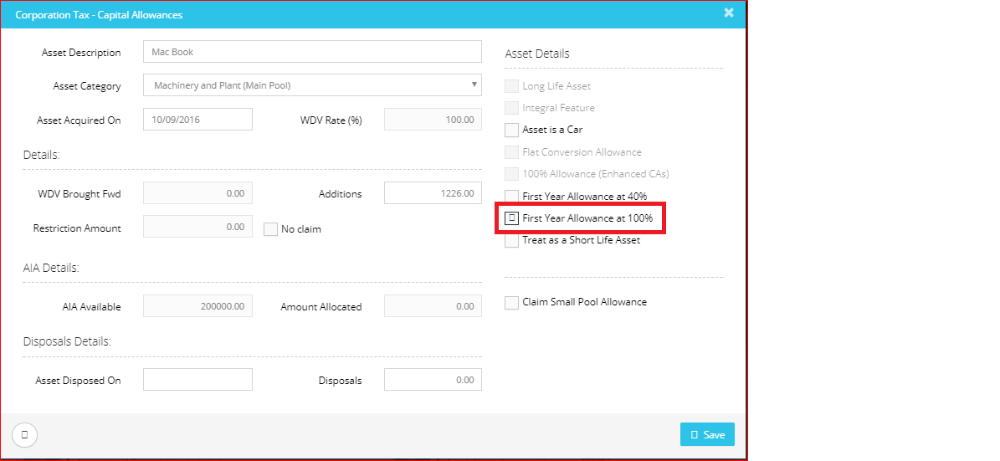

# How would I claim 100% of the AIA?
	 	
			
			Print

- **Category:** Corporation Tax
- **Folder:** Corporation Tax FAQs
- **Source URL:** [https://capium.freshdesk.com/support/solutions/articles/9000165579-how-would-i-claim-100-of-the-aia-](https://capium.freshdesk.com/support/solutions/articles/9000165579-how-would-i-claim-100-of-the-aia-)
- **Article ID:** 9000165579

## Content

Solution home 
		Corporation Tax
		Corporation Tax FAQs

### How would I claim 100% of the AIA?

			Print

	Modified on: Mon, 25 Mar, 2019 at  1:35 PM

		You may simply tick the checkbox of First Year Allowance at 100% in order to get 100% of the AIA.

Please refer below screenshot for more help.

										Did you find it helpful?
								Yes
								No

Send feedback	Sorry we couldn't be helpful. Help us improve this article with your feedback.

## Screenshots & Diagrams (1)

