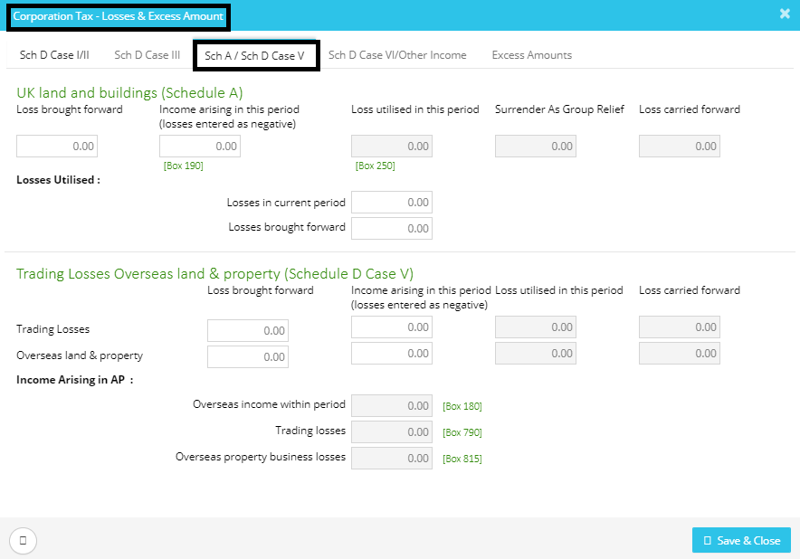

# How to update the rental income under CT600 Returns?
	 	
			
			Print

- **Category:** Corporation Tax
- **Folder:** Corporation Tax FAQs
- **Source URL:** [https://capium.freshdesk.com/support/solutions/articles/9000165581-how-to-update-the-rental-income-under-ct600-returns-](https://capium.freshdesk.com/support/solutions/articles/9000165581-how-to-update-the-rental-income-under-ct600-returns-)
- **Article ID:** 9000165581

## Content

Solution home 
		Corporation Tax
		Corporation Tax FAQs

### How to update the rental income under CT600 Returns?

			Print

	Modified on: Mon, 25 Mar, 2019 at  3:53 PM

		You may update the income arising in this period (losses entered as negative) under "UK land and buildings (Schedule A)" under Losses, Deficits & Excess Amount Calculator.

Click here to watch how to update rental income under CT600

Please refer below screenshot for more help.

										Did you find it helpful?
								Yes
								No

Send feedback	Sorry we couldn't be helpful. Help us improve this article with your feedback.

## Screenshots & Diagrams (1)

