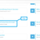
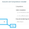
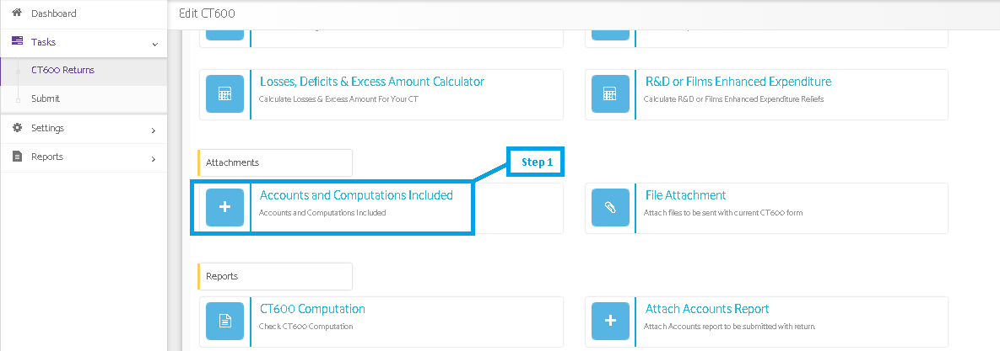
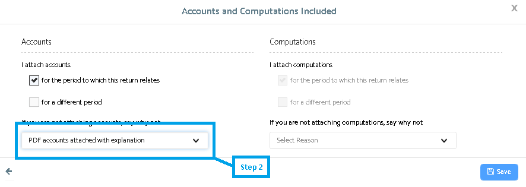

# submission error:-  You must provide a set of iXBRL accounts if the &#39;No accounts reason&#39; is absent.  I have attached a PDF copy of the statutory accounts.
	 	
			
			Print

- **Category:** Corporation Tax
- **Folder:** Corporation Tax FAQs
- **Source URL:** [https://capium.freshdesk.com/support/solutions/articles/9000165814-submission-error-you-must-provide-a-set-of-ixbrl-accounts-if-the-no-accounts-reason-is-absent-](https://capium.freshdesk.com/support/solutions/articles/9000165814-submission-error-you-must-provide-a-set-of-ixbrl-accounts-if-the-no-accounts-reason-is-absent-)
- **Article ID:** 9000165814

## Content

Solution home 
		Corporation Tax
		Corporation Tax FAQs

### submission error:-  You must provide a set of iXBRL accounts if the &#39;No accounts reason&#39; is absent.  I have attached a PDF copy of the statutory accounts.

			Print

	Modified on: Wed, 27 Mar, 2019 at  3:17 PM

		We have checked and found that you have not selected the option "PDF Accounts attached with explanation" under "Accounts and Computations Included" (refer attached), hence the reason. Please select the same to resolve the issue and you may proceed with the submission of CT Returns as desired. 

		Step 1.png (21 KB) Step 2.png (10.1 KB) 

										Did you find it helpful?
								Yes
								No

Send feedback	Sorry we couldn't be helpful. Help us improve this article with your feedback.

## Screenshots & Diagrams (4)

